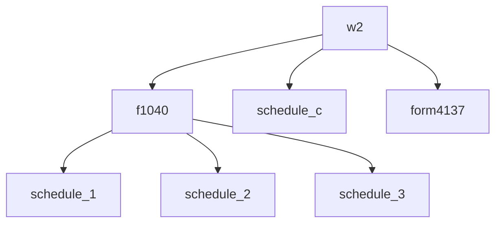

## `node list`

List all 184 registered nodes in the engine.

```bash
tax node list
```

Returns each node's type, category, and description.

---

## `node inspect`

Show the input schema and downstream routing for a specific node.

```bash
tax node inspect --node_type w2
tax node inspect --node_type w2 --json
```

The text output shows:
- Every field the node accepts
- Whether each field is required or optional
- The type and constraints for each field
- Which output nodes this node feeds into

**Example:**

```bash
tax node inspect --node_type f1099int
```

```
Node: f1099int (1099-INT Interest Income)
─────────────────────────────────────────
Fields:
  payer_name          string     optional   Name of the paying institution
  box1_interest       number     required   Interest income
  box3_savings_bonds  number     optional   US savings bond interest
  box8_tax_exempt     number     optional   Tax-exempt interest
  box10_market        number     optional   Market discount
  box11_bond_premium  number     optional   Bond premium
  box13_state         string     optional   State abbreviation
  box14_state_id      string     optional   State ID number
  box15_state_income  number     optional   State interest income
  box16_state_withheld number    optional   State tax withheld

Output nodes: f1040, schedule_b
```

**Flags:**

| Flag | Required | Description |
|------|----------|-------------|
| `--node_type TYPE` | Yes | Node to inspect |
| `--json` | No | Output as JSON |

---

## `node graph`

Show the dependency graph for a node — what it feeds into and what feeds into it.

```bash
tax node graph --node_type start
tax node graph --node_type w2 --depth 3
tax node graph --node_type start --json
```

By default, outputs a Mermaid diagram you can paste into any Mermaid renderer.

**Flags:**

| Flag | Required | Description |
|------|----------|-------------|
| `--node_type TYPE` | Yes | Starting node for the graph |
| `--depth N` | No | How many levels to traverse (default: all) |
| `--json` | No | Output as JSON instead of Mermaid |

**Example — W-2 dependency graph:**

```bash
tax node graph --node_type w2 --depth 2
```


