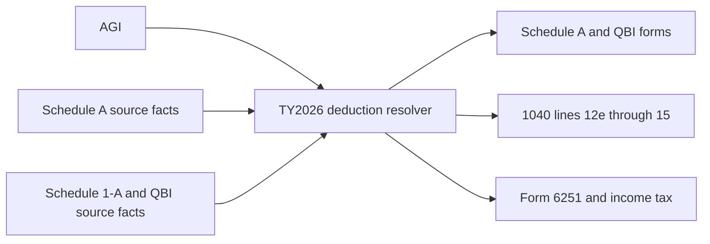

# TY2026 deduction graph: Schedule A, Schedule 1-A, and QBI

Status: source and dependency design, 2026-09-27. This is an implementation
contract for the TY2026 `f1040` entry point, not a registered calculation path.

## Sources and line contract

- The [draft 2026 Schedule A](https://www.irs.gov/pub/irs-dft/f1040sa--dft.pdf)
  puts SALT on lines 5a–5e, mortgage insurance on 8d/8e, current-year charity
  after its limitation worksheet on 13, prior carryover on 14, total charity
  on 15, and total itemized deductions on 18. It adds detailed line 17
  categories. Pin its revision and any final instructions before serializer
  field mapping. The correct instruction slug is `i1040sca`, whose draft URL
  still serves 2025; the pinned [2025 booklet](corpus/authorities/i1040sca--2025.pdf)
  is only a method comparator.
- [2026 Publication 505](https://www.irs.gov/publications/p505), Worksheets
  2-5 and 2-6, specifies the 0.5% AGI charitable floor and the 5.4% overall
  itemized reduction above the top-bracket threshold. The latter uses AGI
  **minus both Schedule 1-A and QBI deductions**. The current pure functions
  are in `forms/f1040/2026/itemized-deductions.ts` and
  `forms/f1040/2026/schedule-a.ts`.
- The draft 2026 Form 1040 puts Schedule A or standard deduction on 12e,
  nonitemizer cash charity on 12f, Schedule 1-A on 13a, and QBI on 13b.
  Draft Form 6251 line 1a removes only Schedule 1-A line 43 from 1040 line
  14; line 2a uses Schedule A line 7 or 1040 line 12e.
- The pinned [December 2025 Form 8283 and instructions](SOURCES.md) govern
  noncash donation source detail and filing when the claimed deduction exceeds
  $500. The [ATS scenario 2 fixture](ATS-SCENARIO-02.md) has a $730 FMV gift
  on Form 8283 but a blank Schedule A noncash amount. Its known Schedule A
  upper bound is below the $32,200 joint standard deduction; resolve the
  deduction choice and Form 8283 attachment together. A noncash gift cannot
  be counted on 1040 line 12f.

## Why these cannot be independent graph branches

`Schedule A line 18` depends on final QBI when the overall limit applies.
Form 8995 or 8995-A can depend on taxable income *before* QBI, which depends
on the selected standard or itemized deduction. The current TY2025 Form 8995
node estimates its income limit with a standard deduction when explicit
pre-QBI taxable income is missing; that is not a valid TY2026 itemizer path.
The shared Schedule 1-A node now sends TY2026 line 44 to the dedicated
deduction node instead of its TY2025 `line13b` field. The 2025 Form 8995 and
Schedule A nodes remain unsuitable for the complete TY2026 itemizer path.

Build **one TY2026 deduction-resolution stage** that owns deduction choice,
Schedule A's overall limit, and the QBI income limit. It must evaluate the
standard and itemized paths using their actual taxable-income bases. Where
Schedule A and QBI constrain each other, solve their shared result explicitly
with dollar rounding and a tested convergence/uniqueness rule; do not insert
a graph cycle or use the TY2025 standard-deduction estimate. The resolver
should publish the two candidate outcomes and the reason for the chosen one
for review, then emit a single finalized set of form lines.

## Inputs that must be supplied or computed upstream

| Area | Required detail | Current status |
| --- | --- | --- |
| Income | AGI, filing status, SALT modified AGI including foreign/Puerto Rico adjustments | AGI graph exists; SALT MAGI source path pending. |
| Home-office SALT split | [Form 8829](FORM8829-GRAPH.md) line 11 worksheet divides business and personal property tax; limited cases iterate through Schedule C, SE, AGI and Schedule A until MAGI stabilizes. | Shared home-office node omits this loop; keep both allocations from one property-tax source. |
| Schedule A | Medical, elected income/sales tax and property taxes, mortgage interest and insurance, investment interest, disaster losses, line 17 components | `schedule-a.ts` assembles lines from already allowed values. Input nodes and each separate eligibility limit pending. |
| Charity | Cash/noncash category and percentage limits, contribution dates/recipients, origin-year carryforwards, floor attribution | Pure 0.5% floor exists; category-limit and carryforward accounting pending. Do not treat raw 11/12/14 amounts as all deductible. |
| Schedule 1-A | Form line 44 total and line 43 enhanced senior deduction, plus eligibility facts | The shared node routes 2026 line 43/44 separately; Form 2555 MAGI addbacks, W-2 TP/TT, and employer-level Form 4137 reconciliation exist. Puerto Rico/Form 4563 addbacks remain. |
| QBI | All Form 8995/8995-A business, wage, UBIA, loss, gain, and carryforward facts | Existing shared nodes need a 2026 output contract and pre-QBI income from the joint resolver. |

The [QBI/cooperative contract](QBI-COOPERATIVE-GRAPH.md) adds the mandatory
patron Form 8995-A route, Form 8995-A Schedule D reduction, passed-through
section 199A(g) deduction, and new $400 minimum. The shared Form 1099-PATR
input mislabels current boxes 6, 8, and 9; its values cannot enter this
resolver until that source shape is corrected and reconciled.

## Implementation order and gates

1. Build TY2026 Schedule A input and form-line node from the pure calculator.
   Wire upstream allowed amounts without guessing percentage limits,
   mortgage-insurance eligibility, Form 4952, or contribution carryovers.
2. Finish Schedule 1-A's 2026 source inputs: Puerto Rico/Form 4563 MAGI
   addbacks. W-2 TP and Form 4137 line 1(c) now reconcile by filer and
   employer using the draft's larger-of rule. Mixed or unverified occupations
   require an explicit qualified-tip amount; they are not inferred. W-2 TT
   and the line 43/44 output route also exist; TY2025 output names remain
   pinned. The focused graph covers tip income, Schedule 2 tip tax, and the
   deduction through 1040. It is not yet a registered TY2026 return.
3. Extract QBI form calculations as pure functions parameterized by actual
   pre-QBI taxable income. Audit Form 8995-A thresholds and every 2025 literal.
4. Implement and test the joint resolver. It must decide standard plus 12f
   versus itemized after the overall limit, handle forced MFS itemizing and
   user itemization elections, and emit final QBI and Schedule A results.
5. Replace the focused TY2026 `standard_deduction` calculation with the joint
   stage before registering the full graph. Route final amounts to 1040,
   Form 6251, Form 1116, MeF, and PDF. Compare all outputs with independent
   source-backed examples and retain TY2025 regression tests.

Minimum cases: no QBI; no itemizing; itemized with and without the 0.5% floor;
SALT phaseout including MFS and SALT MAGI modification; Schedule 1-A senior
amount; QBI limited by taxable income; QBI wage/UBIA limitation; income just
below/above the top bracket; standard-plus-12f beating a slightly larger
Schedule A amount; carryovers by origin year; a forced MFS itemizer. A
single final result must drive calculation, validation, MeF, and PDF.
