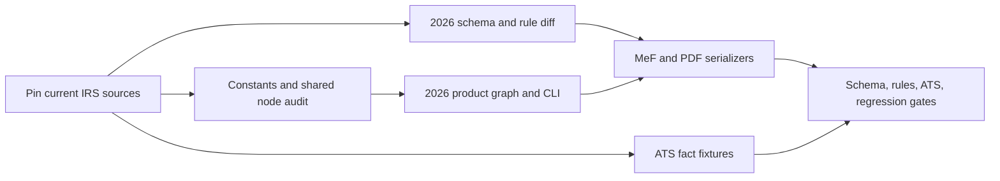

# TY2026 Form 1040 end-to-end implementation plan

Target: a `f1040:2026` return can be created, populated, calculated, validated,
exported to MeF XML and IRS PDF, and checked against TY2026 ATS scenarios for
the complete Form 1040 family supported by the TY2025 implementation. This
plan is based on the 2026-09-27 corpus snapshot. It does not claim current
TY2025 ATS approval or that the May 2026 MeF v1 package is the final target.

## Current state

The TY2026 calculation registry and local calculation validation are
executable, and a growing set of source routes has a reconciled draft-PDF
bundle. They are not registered as a filing product in `catalog.ts`. The
remaining TY2025-supported form surface, current TY2026 MeF XML and rules,
and ATS/XSD checks are open. The May v1 package cannot validate the September
draft Form 1040; the IRS September 24 v4 package must be obtained through
an authorized e-Services/SOR mailbox. Use the current
[implementation entry point](ENTRY-POINT.md),
[`node-coverage.csv`](node-coverage.csv), and generated
[`GRAPH-ROUTES.md`](GRAPH-ROUTES.md) for active route status. The progress
notes below record the order in which work landed and may describe an earlier
state of a node.
The [parity queue](PARITY-QUEUE.md) groups retained TY2025 PDF/MeF surfaces
and TY2026-only attachments into coding waves, with the cross-form evidence
required to close each route.
The [product assembly handoff](PRODUCT-ASSEMBLY.md) names the year-specific
catalog, CLI summary, validation, XML, PDF and submission-archive seams that
must be completed after the individual form routes.
The [MeF binary attachment handoff](MEF-BINARY-ATTACHMENTS.md) records the
four TY2025-generated PDF routes, their TY2026 decisions, caller-supplied
statements, XML references and ZIP acceptance checks.
The [Form 8826/8835 and statement contract](FORM8826-8835-STATEMENTS.md)
closes the TY2025 MeF inventory's distinct credit-form and statement-only
routes, including the 2026 crop-election text change and 5695 statement
sunset.
The [remaining MeF contract](MEF-REMAINDER.md) maps Forms 8911/8978 and
Schedules A plus seven source-linked serializers into 2026 calculation,
PDF and XML evidence.
The [node boundary audit](NODE-BOUNDARY-AUDIT.md) assigns the remaining
TY2025 input and worksheet nodes to route owners before bulk 2026 registry
work, including Form 3800 bypasses and filing-only metadata.
The [Forms 5884/6765/8994 contract](FORM5884-6765-8994-GRAPH.md) pins
source forms and Notice 2026-28, and records the 2026 hire, research
disclosure and paid-leave method changes before Form 3800 routing.
The [Form 3468 contract](FORM3468-GRAPH.md) maps its 2025 comparator's
Parts I–VII to per-facility 2026 eligibility, credit/election evidence,
Form 3800 rows and Form 4255 recapture.
The [Form 4255 contract](FORM4255-GRAPH.md) maps the current recapture form's
credit-use, carryover, EPE/transfer, PWA and emissions ledgers to the revised
2026 Schedule 2 destinations and 646 printable fields.
The [Form 965-A contract](FORM965A-GRAPH.md) maps the continuing liability,
deferral and actual installment history to Schedule 2 line 12. Its January
2021 form/instructions and 413 PDF widgets are pinned; the 2026 Schedule 2
draft omits line 12 from line 15's printed addition and needs resolution.
The [Schedule R contract](SCHEDULER-GRAPH.md) pins its 2026 form and
instructions, maps nine eligibility choices and the credit-limit worksheet,
and inventories all 27 PDF widgets. The shared node misses mixed-age
disability and QSS arithmetic and does not file the schedule.
The [Schedule J contract](SCHEDULEJ-GRAPH.md) pins the 2026 draft and a
marked 2025 instruction comparator, maps three base-year return/tax
branches and inventories 27 PDF widgets. The shared node takes line 23
as an input instead of computing or comparing the election's result.
The [Form 1099-K contract](FORM1099K-GRAPH.md) pins the final 2026 source
form/instructions and maps each payment to one income or personal-sale
route, Schedule 1's header, new cash-tip/TTOC fields and withholding.
The shared $5,000 cutoff incorrectly suppresses taxable receipts.
The [1099-MISC/NEC contract](FORM1099MISC-NEC-GRAPH.md) pins final 2026
forms and combined instructions, maps included cash tips and overtime
to Schedule 1-A, and prevents new source records from duplicating
Schedule C or 1099-K receipts.
The [Form 1099-G contract](FORM1099G-GRAPH.md) pins final 2026 source
authority and maps the currently rejected family-leave, business-refund,
agricultural-payment and CCC-market-gain branches to return owners.
The [Forms 1098/1098-E contract](FORM1098-1098E-GRAPH.md) pins current
source statements and specifies 2026 Schedule A points/MIP, mortgage
allocation, and student-loan eligibility/MAGI work.
The [Form 1098-VLI contract](FORM1098VLI-GRAPH.md) pins the new 2026
vehicle-loan source, final regulations, loan/refund facts and allocation
to Schedule 1-A Part IV or business-interest schedules.
The [Form 3903/educator contract](FORM3903-EDUCATOR-GRAPH.md) pins the 2026
moving form and instructions, all ten PDF widgets, per-move deduction or
taxable reimbursement routes, and educator Schedule A line 17k after the
Schedule 1 limit. Both shared input nodes need 2026 source facts before
registration.
The [Form 8938 contract](FORM8938-GRAPH.md) pins its 2026 draft and
continuous-use instructions, 131 PDF widgets, threshold/exception ledger,
Part III income reconciliation and repeated asset statements. The shared
node produces no filed form; 2026 PDF and MeF support remain open.
The [Form 4852 contract](FORM4852-GRAPH.md) pins its continuous-use form,
correct line 7e/8f withholding labels and 34 PDF widgets. The shared node
needs original/substitute deduplication, printed explanation fields and
reconciliation with the 2026 wage/1099-R/Medicare and withholding owners.
The [RRB statement contract](RRB-1099-GRAPH.md) pins issuer explanations
and IRS 575/915/939 comparators. The shared node mixes RRB-1099 SSEB
with RRB-1099-R pension boxes; the 2026 benefit owner already accepts
RRB-1099, while pension basis, prior-year repayments and separate
withholding require their own source route.
The [Form 8962 contract](FORM8962-GRAPH.md) identifies the 2026 line 27
repayment and reserved lines 28/29, Form 1095-A and Schedule 2/3 graph
handoff, full PDF field map, and the current-instruction/MeF gates.
The [Form 1116 contract](FORM1116-GRAPH.md) pins its 2026 line 18
Schedule 1-A addback and line 20 Schedule 2 tax base, continuous-use
carryover/redetermination schedules, and the current graph/PDF/MeF gaps.
The [Form 2555 contract](FORM2555-GRAPH.md) pins its 2026 $132,900
exclusion, Notice 2026-25 housing limits, 160 PDF fields and distinct
Schedule 1 line 8d/24j destinations. The shared structured filing path
rejects TY2026 and the aggregate housing path conflicts with the 2026
Schedule 1 node.
The [Form 8936 contract](FORM8936-GRAPH.md) pins the 2025 acquisition
cutoff with 2026 placed-in-service eligibility, all four credit routes,
dealer-transfer repayment, 96 PDF fields, and Form 3800/Schedule 2/3
handoffs. The shared node currently rejects 2026 service dates.
The [Form 8889 contract](FORM8889-GRAPH.md) maps owner-specific HSA limits,
the 2026 eligibility expansions, spouse allocation and testing-period
recapture to Schedule 1 lines 8f/13 and Schedule 2 lines 13c/13d. It
inventories all 27 PDF fields and identifies stale 2025 widget tooltip text.
The [Form 8959 contract](FORM8959-GRAPH.md) pins the 2026 wage/RRTA tax on
Schedule 2 line 17b and SE tax on line 11, with withholding on 1040 line
25c. It maps the changed Part II–IV line positions and all 26 PDF fields.
The [Form 7206 contract](FORM7206-GRAPH.md) maps per-business health-plan
limits, LTC age caps, Form 2555 and Marketplace PTC coordination, and all
16 PDF fields. The shared node's aggregate profit/PTC shortcut and TY2025
PDF mapping cannot produce a filed 2026 attachment.
The [Form 8853 contract](FORM8853-GRAPH.md) maps Archer/Medicare Advantage
MSA contributions/distributions, the 2026 $430 LTC per-diem amount and
multi-payee statement, Form 8889 contribution handoff, Schedule 1/2 lines,
and all 38 PDF fields. The shared node misses the prior-year MSA tax worksheet.
The [Form 8829 contract](FORM8829-GRAPH.md) maps each home to its Schedule C
activity, the SALT/AGI iteration, casualty and depreciation order, 2027
carryforwards and all 58 PDF fields. The shared node loses line 43/44
carryforwards and its TY2025 PDF mapping reverses the area fields.
The [Form 4562 contract](FORM4562-GRAPH.md) makes asset/activity depreciation
and return-wide section 179 allocation explicit, maps all 271 draft widgets,
and identifies the old Schedule 1 line 13 output as incompatible with 2026.
Notice 2026-11, QPP guidance and prior-year comparators are pinned; final 2026
instructions and current MeF remain gates.
The [Form 461 contract](FORM461-GRAPH.md) pins the 2026 return-wide excess-
business-loss worksheet, its Schedule 1 line 8p addback and future NOL record.
The current per-source threshold shortcut can miss or overstate losses; the
2025 PDF descriptor targets the 2026 name field instead of line 16.
The [Form 8582 contract](FORM8582-GRAPH.md) maps the active-rental and
other-passive partitions, modified-AGI allowance, Parts IV–IX loss allocation,
source-schedule destinations and 205 draft PDF widgets. The current node
collapses carryforwards and excludes every MFS filer from Part II.
The [Form 6198 contract](FORM6198-GRAPH.md) pins the current continuous-use
form/instructions and maps the at-risk stage ahead of Forms 8582 and 461.
Its 34-widget PDF has no tooltips; the current TY2025 descriptor puts income
in the activity-description field and the shared node loses per-item losses.
The [Form 4684 contract](FORM4684-GRAPH.md) maps casualty events and property,
the draft state-declaration and qualified-disaster split, Section B's
Schedule A/Form 4797 routes, Ponzi and §165(i) branches, and all 162 PDF
widgets. The 2026 instructions and current MeF remain acceptance gates.
The [Form 4797 contract](FORM4797-GRAPH.md) maps its renumbered Part I–IV
lines, per-asset disposition and recapture ledger, Form 4684 casualty
feedback, five-year §1231 history, QPP use change and 188 PDF widgets.
Its TY2025 MeF and shared aggregate node cannot file the complete 2026 form.
The [Form 6252 contract](FORM6252-GRAPH.md) maps the continuing installment
obligation, sale-year and future payments, related-party/deemed receipts,
recapture and 49 PDF widgets. The 2026 form embeds its instructions, which
still cite obsolete Form 4797 line numbers; final reconciliation is a gate.
The [Form 8824 contract](FORM8824-GRAPH.md) maps multi-property §1031,
deferred basis, related-party disposition, recapture and the separate §1043
sale. Its 68 PDF widgets are inventoried; the draft also names old Form 4797
destinations that require final-source correction.
The [Form 8990 contract](FORM8990-GRAPH.md) maps the $32 million 2026
gross-receipts threshold, source-keyed deductible and capitalized interest,
ATI, pass-through EBIE/ETI/EBII and CFC branches. Its 138 draft PDF widgets
are inventoried; the shared Schedule 1 addback loses source deductions.
The [Form 4952 contract](FORM4952-GRAPH.md) maps investment-interest income,
the qualified-dividend/capital-gain tax election, AMT carryforwards and
Schedule A/6198/E destinations. Its 2026 form embeds instructions and has
17 PDF widgets; the shared node currently demands AMT inputs unconditionally.
The [Form 6781 contract](FORM6781-GRAPH.md) maps section 1256 accounts,
straddle positions, election boxes, current-year loss carryback and
Schedule D/Form 8949 destinations. Its 2026 form embeds instructions and
has 71 PDF widgets; the shared node covers only simple 60/40 totals.
The [Form 8615 contract](FORM8615-GRAPH.md) maps child eligibility and
unearned-income sources, parent and sibling return facts, preferential-rate
tax worksheets, Form 2555 and the child's Form 1040 line 16. Its 32 draft
PDF widgets are inventoried; the shared calculator covers ordinary tax only.
The [Form 8814 contract](FORM8814-GRAPH.md) maps the alternative parent
election, per-child eligible source income, allocated dividend/capital gain,
tax and AMT/NIIT/PTC effects. Its 26 draft PDF widgets are inventoried;
eligibility and specialist source details need 2026 graph/MeF work.
The [Form 8997 contract](FORM8997-GRAPH.md) uses the new draft and Notice
2026-40 to map legacy QOF gain recognized at the end of the 2026 deferral
period, split Part III A/B, reserved Part IV and post-deferral Part V.
Its 461 widgets are inventoried; the two shared QOF nodes disagree on
gain character and neither supplies a complete 2026 Form 8949/MeF route.
The [Form 8621 contract](FORM8621-GRAPH.md) uses the current December 2025
revision and the 2026 Schedule 2 draft to map PFIC/QEF ordinary and capital
income, section 1291 tax, Part VI section 1294 deferred-tax interest and
new Schedule 2 lines 19a/b. Its 151 widgets are inventoried; the shared
node still routes interest to old line 17p and lacks the Part VI ledger.
The [Form 4972 contract](FORM4972-GRAPH.md) uses the 2026 draft's embedded
instructions to map per-participant lump-sum elections, the Part II-only
ordinary-income remainder and the tax added to 1040 line 16 box 2. Its
58 widgets are inventoried; NUA, multi-recipient allocation and current
MeF remain.
The [Form 8815 contract](FORM8815-GRAPH.md) pins the 2026 savings-bond
education exclusion, Schedule B line 3 and 23 PDF widgets. The shared
calculator uses MFJ thresholds for QSS despite the printed single/HOH/QSS
range; the TY2025 PDF descriptor also maps amounts into line 1 identity
fields, so both routes need correction before 2026 registration.
The [Form 8915-F contract](FORM8915F-GRAPH.md) pins the newly found
December 2026 draft and a prior-year instruction comparator. Its 102 widgets
and Parts I–IV require a per-disaster distribution/repayment ledger; the
shared node's $100,000 cap and Schedule 1 line 8z output conflict with the
draft's $22,000-per-disaster limit and 1040 lines 4b/5b destinations.
The [Form 8915-D source decision](FORM8915D-STATUS.md) pins the latest
2024 form/instructions. Its 2019-disaster repayment period ended in 2024,
so the shared node's `repayments_in_2025` and Schedule 1 line 8z output
must not be carried into a 2026 filing; retain only the older-year
amendment history unless the IRS issues a newer revision.
The [Form 8912 contract](FORM8912-GRAPH.md) pins its current continuous-use
form/instructions and 218 PDF widgets. Schedule 3 line 6k persists in the
2026 draft; the existing shared schema blocks 2025-origin carryforwards and
does not calculate pass-through CREB, while current MeF remains to verify.
The [Form 982 contract](FORM982-GRAPH.md) pins the current 2018 form and
2021 instructions, 27 PDF widgets and the 2026 written-agreement QPRI gate.
The shared 1099-C source lacks that agreement date, the calculator drops
fully excluded attachments, and TY2025 PDF fields point at wrong lines;
Part II attribute reductions and current MeF remain to build.
The [Form 8834 contract](FORM8834-GRAPH.md) pins the October 2024 form,
whose embedded instructions apply from 2024 onward, and its 11 widgets.
Only Form 8582-CR-released legacy passive credits enter line 1; the
2026 Schedule 3 line 6i route persists, with current MeF and credit-order
reconciliation to verify.
The [Form 4136 contract](FORM4136-GRAPH.md) pins the 2026 main form plus
2025 Schedule A and combined instructions as comparators. It requires one
Schedule A per qualifying business activity for multi-activity claims,
reconciles line 17 to Schedule 3 line 12, and holds PDF/MeF acceptance for
the current Schedule A and XSD/rules.
The [Form 8960 contract](FORM8960-GRAPH.md) maps NIIT across investment
income, activity dispositions, allocable expenses and the §911 MAGI
worksheet. The registered 2026 graph/PDF slice lacks printed lines 5c, 6
and 9c, election boxes, and a current MeF serializer; all 38 draft widgets
are inventoried.
The [Forms 4137/8919 contract](FORM4137-8919-GRAPH.md) maps tips and
misclassified wages through 1040 lines 1c/1g, Form 8959, and Schedule 2
lines 16a/16b with a shared $184,500 Social Security wage base. Its pinned
2026 drafts embed instructions. Form 8919's shared reason-code enum and
TY2025 Schedule 2 output are wrong for 2026; Form 4137's own Schedule 2
cross-reference conflicts with the newer Schedule 2 draft.
The [Form 8839 contract](FORM8839-GRAPH.md) maps the 2026 per-child
adoption credit, $5,120 refundable ceiling, employer-benefit exclusion,
nonrefundable carryforward and Schedule 3-A handoff. The shared node has
partial calculations, but not a complete 2026 child/source ledger, PDF
record or current MeF serializer; all 101 draft widgets are inventoried.
The [Forms 8396/8859/8880 contract](FORM8396-8859-8880-GRAPH.md) separates
the mortgage certificate's interest-deduction reduction and three-year
credit ledger, DC carryforward-only limitation, and 2026 saver-credit
eligibility/distribution window. Their draft forms include instructions and
26/9/23 PDF widgets; the shared nodes have unbounded or unresolved
credit-limit paths and no complete 2026 filing output.
The [Form 7217 contract](FORM7217-GRAPH.md) adds the current 2024+ form,
instructions and April 2026 K-1 box 19 correction to the partnership
distribution ledger. The shared node blocks recognized gain and does not
derive the property-basis handoff; the 306-widget PDF and TY2026 MeF route
remain to build, with the ATS 12 source inconsistency held as a failing case.
The [scenario 12 contract](ATS-SCENARIO-12.md) and
[business credit graph](GENERAL-BUSINESS-CREDIT-GRAPH.md) cover the remaining
broad 1040 ATS packet. Form 7207 must feed a source-backed 2026 Form 3800
with Schedule A transfer evidence before Schedule 3; Form 7205/7220 and
Form 4562-B feed the same Schedule C activity. The packet's inconsistent
Form 3800 tax amount and registration, missing signed binary, and blank
apprenticeship section are explicit fixture failures until reconciled.
The [Schedule E implementation contract](SCHEDULEE-GRAPH.md) now gives the
next property/K-1 activity build order and the new line 13a split from other
interest. It covers PDF, MeF, and ATS 3/6 acceptance; the route remains
`audit-required` in the ledger.
The [ATS scenario 6 contract](ATS-SCENARIO-06.md) identifies the W-2G box
contract and Schedule 1 line 8b route, the partnership Part II income/loss
columns, dependent earned-income and overtime decisions, and missing K-1
evidence. Its provisional total-income bridge is $5,700.
The [ATS scenario 2 contract](ATS-SCENARIO-02.md) makes statutory W-2 income
ownership a concrete graph gate: James's W-2 box 1 belongs on Schedule C,
while June's belongs on Form 1040 line 1a. It also isolates the Schedule A/
Form 8283 versus standard-deduction inconsistency and the checked EIC opt-out.
The [Schedule C contract](SCHEDULEC-GRAPH.md) maps all 109 draft PDF widgets,
the 2026 line 16b/16c and vehicle-mileage labels, source ownership, and the
unused statutory-W-2 output in the shared node. It sets the PDF/MeF/ATS 2
acceptance order.
The [ATS scenario 5 contract](ATS-SCENARIO-05.md) specifies Form 8888's
refund-dependent checking remainder, savings allocation, 20-widget PDF map,
and current MeF rules. Its packet embeds a December form while the public
draft/instructions are November revisions; the form's attachment indicator
is blank in the packet and must be reconciled for a completed return.
The [ATS scenario 4 contract](ATS-SCENARIO-04.md) extracts the 18-page
HOH/dependent-credit case and marks its blank Form 8862 selections,
incomplete AOTC institution EIN, 1098-T exception, moving expense, and
Form 2441 student box as explicit source gates. The
[credit recertification/EIC/education contract](FORM8862-8863-EIC-GRAPH.md)
pins continuous-use Form 8862 and its instructions, inventories its PDF and
Schedule EIC widgets, and specifies the credit worksheet and graph order.
The [Schedule F contract](SCHEDULEF-GRAPH.md) isolates the 2026 line 21b
vehicle-interest change from the shared TY2025 21b other-interest input and
maps the farm calculation, PDF, MeF, and ATS scenario 3 gates.
The [Form 4835 contract](FORM4835-GRAPH.md) maps the pinned one-page form and
instructions, including line 19b vehicle interest and its distinct Schedule
E/SE routing. [ATS scenario 3](ATS-SCENARIO-03.md) now has page-level source
facts and independently calculated intermediate amounts, with the missing
farm optional Schedule SE method named as an implementation dependency.
The [Schedule SE contract](SCHEDULESE-GRAPH.md) maps both optional methods,
the owner/source boundary, all 27 draft PDF fields, and the exact current
graph/serializer gaps. Its ATS scenario 3 case can be implemented without
re-researching the source lines, subject to current MeF and rounding checks.
The [QBI/cooperative contract](QBI-COOPERATIVE-GRAPH.md) pins Form 1099-PATR
and all four Form 8995-A schedules, flags the shared input's incorrect 1099-PATR
box labels, and specifies the per-business Schedule D reduction and cooperative
DPAD routes. The 2026 Form 8995-A instructions remain a source gate.

## Chronological progress notes

Progress after this snapshot: `FormDefinition.validation` now owns a field
registry and rule set; `tax validate` and both export paths select that bundle
from the return definition. TY2025 supplies its existing artifacts. The
TY2026 validation bundle, full node graph, MeF/PDF builders, and catalog entry
remain to build. A dedicated `forms/f1040/2026/{inputs,start,registry}.ts` now
executes the audited wages and tip calculation slice through the standard
planner/executor. The generic start-node factory is shared at
`forms/f1040/start.ts`; TY2025 retains its old import path as a re-export.
`forms/f1040/2026/settlement.ts` implements and tests the changed payment and
Schedule 3-A arithmetic but is not wired into a return yet.
The shared Form 8962 node now selects TY2025 or TY2026 applicable percentage,
repayment cap, and QSEHRA affordability rules explicitly; 2026 FPL figures
are sourced from the 2025 HHS guideline PDF. The final Form 8962 instruction
table remains outstanding.
`forms/f1040/nodes/config/2026-indexed.ts` now holds all 111 source-backed 2026
config members, including tax brackets, standard deduction, AMT, capital-gain,
HSA, IRA, QBI, EITC, and other amounts. The QBI config distinguishes the TY2026
MFS threshold from other nonjoint statuses and shares one threshold selector
across the nodes.
`forms/f1040/nodes/config/2026.ts` now implements the complete `F1040Config`
and registers it in `CONFIG_BY_YEAR`. W-2 validation distinguishes standard
and enhanced SIMPLE limits, including the age 60–63 catch-up tier. A missing
age uses the under-50 limit, so a catch-up amount requires age evidence.
Registration makes shared nodes callable for TY2026; it does not register a
TY2026 return product or prove that every shared node has the right TY2026
logic. The 2026 Form 982 QPRI path now requires a 2026 discharge date and a
written agreement before 2026. Its cap remains $750,000 ($375,000 MFS) for
eligible legacy agreements.
The shared `general` node now uses the selected tax year for dependent CTC,
ODC, and EITC age tests, and it uses Rev. Proc. 2025-32 §4.23's $5,300
qualifying-relative gross-income ceiling for TY2026. Its TY2025 regression
tests and TY2026 boundary tests pass.
The `auto_expense` and Form 2106 nodes now use the two 2026 business-mileage
rates and require period miles to reconcile to the annual total. Their focused
TY2025 and TY2026 tests pass; medical/moving mileage still needs review.
Form 8621 Part V now derives its event dates, three-year distribution history,
and current/prior-year allocations from the selected return year. The TY2025
and TY2026 excess-distribution tests pass.
Rev. Proc. 2026-15 is pinned for passenger autos first placed in service in
2026, and Rev. Proc. 2025-16 supports the TY2025 regression correction. Form
4562 must select the cap table by the vehicle's placed-in-service year, not
merely the return year, before TY2026 old-vehicle scenarios are complete.
The shared Form 2441 detailed and aggregate calculations now select explicit
TY2025/TY2026 benefit limits and credit rates, with 2026 phaseout boundaries
tested. Its TY2026 MeF/PDF serializers remain outstanding.
`forms/f1040/2026/deductions.ts` implements the new 1040 lines 12e–15, and
the prior CLI type-check errors have been cleared. Neither pure 2026
calculator is connected to a registered graph yet.
`forms/f1040/2026/nodes/f1040.ts` now assembles the changed core 1040 lines
from final upstream amounts using the 2026 deduction and settlement
calculators. It emits a `schedule3a` node when a relevant refundable credit is
claimed. This node is not registered yet; it still needs the full upstream
input surface, form-specific credit reconciliation, and MeF/PDF mappings.
It now also exposes separate AGI 11a/11b, withholding 25a–25d, EIC 27b/27c,
and overpayment allocation 35a/36, with focused calculation tests.
The pure 2026 itemized-deduction module applies P.L. 119-21's charitable
floor and the Publication 505 overall limit. The 2026 Schedule A node still
needs to feed these rules, including carryforward attribution and its new
form lines.
`forms/f1040/2026/schedule-a.ts` now assembles the changed Schedule A totals
from already allowed amounts, with 2026 SALT limits and line 18 reduction.
The [deduction graph contract](DEDUCTION-GRAPH.md) identifies the Schedule A ↔
QBI dependency and the joint resolver required before registering itemizers;
the source and carryforward nodes are still to implement.
The dedicated 2026 standard-deduction node now selects standard or itemized,
applies the dependent and age/blindness amounts, computes the nonitemizer
charitable deduction, and feeds taxable income and draft 2026 Form 6251 values
to the shared income-tax node. A focused calculation graph reaches the 2026
1040 with no direct 1040 input. Income and deduction source nodes are not yet
connected to that graph.
The shared AGI aggregator now has explicit 2025/2026 downstream shapes. For
2026 it sends total income and adjustments to the 2026 deduction node, so that
node and the final 1040 derive the same AGI. A graph test reaches the 2026
1040 from income facts and preserves taxable Social Security and Schedule 1
additional income. It does not yet include the full W-2/general input graph.
The focused graph now accepts multiple actual W-2 input records and reaches
1040 wages, tax, withholding, and refund. The shared W-2 node's 2026 config
tests also cover retirement limits. The remaining W-2 downstream form
branches are still outside this calculation slice.
The shared general input reaches the focused TY2026 graph with dependent
details. The 2026 Form 1040 node preserves filer identity and address fields;
AGI and deduction resolution supply one filing-status value to avoid duplicate
graph inputs. The dedicated 2026 Schedule 8812 node now finalizes CTC/ACTC for
credit-category dependents and routes lines 14/27 to Form 1040 lines 19/28.
The draft PDF bundle prints dependent rows, continuations, and Schedule 8812.
The full Schedule 3 credit-source and MeF paths are still open.
The shared Schedule 1-A node now emits its 2026 line 15/27/36/43/44 results
and sends lines 43/44 to the 2026 deduction node. AGI adds Form 2555 amounts
back for Schedule 1-A MAGI in 2026. W-2 code TP/TT records now feed employee
tips/overtime into Schedule 1-A and through the 1040 calculation graph, with
the official 2026 W-2 instructions pinned in the corpus. W-2 TP and Form 4137
line 1(c) now reconcile by filer and employer with the larger-of rule. Mixed
occupations require an explicit qualified amount, and a focused graph test
carries the resulting deduction, unreported tip income, and Schedule 2 tip
tax to 1040. Puerto Rico/Form 4563 MAGI addbacks remain. The graph now
matches W-2 allocated tips to the Form 4137 recipient by employee SSN. The
shared 2025 W-2 source shape retains its recipient field; TY2026 carries the
employee SSN and general identity to Form 4137 so a taxpayer W-2 is not
mistaken for a spouse W-2. The graph rejects allocated tips with an unmatched
SSN. The TY2026 1040 node rejects a nonzero Schedule 2 credit-limit amount
until the 2026 credit
finalization path exists; it does not silently discard that upstream field.
The draft 2026 Schedule 2 reorders additional tax lines. The pure
`forms/f1040/2026/schedule2.ts` now computes its filed subtotals, and the
[Schedule 2/8812 map](SCHEDULE2-8812.md) records each upstream source split.
The focused tip-tax graph now uses the 2026 Schedule 2 node: Form 4137 reaches
line 16a and W-2 A/B/M/N reach line 17c; the node sends line 3 and line 21
totals to 1040. Other tax-source splits remain. Schedule 8812 now has a
TY2026 Part II-B shape for Schedule 2 lines
16c and 17c, with graph reconciliation of those line amounts. Its credit
limit, earned-income, and 1040 output paths are now in the 2026 registry;
Schedule 3 source reconciliation and broader Part II-B graph cases remain.
The draft 2026
Schedule 8812 instructions are pinned; Credit Limit Worksheet A now uses the
2026 Schedule 3 line list and rejects the 2025 worksheet shape. Worksheet B
line 15 now sums the four 2026 Schedule 3 credit lines; graph reconciliation
remains. Code Z explicitly
fails until its 409A tax and interest path exists.
The shared Form 8839 node now splits the credit into refundable 1040 line 30
and nonrefundable Schedule 3 amounts for both TY2025 and TY2026, using each
year’s per-child cap and MAGI phaseout. It now consumes and emits nonrefundable
carryforwards by origin year; the full credit-limit worksheet remains
outstanding.
The CLI node list, inspect, and graph commands now accept `--year` and select
the registered definition for that year. They still default to TY2025 for
existing CLI calls; an unregistered year fails explicitly.
The TY2025 MeF builder now skips absent optional form serializers instead of
passing each an empty array. This resolved the Form 8283 parser failure;
three builder fixtures were updated to give Form 1116 the matching Schedule 3
foreign-tax-credit field. Its 130 tests pass. The complete TY2025 regression
suite still needs a separate run before that release gate is green.
The draft 2026 Form 1040's 207 AcroForm fields are inventoried with tooltips,
widget coordinates, and physical pages in `pdf-fields-f1040.csv`. The
[Form 1040 PDF map](PDF-F1040-MAP.md) identifies changed 2026 line fields and
the new authorization/dependent checkbox groups. The dedicated main-form
descriptor and filler produce a two-page draft 1040 from a wages-only graph
result and dependent continuations from the revised first-page table. The
draft Schedule 8812 filler reconciles its credit lines and appends two pages
when a credit is filed; both forms passed visual QA. The full PDF bundle
remains open across the rest of the supported 2025 surface.
The dedicated 2026 Schedule 3 node and draft PDF now route excess Social
Security withholding from two W-2s through line 11, line 15, and Form 1040
line 31. It leaves reserved 2026 line 5b blank, models new line 13e, and
sends credit source amounts to Schedule 8812 for worksheet reconciliation.
The combined three-page PDF passed visual QA. Other Schedule 3 sources remain
open.
The [MeF v1 drift review](MEF-V1-DRIFT.md) confirms the downloaded May package
predates 1040 lines 12f, 24a–c, 32a–c, Schedule 3-A, and the new
work-authorization question. IRS announced v4 on September 24 through the
registered e-Services mailbox. Obtain that package before fixing 2026 XML
element names or asserting schema validation.
The [Schedule 3-A PDF map](PDF-SCHEDULE3A-MAP.md) records its 16 orphaned
widgets and line-level pending keys. A hash-pinned static overlay now renders
the schedule's header, numbers, and elections; the one-page result passed
visual QA. The two main 1040 pages and Schedule 3-A now merge into a
three-page core PDF when a relevant credit is present, with lines 24a, 31,
32a, and 32b reconciled. Other supported attachments remain to implement.
The 2026 final 1040 node and main-form PDF descriptor now cover the principal
income amounts through line 7a. The node sums accumulated wage and dividend
amounts for the printed lines, and a populated page-1 sample passed text extraction and
visual inspection. The source income nodes and their required attachment
routes still need to enter the dedicated 2026 registry.
The [generated graph route inventory](GRAPH-ROUTES.md) records 37 declared
edges from the current 2026 registry to absent targets; a wages-only return
actually deposits values into 12 of those pending slots. The 2025 registry
contains each target, but each needs its own 2026 behavior and output audit
before adding it to the dedicated graph.
Form 8960 is now in the 2026 registry and emits NIIT on the draft Schedule 2
line 6, while TY2025 keeps its line 12 route. The route to 2026 Form 1040 tax
passes a focused test; the rest of the investment-income graph is still open.
The shared Form 6251 is now in the 2026 calculation registry. Its pinned draft
line 5 exemption and line 7 rate constants agree with the 2026 config; a
focused ISO-adjustment graph test carries AMT to Schedule 2 line 2 and Form
1040 line 17/24a. The [Schedule 2/Form 6251 PDF map](PDF-SCHEDULE2-6251-MAP.md)
inventories 68 and 62 draft widgets, respectively. Their fillers produce
two printed pages each, verify calculation and 1040 totals, and merge with
the 1040 into a six-page sample that passed visual QA. Public ISO input,
other AMT adjustment detail, credit-limit feedback, and MeF still need to be
completed.
The August 2026 [Schedule B instructions](corpus/draft/i1040sb.pdf) are now
hash-pinned. The [interest graph contract](INTEREST-GRAPH.md) records every
1099-INT branch, filing trigger, disclosure, and outstanding attachment path.
The shared 1099-INT node now sends box 2 early-withdrawal penalties to AGI as
well as printed Schedule 1; its focused TY2025 and TY2026-related tests pass.
Full 1099-INT input registration awaits the Schedule B disclosure and
dependent-node work in that contract.
The [Schedule 1 graph contract](SCHEDULE1-GRAPH.md) inventories 73 draft PDF
widgets and the source fields whose old line names no longer describe 2026.
The dedicated 2026 Schedule 1 sink and draft PDF now reconcile a 1099-INT
box 2 penalty to 1040 line 10. A graph-generated five-page
1040/Schedule 1/Schedule B PDF passed visual QA. Public 1099-INT input,
other Schedule 1 source lines, and MeF remain open. Form 1098-E is now a
registered TY2026 input: its raw student-loan deduction is phased out in
AGI, printed on 2026 Schedule 1 line 21, and reconciled to 1040 line 10.
The dedicated 2026 Schedule B node preserves gross interest and labeled
adjustments, validates its line 2/4 totals and required Part III answers, and
routes taxable interest to AGI, NIIT, and the final 1040. A temporary graph
with 1099-INT and W-2 inputs executes through Schedule 2. The
[Schedule B PDF field map](PDF-SCHEDULEB-MAP.md) inventories 72 draft widgets.
The PDF filler now renders the filed page plus payer, seller-financed, and
country continuations. The core PDF builder appends it and reconciles lines
4/6 to 1040 lines 2b/3b. MeF and exceptional interest routes remain to
implement.
The January 2024 continuous-use Form 1099-DIV and instructions are now pinned
in the corpus. The dedicated TY2026 1099-DIV source handles ordinary,
qualified, and exempt-interest dividends, plus federal withholding and
private-activity-bond AMT, through AGI, tax, Form 1040, Schedule B when
required, Form 6251, and the draft PDF. The [branch contract](DIVIDEND-GRAPH.md)
identifies each remaining 1099-DIV box and its required downstream form;
the plain box 2a distribution now passes through the shared Schedule D
filing decision to 1040 line 7a and its line 7b checkbox. The rendered
two-page draft PDF shows both. TY2026 now requires explicit public short- and
long-term carryover amounts, QOF/other-capital-activity answers, and a Form 4952
filing answer before that filing decision. A nonzero carryover takes the filed
Schedule D route; its two-page draft PDF now reconciles the carryover,
distribution, and Form 1040 line 7a in a four-page bundle that passed visual
QA. QOF and unmodeled activity still produce diagnostics. Special-rate
capital gains, QBI, foreign tax, state withholding, nominee,
and basis routes currently fail with named diagnostics. MeF remains open.
The [capital transaction contract](TRANSACTION-GRAPH.md) now pins final 2026
Forms 1099-B/1099-DA and their instructions, the draft Form 8949 field map,
and a marked 2025 Form 8949 instruction comparator. A dedicated 2026 1099-B
source node fixes the shared node's box-12/QOF mislabel and computes supported
short/long trades with basis, selling-expense, and wash-sale adjustments. A
dedicated 1099-DA node handles individual digital-asset sales. Both now run
through the public 2026 graph and the Form 8949/Schedule D PDF attachment
path; a mixed-source return passes end-to-end calculation and PDF tests.
Progress update: 1099-INT and Schedule B Part III answers are now registered
TY2026 inputs. A public graph test carries taxable interest, box 2 penalty,
and withholding to Schedule B, Schedule 1, Form 1040, and the combined PDF.
Foreign tax and affirmed investment-property cases fail before routing until
their Form 1116/4952 attachment paths exist. Treasury bond premium requires an
amortization election for TY2026. A private-activity bond test reaches
Form 6251, Schedule 2, Form 1040, and a six-page PDF. MeF and the remaining
Schedule B disclosures still need end-to-end checks.
The standalone TY2026 validation module now checks the calculated 1040's AGI,
deductions, tax, payments, and required Schedule 1/2/B reconciliation using
pending-field keys. It is a local calculation gate, not a 2026 MeF
business-rule bundle. The standalone PDF builder selects only filed 2026
attachments. A wages-plus-interest graph produces
the expected five-page PDF through this boundary. Catalog registration remains
pending so `tax validate` does not report `canFile` from local-only rules.
The pinned draft Form 8960 now fills and appends its individual page for a
positive NIIT calculation. Its line 17 reconciles with Schedule 2 line 6, and
a high-income wages-plus-interest graph produces a six-page PDF.
The pinned draft Form 4137 now fills one page per recipient and appends a
line 1 employer statement beyond five rows. Its income and tax reconcile
with Form 1040 line 1c and Schedule 2 line 16a. The March 2026 draft
Form 4137 still names Schedule 2 line 5 beside its line 13; the draft
Schedule 2 itself places Form 4137 tax on line 16a. Keep that source
inconsistency visible until the IRS publishes aligned final forms.
The pinned draft Schedule 1-A now prints employee tips, W-2 overtime,
vehicle interest, and senior deductions. It reconciles the final deduction with Form
1040 line 13a and appends row statements beyond five employers or payers.
Positive W-2 overtime carries employer name and EIN; non-W-2 overtime has a
2026 row input with recipient, business, payer TIN, and amount. Its PDF
renderer is mapped, but the public PDF boundary rejects a positive non-W-2
claim until matching Form 1099 and Schedule C/E/F income can be reconciled.
The calculation rejects an amount-only claim for the same recipient alongside
rows. Earlier amount-only overtime inputs remain calculable but cannot print
a positive overtime deduction. Vehicle-interest input now records original
use and US assembly answers. Positive claims print VINs, interest allocation,
and eligibility boxes; a statement carries rows beyond two VINs. Explicit
negative eligibility answers fail calculation, and missing answers block the
PDF. The tip/Form 4137 example builds eight pages; senior-only, overtime,
and vehicle examples build five pages. The AGI node now passes Form 2555
lines 45 and 50 separately, allowing Schedule 1-A Part I to print and
reconcile those MAGI addbacks. Puerto Rico and Form 4563 addbacks still need
source routes before their Part I fields can print.

## 0. Freeze source versions and establish the baseline

1. Record the current branch commit, TY2025 benchmark/test results, and
   `catalog.ts`/`FormDefinition` public interface. Keep TY2025 results as a
   regression baseline.
2. Use `corpus/manifest.json` to pin all public inputs. Retrieve the latest
   2026 IMF release from the registered IRS e-Services SOR and log its release
   date and hash in a private research record. The user's Drive folder holds
   2026v1.0; the IRS public version page lists v4.0 on this snapshot date.
   Diff 2026v1→current and TY2025v5.4→current by XSD element, form namespace,
   document order, required attachment, and active rule ID. Keep raw packages
   in ignored `.state/research/docs/` because this repository is public.
3. Use `node-coverage.csv` (191 registered TY2025 nodes),
   `pdf-coverage.csv` (56 descriptors: 51 current drafts, five older-year
   URLs), `mef-coverage.csv` (84 serializers), `year-literals.csv` (237 non-test
   occurrences), and the current MeF accepted-form XLSX. Give each existing
   component one disposition: **2026 updated**, **2026 verified unchanged**,
   **replaced**, or **unsupported with explicit diagnostic**. Add Schedule 3-A
   and Form 1062 as new rows. Do not silently omit a 2025 supported form.

**Exit:** one versioned coverage ledger and a current schema/rule target.

## 1. Make calculation genuinely year aware

1. Audit the registered `forms/f1040/nodes/config/2026.ts` and its source map
   against final 2026 instructions as they arrive. The config now covers every
   member of `forms/f1040/nodes/config/types.ts`; `CONSTANTS.md` records the
   sources and boundary cases. Registration alone does not validate every
   shared node's 2026 behavior.
2. Review every occurrence in `year-literals.csv`. Split behavior by
   `ctx.taxYear` or a dedicated year implementation where the law/form changed.
   Audit adjacent tables and predicates without a year literal. In particular,
   review Form 8962's 400% FPL and repayment handling, SALT, Schedules 1-A and
   8812, Form 8839 refundable adoption, clean-energy/vehicle sunsets, and
   half-year mileage. Do not route an unknown 2026 case through 2025 values.
3. Build changed line calculations in dependency order: base income and AGI;
   12f charitable deduction and itemized-vs-standard choice; 13a Schedule 1-A
   and 13b QBI; taxable income/tax; Form 1062 amount and 24a/24b/24c; credit
   sources and 32a; Schedule 3-A amount using 24a and 32a; 32b/32c/33;
   refund or balance against 24c. Keep Schedule 3-A's prerequisites upstream
   of the final 1040 output node to avoid a graph cycle.
4. Add input schemas, nodes and pending keys for 2026 work authorization,
   dependent flags, Schedule 3-A eligibility/election data, and Form 1062
   qualified-farmland facts. Validation must reject impossible combinations
   before MeF export.

**Exit:** independent calculation examples cover each changed line and the
edge conditions of every new deduction/credit; all TY2025 calculation tests
still pass. Test both sides of each threshold and July 1 mileage boundary.

## 2. Define and register the TY2026 product

1. Create `forms/f1040/2026/{config,inputs,start,registry,index}.ts` with a
   TY2026 node graph and explicit input registry. Share pure nodes only after
   the audit in step 1; retain separate year configuration and outputs.
2. Extend `core/types/form-definition.ts` only as needed for a year-specific
   validation artifact bundle and current MeF version. Route
   `cli/commands/validate.ts` and `cli/commands/export.ts` through the selected
   `FormDefinition` (completed for the existing TY2025 definition). Fix
   `cli/commands/node.ts` and `cli/commands/graph.ts` to use the selected
   year's registry rather than the hardcoded 2025 one (completed). Review benchmark year
   selection and CLI summaries for `line24_total_tax`/new 24c and 32c.
3. Register `"f1040:2026"` in `catalog.ts` after one executable 2026 return
   completes the calculation and validation path. Registration is a milestone,
   not the release gate.

**Exit:** `tax return create`, input addition, form view, graph/node inspection,
validation and summary all select the same year. Unknown years fail clearly.

## 3. Build 2026 MeF and PDF outputs

1. Create `forms/f1040/2026/mef` from the **current** 2026 XSD/rules: return
   header, namespace/version, form serializers, document order, dependency and
   attachment registry, field maps, XML validations, and rule diagnostics.
   Include Schedule 3-A, Form 1062, changed 1040 line structure and all
   retained components in the coverage ledger. Use the current XSD to decide
   element names; a printed form line is not an XML name.
2. Create `forms/f1040/2026/pdf` from the final 2026 fillable forms. Map each
   changed field and checkbox, including 12f, 13a/13b, 24a–c, 30, 32a–c,
   work authorization, and dependent flags. Preserve a PDF field provenance
   table and verify generated pages visually for the changed forms.
3. Add year-specific field and business-rule registries. Update the CLI export
   and validate commands to select them by `FormDefinition`. Validate XML
   against current 2026 XSD and exercise active reject rules relevant to every
   supported form. Store source version/hash with validation evidence.

**Exit:** every retained 2025 output surface has a documented 2026 disposition;
source-backed examples generate readable PDFs and schema-valid 2026 XML. No
2025 namespace, form, or PDF file is selected by a 2026 return.

## 4. Build ATS fixtures and release evidence

1. Use `ATS.md` and the committed PDFs to create one fixture per relevant
   linked 1040 scenario. Transcribe source facts separately from expected
   computed outputs, note corrections and blank/inconsistent printed totals,
   and attach a source page for each fact. Include all required forms and
   attachments in each scenario, not merely the 1040 totals.
2. Validate scenario XML against the selected 2026 XSD, run applicable active
   business rules, compare calculated amounts with independently derived
   expectations, and inspect PDF fields. Add targeted fixtures for new 2026
   paths not present in ATS: charitable 12f, Schedule 3-A amount/election,
   Form 1062 deferral, adoption refund, PTC cliff/repayment, and midyear
   mileage. Handle scenarios 13–14 when IRS publishes links.
3. Run the TY2025 regression suite and benchmark. Confirm a 2025 return still
   selects 2025 constants, fields, rules, namespace and PDFs. Update release
   documentation with exact MeF, ATS and form versions, supported forms, known
   exclusions, and results. Do not claim IRS acceptance merely from local XSD
   validation.

**Exit:** all supported 1040 scenarios and new paths pass with reproducible
fixtures; zero unexplained source-to-output mismatches; TY2025 regression green.

## Work sequencing and dependencies

The current MeF v4+ package is a dependency for final serialization and
conformance. The May v1 package supports discovery and early graph/calculation
work only. Final 2026 forms/instructions may change this plan; update the
corpus, coverage ledger and tests before release.
