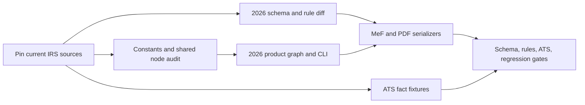

# TY2026 Form 1040 end-to-end implementation plan

Target: a `f1040:2026` return can be created, populated, calculated, validated,
exported to MeF XML and IRS PDF, and checked against TY2026 ATS scenarios for
the complete Form 1040 family supported by the TY2025 implementation. This
plan is based on the 2026-09-27 corpus snapshot. It does not claim current
TY2025 ATS approval or that the May 2026 MeF v1 package is the final target.

Progress after this snapshot: `FormDefinition.validation` now owns a field
registry and rule set; `tax validate` and both export paths select that bundle
from the return definition. TY2025 supplies its existing artifacts. The
TY2026 bundle, node graph, MeF/PDF builders, and catalog entry remain to build.
`forms/f1040/2026/settlement.ts` implements and tests the changed payment and
Schedule 3-A arithmetic but is not wired into a return yet.
The shared Form 8962 node now selects TY2025 or TY2026 applicable percentage,
repayment cap, and QSEHRA affordability rules explicitly; 2026 FPL figures
are sourced from the 2025 HHS guideline PDF. The complete `F1040Config` for
2026 and final Form 8962 instruction table remain outstanding.
`forms/f1040/nodes/config/2026-indexed.ts` now holds 91 source-backed 2026
config members, including tax brackets, standard deduction, AMT, capital-gain,
HSA, IRA, QBI, EITC, and other indexed amounts. The QBI config distinguishes the TY2026 MFS threshold from
other nonjoint statuses and shares one threshold selector across the nodes.
This is not yet a complete or registered `F1040Config`.
The remaining 20 members are grouped below so source review and implementation
can proceed without repeating the config inventory:

| Source target | Remaining `F1040Config` members |
| --- | --- |
| Final Schedule 8812 instructions and §24 | `actcEarnedIncomeFloor`, `ctcPhaseOutThresholdMfj`, `ctcPhaseOutThresholdOther`, `odcPerDependent` |
| 2026 Schedule A instructions and SALT statute | `saltFloor`, `saltFloorMfs`, `saltPhaseoutRate` |
| 2026 retirement/benefit forms and notices | `retirementLimits`, `sepContributionRate`, `simpleEmployerMatchRate`, `psoExclusionLimit`, `deathBenefitMax`, `mdaMax`, `mdaPhaseOutThreshold`, `mdaZeroThreshold` |
| 2026 Forms 982, 2106, 8396 and Schedule B | `qpriCapMfs`, `qpriCapStandard`, `f2106PerformingArtistAgiLimit`, `mccMaxCreditHighRate`, `scheduleBDividendThreshold` |

The current `retirementLimits` shape may need to distinguish enhanced SIMPLE
limits and age 60–63 catch-ups. Specify those cases before adding 2026 values.
Rev. Proc. 2026-15 is pinned for passenger autos first placed in service in
2026, and Rev. Proc. 2025-16 supports the TY2025 regression correction. Form
4562 must select the cap table by the vehicle's placed-in-service year, not
merely the return year, before TY2026 old-vehicle scenarios are complete.
The shared Form 2441 detailed and aggregate calculations now select explicit
TY2025/TY2026 benefit limits and credit rates, with 2026 phaseout boundaries
tested. Its TY2026 MeF/PDF serializers remain outstanding.
`forms/f1040/2026/deductions.ts` implements the new 1040 lines 12e–15, and
the prior CLI type-check errors have been cleared. Neither pure 2026
calculator is connected to a registered graph yet.
`forms/f1040/2026/nodes/f1040.ts` now assembles the changed core 1040 lines
from final upstream amounts using the 2026 deduction and settlement
calculators. It emits a `schedule3a` node when a relevant refundable credit is
claimed. This node is not registered yet; it still needs the full upstream
input surface, form-specific credit reconciliation, and MeF/PDF mappings.
The CLI node list, inspect, and graph commands now accept `--year` and select
the registered definition for that year. They still default to TY2025 for
existing CLI calls; an unregistered year fails explicitly.

## 0. Freeze source versions and establish the baseline

1. Record the current branch commit, TY2025 benchmark/test results, and
   `catalog.ts`/`FormDefinition` public interface. Keep TY2025 results as a
   regression baseline.
2. Use `corpus/manifest.json` to pin all public inputs. Retrieve the latest
   2026 IMF release from the registered IRS e-Services SOR and log its release
   date and hash in a private research record. The user's Drive folder holds
   2026v1.0; the IRS public version page lists v4.0 on this snapshot date.
   Diff 2026v1→current and TY2025v5.4→current by XSD element, form namespace,
   document order, required attachment, and active rule ID. Keep raw packages
   in ignored `.state/research/docs/` because this repository is public.
3. Build a coverage ledger from `pdf-coverage.csv` (56 descriptors: 51 current
   drafts, five older-year URLs),
   `mef-coverage.csv` (84 serializers), `year-literals.csv` (244 non-test
   occurrences), and the current MeF accepted-form XLSX. Give each existing
   component one disposition: **2026 updated**, **2026 verified unchanged**,
   **replaced**, or **unsupported with explicit diagnostic**. Add Schedule 3-A
   and Form 1062 as new rows. Do not silently omit a 2025 supported form.

**Exit:** one versioned coverage ledger and a current schema/rule target.

## 1. Make calculation genuinely year aware

1. Implement `forms/f1040/nodes/config/2026.ts` against all members in
   `forms/f1040/nodes/config/types.ts`; register it in
   `forms/f1040/nodes/config/index.ts`. `CONSTANTS.md` is the source checklist.
   Record source section and boundary cases alongside each group of values.
2. Review every occurrence in `year-literals.csv`. Split behavior by
   `ctx.taxYear` or a dedicated year implementation where the law/form changed.
   Audit adjacent tables and predicates without a year literal. In particular,
   review Form 8962's 400% FPL and repayment handling, SALT, Schedules 1-A and
   8812, Form 8839 refundable adoption, clean-energy/vehicle sunsets, and
   half-year mileage. Do not route an unknown 2026 case through 2025 values.
3. Build changed line calculations in dependency order: base income and AGI;
   12f charitable deduction and itemized-vs-standard choice; 13a Schedule 1-A
   and 13b QBI; taxable income/tax; Form 1062 amount and 24a/24b/24c; credit
   sources and 32a; Schedule 3-A amount using 24a and 32a; 32b/32c/33;
   refund or balance against 24c. Keep Schedule 3-A's prerequisites upstream
   of the final 1040 output node to avoid a graph cycle.
4. Add input schemas, nodes and pending keys for 2026 work authorization,
   dependent flags, Schedule 3-A eligibility/election data, and Form 1062
   qualified-farmland facts. Validation must reject impossible combinations
   before MeF export.

**Exit:** independent calculation examples cover each changed line and the
edge conditions of every new deduction/credit; all TY2025 calculation tests
still pass. Test both sides of each threshold and July 1 mileage boundary.

## 2. Define and register the TY2026 product

1. Create `forms/f1040/2026/{config,inputs,start,registry,index}.ts` with a
   TY2026 node graph and explicit input registry. Share pure nodes only after
   the audit in step 1; retain separate year configuration and outputs.
2. Extend `core/types/form-definition.ts` only as needed for a year-specific
   validation artifact bundle and current MeF version. Route
   `cli/commands/validate.ts` and `cli/commands/export.ts` through the selected
   `FormDefinition` (completed for the existing TY2025 definition). Fix
   `cli/commands/node.ts` and `cli/commands/graph.ts` to use the selected
   year's registry rather than the hardcoded 2025 one (completed). Review benchmark year
   selection and CLI summaries for `line24_total_tax`/new 24c and 32c.
3. Register `"f1040:2026"` in `catalog.ts` after one executable 2026 return
   completes the calculation and validation path. Registration is a milestone,
   not the release gate.

**Exit:** `tax return create`, input addition, form view, graph/node inspection,
validation and summary all select the same year. Unknown years fail clearly.

## 3. Build 2026 MeF and PDF outputs

1. Create `forms/f1040/2026/mef` from the **current** 2026 XSD/rules: return
   header, namespace/version, form serializers, document order, dependency and
   attachment registry, field maps, XML validations, and rule diagnostics.
   Include Schedule 3-A, Form 1062, changed 1040 line structure and all
   retained components in the coverage ledger. Use the current XSD to decide
   element names; a printed form line is not an XML name.
2. Create `forms/f1040/2026/pdf` from the final 2026 fillable forms. Map each
   changed field and checkbox, including 12f, 13a/13b, 24a–c, 30, 32a–c,
   work authorization, and dependent flags. Preserve a PDF field provenance
   table and verify generated pages visually for the changed forms.
3. Add year-specific field and business-rule registries. Update the CLI export
   and validate commands to select them by `FormDefinition`. Validate XML
   against current 2026 XSD and exercise active reject rules relevant to every
   supported form. Store source version/hash with validation evidence.

**Exit:** every retained 2025 output surface has a documented 2026 disposition;
source-backed examples generate readable PDFs and schema-valid 2026 XML. No
2025 namespace, form, or PDF file is selected by a 2026 return.

## 4. Build ATS fixtures and release evidence

1. Use `ATS.md` and the committed PDFs to create one fixture per relevant
   linked 1040 scenario. Transcribe source facts separately from expected
   computed outputs, note corrections and blank/inconsistent printed totals,
   and attach a source page for each fact. Include all required forms and
   attachments in each scenario, not merely the 1040 totals.
2. Validate scenario XML against the selected 2026 XSD, run applicable active
   business rules, compare calculated amounts with independently derived
   expectations, and inspect PDF fields. Add targeted fixtures for new 2026
   paths not present in ATS: charitable 12f, Schedule 3-A amount/election,
   Form 1062 deferral, adoption refund, PTC cliff/repayment, and midyear
   mileage. Handle scenarios 13–14 when IRS publishes links.
3. Run the TY2025 regression suite and benchmark. Confirm a 2025 return still
   selects 2025 constants, fields, rules, namespace and PDFs. Update release
   documentation with exact MeF, ATS and form versions, supported forms, known
   exclusions, and results. Do not claim IRS acceptance merely from local XSD
   validation.

**Exit:** all supported 1040 scenarios and new paths pass with reproducible
fixtures; zero unexplained source-to-output mismatches; TY2025 regression green.

## Work sequencing and dependencies

The current MeF v4+ package is a dependency for final serialization and
conformance. The May v1 package supports discovery and early graph/calculation
work only. Final 2026 forms/instructions may change this plan; update the
corpus, coverage ledger and tests before release.
