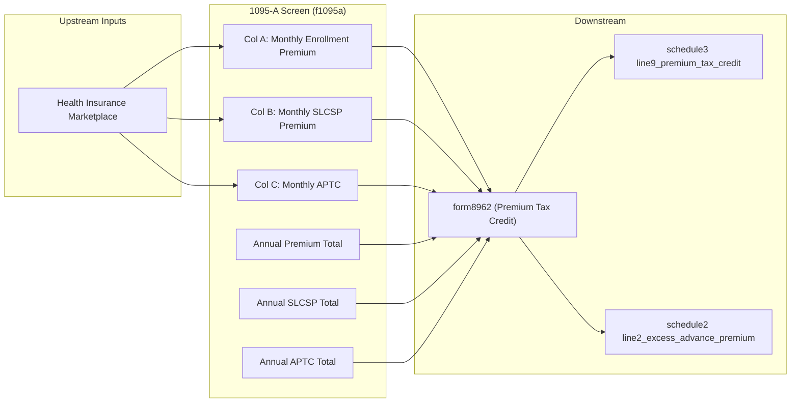

# Form 1095-A — Health Insurance Marketplace Statement

## Overview
Form 1095-A is issued by Health Insurance Marketplaces and reports the monthly enrollment premiums, the applicable second-lowest-cost silver plan (SLCSP) premiums, and the advance payments of the premium tax credit (APTC) paid on behalf of the enrollee. This data is the sole input needed to compute the Premium Tax Credit on Form 8962. The 1095-A node aggregates across all policies and passes monthly arrays to form8962 for PTC reconciliation.

**IRS Form:** 1095-A
**Drake Screen:** 1095, 95A
**Tax Year:** 2025
**Drake Reference:** https://kb.drakesoftware.com/Site/Browse/16074

---

## Data Entry Fields

| Field | Type | Required | Drake Label | Description | IRS Reference | URL |
| ----- | ---- | -------- | ----------- | ----------- | ------------- | --- |
| issuer_name | string | yes | Issuer name | Name of the health plan issuer / Marketplace | Form 1095-A Part I | https://www.irs.gov/pub/irs-pdf/i1095a.pdf |
| policy_number | string | no | Policy number | Unique identifier for the insurance policy | Form 1095-A Part I, Box 2 | https://www.irs.gov/pub/irs-pdf/i1095a.pdf |
| monthly_premium_jan–dec | number (×12) | no | Monthly enrollment premium (col A) | Column A: Enrollment premium for each month Jan–Dec | Form 1095-A Part III, col A, lines 21–32 | https://www.irs.gov/pub/irs-pdf/i1095a.pdf |
| monthly_slcsp_jan–dec | number (×12) | no | Monthly applicable SLCSP (col B) | Column B: SLCSP premium for each month | Form 1095-A Part III, col B, lines 21–32 | https://www.irs.gov/pub/irs-pdf/i1095a.pdf |
| monthly_aptc_jan–dec | number (×12) | no | Monthly advance PTC (col C) | Column C: APTC actually paid for each month | Form 1095-A Part III, col C, lines 21–32 | https://www.irs.gov/pub/irs-pdf/i1095a.pdf |
| annual_premium | number | no | Annual enrollment premium (col A, line 33) | Total Part III col A (sum of monthly) | Form 1095-A Part III, col A, line 33 | https://www.irs.gov/pub/irs-pdf/i1095a.pdf |
| annual_slcsp | number | no | Annual SLCSP (col B, line 33) | Total Part III col B | Form 1095-A Part III, col B, line 33 | https://www.irs.gov/pub/irs-pdf/i1095a.pdf |
| annual_aptc | number | no | Annual APTC (col C, line 33) | Total Part III col C | Form 1095-A Part III, col C, line 33 | https://www.irs.gov/pub/irs-pdf/i1095a.pdf |

### Simplification: Monthly arrays vs annual totals
The node accepts **either** individual monthly fields (12 per column) **or** annual totals. If only annual totals are present, the node passes them directly to form8962 for the simplified annual calculation (Form 8962 lines 10–11). If monthly fields are present, the node passes arrays for the full monthly calculation (Form 8962 lines 12–23).

---

## Per-Field Routing

| Field | Destination | How Used | Triggers | Limit / Cap | IRS Reference | URL |
| ----- | ----------- | -------- | -------- | ----------- | ------------- | --- |
| monthly_premium (col A) | form8962 | Lines 12–23 col (a): monthly enrollment premium | Always when present | None | Form 8962 lines 12–23 col (a) | https://www.irs.gov/pub/irs-pdf/i8962.pdf |
| monthly_slcsp (col B) | form8962 | Lines 12–23 col (b): monthly SLCSP | Always when present | None | Form 8962 lines 12–23 col (b) | https://www.irs.gov/pub/irs-pdf/i8962.pdf |
| monthly_aptc (col C) | form8962 | Lines 12–23 col (f): monthly APTC; sum → line 25 | Always when present | None | Form 8962 lines 12–23 col (f) | https://www.irs.gov/pub/irs-pdf/i8962.pdf |
| annual_premium | form8962 | Line 10 col (a): annual enrollment premium (used when no monthly detail) | When monthly arrays absent | None | Form 8962 line 10 col (a) | https://www.irs.gov/pub/irs-pdf/i8962.pdf |
| annual_slcsp | form8962 | Line 10 col (b): annual SLCSP | When monthly arrays absent | None | Form 8962 line 10 col (b) | https://www.irs.gov/pub/irs-pdf/i8962.pdf |
| annual_aptc | form8962 | Line 11 col (f): total APTC paid | Always; also used if no monthly detail | None | Form 8962 line 11 col (f) | https://www.irs.gov/pub/irs-pdf/i8962.pdf |
| issuer_name / policy_number | form8962 | Informational; passed for identification | Always | None | Form 1095-A Part I | https://www.irs.gov/pub/irs-pdf/i1095a.pdf |

### Downstream outputs from form8962
- form8962 → **schedule3 line9_premium_tax_credit** (net PTC credit — when PTC > APTC)
- form8962 → **schedule2 line2_excess_advance_premium** (repayment — when APTC > PTC)

---

## Calculation Logic

### Step 1 — Pass-through to form8962
The 1095-A input node is a pure pass-through. It validates and aggregates all 1095-A items from all policies, then emits one output to `form8962` with:
- All monthly premium arrays (or annual totals if only those are provided)
- All monthly SLCSP arrays (or annual totals)
- All monthly APTC arrays (or annual total)

The actual PTC calculation occurs entirely within form8962.

> **Source:** IRS Form 8962 Instructions (2024), Part II, pp. 10–16 — https://www.irs.gov/pub/irs-pdf/i8962.pdf

### Step 2 — Multiple policies
When a taxpayer has multiple 1095-As (e.g., coverage changed mid-year), each policy's monthly data is passed separately to form8962, which sums across policies per month.

> **Source:** IRS Form 8962 Instructions (2024), "More Than One Policy or Plan," p. 10 — https://www.irs.gov/pub/irs-pdf/i8962.pdf

### Step 3 — Zero-column months
Months with no coverage have zero in all three columns. These are simply passed as zero — form8962 excludes them from the credit computation.

> **Source:** IRS Form 8962 Instructions (2024), lines 12–23 instructions, p. 10 — https://www.irs.gov/pub/irs-pdf/i8962.pdf

---

## Constants & Thresholds (Tax Year 2025)

| Constant | Value | Source | URL |
| -------- | ----- | ------ | --- |
| (none) | — | Form 1095-A is a data-collection screen only. All PTC thresholds (FPL tables, repayment caps) are computed by form8962. | https://www.irs.gov/pub/irs-pdf/i8962.pdf |

---

## Data Flow Diagram

---

## Edge Cases & Special Rules

1. **Multiple 1095-As**: Taxpayer may receive multiple forms (different plans, different months). Each is a separate item in the array. form8962 handles aggregation.
2. **Shared policy (two tax families on one policy)**: Form 8962 Part IV handles allocation. The 1095-A node passes data as-is; allocation percentages are entered separately.
3. **Months with no coverage**: All three column values are 0 for uncovered months — valid inputs.
4. **Annual totals only vs. monthly detail**: Either is valid. If only annual totals provided, the node passes them for the simplified calculation (Form 8962 line 10/11). If monthly arrays provided, they're used for lines 12–23.
5. **SLCSP correction**: The Marketplace may provide a corrected SLCSP. The node accepts whatever value is provided.
6. **No APTC paid (APTC = 0)**: Valid — taxpayer enrolled but didn't take advance payments. PTC can still be computed.

---

## Sources

| Document | Year | Section | URL | Saved as |
| -------- | ---- | ------- | --- | -------- |
| IRS Form 8962 Instructions | 2024 | Part II, lines 12–23 | https://www.irs.gov/pub/irs-pdf/i8962.pdf | .research/docs/i8962.pdf |
| IRS About Form 1095-A | 2024 | Overview | https://www.irs.gov/forms-pubs/about-form-1095-a | (web) |
| IRS Form 1095-A | 2024 | Parts I–III | https://www.irs.gov/pub/irs-pdf/f1095a.pdf | (binary) |
