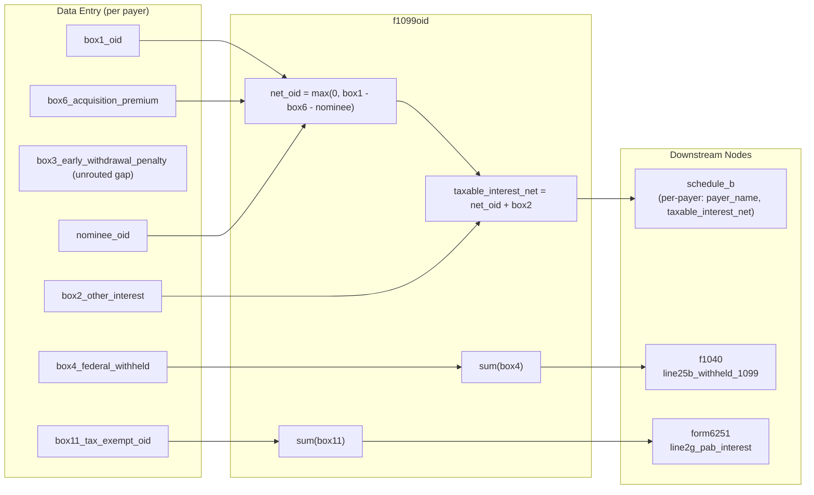

# Form 1099-OID — Original Issue Discount

## Overview

This node captures one or more Form 1099-OID documents (one per payer) and routes their amounts downstream. OID is the difference between a debt instrument's stated redemption price at maturity and its issue price — it accrues as interest income over the life of the instrument even though no cash payment is received. The taxable OID for each payer (box 1 minus acquisition premium and nominee adjustments) flows to Schedule B as interest income. Federal withholding (box 4) goes to Form 1040 line 25b. Tax-exempt OID from private activity bonds (box 11) is an AMT preference item that flows to Form 6251 line 2g.

**IRS Form:** 1099-OID
**Drake Screen:** OID (Drake data entry screen "OID" under Interest/Dividend income)
**Node Type:** input
**Tax Year:** 2025
**Drake Reference:** https://kb.drakesoftware.com/Site/Browse/11052 (1099-OID screen)

---

## Input Fields

Each item in `f1099oids[]` represents one 1099-OID from one payer.

| Field | Type | Required | Source / Label | Description | IRS Reference | URL |
| ----- | ---- | -------- | -------------- | ----------- | ------------- | --- |
| payer_name | string (min 1) | Yes | Payer's name | Name of the financial institution or entity that issued the OID instrument | Form 1099-OID, Payer box | https://www.irs.gov/pub/irs-pdf/f1099oid.pdf |
| payer_tin | string | No | Payer's TIN | Payer's taxpayer identification number | Form 1099-OID, PAYER'S TIN | https://www.irs.gov/pub/irs-pdf/f1099oid.pdf |
| box1_oid | number ≥ 0 | No | Box 1 — Original issue discount for 2025 | Total OID for the tax year on the debt instrument. Accrued interest regardless of whether cash was received. | Form 1099-OID Box 1; IRC §1272; Pub. 1212 | https://www.irs.gov/pub/irs-pdf/i1099oid.pdf |
| box2_other_interest | number ≥ 0 | No | Box 2 — Other periodic interest | Periodic interest other than OID paid by the payer during the year (e.g., stated interest on a bond). Taxable as ordinary interest. | Form 1099-OID Box 2; Pub. 1212 | https://www.irs.gov/pub/irs-pdf/i1099oid.pdf |
| box3_early_withdrawal_penalty | number ≥ 0 | No | Box 3 — Early withdrawal penalty | Penalty on early withdrawal of a time deposit (similar to 1099-INT box 2). Deductible on Schedule 1 line 18. | Form 1099-OID Box 3; IRC §165(c) | https://www.irs.gov/pub/irs-pdf/i1099oid.pdf |
| box4_federal_withheld | number ≥ 0 | No | Box 4 — Federal income tax withheld | Backup withholding or voluntary withholding on OID income. Flows to Form 1040 line 25b. | Form 1099-OID Box 4; IRC §3406 | https://www.irs.gov/pub/irs-pdf/i1099oid.pdf |
| box5_market_discount | number ≥ 0 | No | Box 5 — Market discount | Market discount accrued during the year for market discount bonds. Informational — taxable upon sale unless elected to include currently. Not directly routed by this node. | Form 1099-OID Box 5; IRC §1278; Pub. 550 | https://www.irs.gov/pub/irs-pdf/i1099oid.pdf |
| box6_acquisition_premium | number ≥ 0 | No | Box 6 — Acquisition premium | Amount paid above the adjusted issue price when purchasing an OID bond. Reduces the taxable OID for the year. net OID = box1 − box6. | Form 1099-OID Box 6; IRC §1272(a)(7); Pub. 1212 | https://www.irs.gov/pub/irs-pdf/i1099oid.pdf |
| box7_description | string | No | Box 7 — Description | CUSIP number or description of the debt instrument (e.g., bond name, maturity date). Informational. | Form 1099-OID Box 7 | https://www.irs.gov/pub/irs-pdf/f1099oid.pdf |
| box8_oid_treasury | number ≥ 0 | No | Box 8 — Original issue discount on U.S. Treasury obligations | OID on U.S. Treasury bills, notes, and bonds. Exempt from state/local tax but federally taxable. Informational for state return purposes. | Form 1099-OID Box 8; IRC §1272; Pub. 1212 | https://www.irs.gov/pub/irs-pdf/i1099oid.pdf |
| box9_investment_expenses | number ≥ 0 | No | Box 9 — Investment expenses | Deductible investment expenses allocated to the OID instrument (IRC §212). Post-TCJA (2018–2025): miscellaneous itemized deductions suspended; this box is largely informational. | Form 1099-OID Box 9; IRC §212; TCJA §11045 | https://www.irs.gov/pub/irs-pdf/i1099oid.pdf |
| box10_bond_premium | number ≥ 0 | No | Box 10 — Bond premium | Bond premium amortized during the year under IRC §171. Reduces taxable interest (and OID) when the §171 election is in effect. Currently captured in schema but not independently routed by this node (reduces OID via box6 / broker netting). | Form 1099-OID Box 10; IRC §171; Pub. 550 | https://www.irs.gov/pub/irs-pdf/i1099oid.pdf |
| box11_tax_exempt_oid | number ≥ 0 | No | Box 11 — Tax-exempt OID | OID accrued on tax-exempt private activity bonds (PABs). Excluded from regular tax but is an AMT preference item under IRC §57(a)(5). Routes to Form 6251 line 2g. | Form 1099-OID Box 11; IRC §57(a)(5); Form 6251 Line 2g | https://www.irs.gov/pub/irs-pdf/i1099oid.pdf |
| box12_state_tax | number ≥ 0 | No | Box 12 — State tax withheld | State income tax withheld. Informational for state return; not routed by this node. | Form 1099-OID Box 12 | https://www.irs.gov/pub/irs-pdf/f1099oid.pdf |
| box13_fatca | boolean | No | Box 13 — FATCA filing requirement | Checked if the payer is reporting under FATCA. Informational only; no tax calculation impact. | Form 1099-OID Box 13; IRC §6038D | https://www.irs.gov/pub/irs-pdf/f1099oid.pdf |
| nominee_oid | number ≥ 0 | No | Nominee OID | Amount of box 1 OID that belongs to another person (nominee situation). Reduces taxable OID for this taxpayer. Nominee must issue their own 1099-OID to the actual owner. | Pub. 1212, "Nominee Distributions"; Pub. 550 | https://www.irs.gov/pub/irs-pdf/p1212.pdf |

---

## Calculation Logic

### Step 1 — Compute net taxable OID per payer

For each 1099-OID item, net taxable OID = box1_oid − box6_acquisition_premium − nominee_oid, floored at 0.

```
net_oid = max(0, (box1_oid ?? 0) − (box6_acquisition_premium ?? 0) − (nominee_oid ?? 0))
```

- Acquisition premium (box 6) offsets OID because the taxpayer paid above the adjusted issue price; that excess premium amortizes to reduce OID income. IRC §1272(a)(7).
- Nominee OID is excluded because it belongs to a different taxpayer; the recipient must issue a separate 1099-OID. Pub. 1212.
- Result cannot go below zero.

Source: IRS Publication 1212 (2025), "Figuring OID on Long-Term Debt Instruments" and "Acquisition Premium"; IRS Instructions for Form 1099-OID (2025), Box 6 — https://www.irs.gov/pub/irs-pdf/i1099oid.pdf

### Step 2 — Route per-payer interest to Schedule B

For each payer, emit one NodeOutput to `schedule_b` with:
- `payer_name` — payer name for Schedule B listing
- `taxable_interest_net` = net_oid (from Step 1) + (box2_other_interest ?? 0)

Box 2 (other periodic interest) is ordinary interest income included in the same Schedule B listing as the OID. Schedule B Part I lists each payer separately.

Source: IRS Schedule B Instructions (2025), Part I — list each payer; Form 1099-OID Instructions, Box 1 and Box 2 — https://www.irs.gov/pub/irs-pdf/i1099oid.pdf; https://www.irs.gov/pub/irs-pdf/i1040sb.pdf

### Step 3 — Aggregate and route federal withholding to Form 1040

Sum `box4_federal_withheld` across all payers. If total > 0, emit one NodeOutput to `f1040` with `line25b_withheld_1099 = total`.

Multiple payer withholding amounts are aggregated into a single f1040 output because Form 1040 line 25b is a single total field.

Source: IRS Form 1040 Instructions (2025), Line 25b — "Add the amounts on Forms 1099-INT, 1099-OID, 1099-DIV, and 1099-B" — https://www.irs.gov/pub/irs-pdf/i1040gi.pdf; IRC §3406 (backup withholding)

### Step 4 — Route private activity bond OID to Form 6251 (AMT)

Sum `box11_tax_exempt_oid` across all payers. If total > 0, emit one NodeOutput to `form6251` with `line2g_pab_interest = total`.

Tax-exempt OID from private activity bonds is excluded from regular tax (IRC §103) but is an AMT preference item under IRC §57(a)(5). It increases Alternative Minimum Taxable Income (AMTI) on Form 6251 line 2g.

Source: IRC §57(a)(5); IRS Instructions for Form 6251 (2025), Line 2g — https://www.irs.gov/pub/irs-pdf/i6251.pdf

---

## Output Routing

| Output Field | Destination Node | Condition | IRS Reference | URL |
| ------------ | ---------------- | --------- | ------------- | --- |
| payer_name | schedule_b | Always (one output per payer) | Sch B Part I, Line 1 — list each payer | https://www.irs.gov/pub/irs-pdf/i1040sb.pdf |
| taxable_interest_net | schedule_b | Always (one output per payer; value may be 0) | Sch B Part I, Line 1 — net OID + other interest per payer | https://www.irs.gov/pub/irs-pdf/i1040sb.pdf |
| line25b_withheld_1099 | f1040 | Only if sum of box4_federal_withheld > 0 | Form 1040 Line 25b — federal tax withheld from 1099s | https://www.irs.gov/pub/irs-pdf/i1040gi.pdf |
| line2g_pab_interest | form6251 | Only if sum of box11_tax_exempt_oid > 0 | Form 6251 Line 2g — tax-exempt PAB interest as AMT preference | https://www.irs.gov/pub/irs-pdf/i6251.pdf |

**Note on box3_early_withdrawal_penalty:** The schema captures this field but the current implementation does NOT route it to `schedule1 line18_early_withdrawal`. This is a known gap — the early withdrawal penalty is a deduction on Schedule 1 line 18 (same as 1099-INT box 2) and should be routed. See Edge Cases section.

---

## Constants & Thresholds (Tax Year 2025)

| Constant | Value | Source | URL |
| -------- | ----- | ------ | --- |
| None | — | Form 1099-OID has no filing thresholds or phase-out constants that affect this input node's routing logic. OID de minimis rule ($1 rounding on annual OID < $1) applies to issuers/brokers, not to this node's calculations. | — |

No Rev Proc 2024-40 constants apply to this node. The AMT thresholds (exemption amounts, phase-out start, bracket thresholds) belong to the downstream `form6251` node.

---

## Data Flow Diagram



---

## Edge Cases & Special Rules

1. **Acquisition premium exceeding OID floors at zero**: If box6_acquisition_premium > box1_oid, the net OID is 0 (not negative). This can occur when a taxpayer paid a large premium. The acquisition premium in excess of the current OID accrual cannot create a deductible loss; it carries forward to reduce future OID. IRC §1272(a)(7). The current implementation correctly floors at 0 via `Math.max(0, ...)`.

2. **Nominee OID**: When a taxpayer receives a 1099-OID but part of the OID belongs to another person (e.g., joint account, inherited account), the taxpayer must subtract the nominee amount and file a 1099-OID for the actual owner. The `nominee_oid` field reduces taxable OID in this node. Pub. 1212.

3. **Multiple payers — one schedule_b output each**: Each 1099-OID item emits its own NodeOutput to schedule_b. This allows Schedule B to list each payer separately on its own line, as required by IRS instructions.

4. **Zero OID item still emits schedule_b output**: A payer entry with box1_oid = 0 still produces a schedule_b output with taxable_interest_net = 0 (plus any box2). This preserves the payer listing on Schedule B. The downstream schedule_b node aggregates all entries.

5. **box3_early_withdrawal_penalty — unrouted gap**: Box 3 represents a penalty on early withdrawal of a time deposit (same concept as 1099-INT box 2). It is deductible on Schedule 1 line 18 (Penalty on Early Withdrawal of Savings). The schema captures it but the current `compute()` does not route it to `schedule1 { line18_early_withdrawal }`. This is a known gap in the implementation.

6. **box8_oid_treasury (US Treasury OID)**: Treasury OID accrues as federal interest income but is exempt from state and local tax. For federal purposes it is ordinary income included in box 1 (or box 8 separately). The current node captures box8 in the schema but does not separately route it. State-level treatment is outside the scope of this federal 1040 engine.

7. **box9_investment_expenses**: Post-Tax Cuts and Jobs Act (2018–2025), miscellaneous itemized deductions subject to the 2% AGI floor are suspended (IRC §67(g)). Investment expenses reported in box 9 are not currently deductible and the node correctly does not route this field.

8. **box10_bond_premium**: Bond premium amortization (IRC §171) reduces taxable interest. When a broker applies §171 amortization, the net amount is already reflected in box 1 (the broker reduces the reported OID). If the taxpayer makes the §171 election themselves, the acquisition premium field (box 6) is the primary adjustment. Box 10 is captured in the schema for completeness but not independently routed.

9. **box11_tax_exempt_oid only if from private activity bonds**: Not all tax-exempt OID is an AMT preference item. Only OID from private activity bonds (PABs) under IRC §57(a)(5) triggers AMT. Box 11 on Form 1099-OID specifically reports PAB OID, so routing the full box 11 to form6251 line 2g is correct.

10. **box5_market_discount**: Market discount accrues when a taxpayer purchases a bond below its adjusted issue price in the secondary market. Unless the taxpayer elects to include market discount currently (IRC §1278(b)), it is recognized as ordinary income upon sale/maturity — not routed by this input node. Box 5 is informational.

11. **De minimis OID rule (IRC §1273(a)(3))**: OID is considered zero if it is less than 0.25% of the stated redemption price at maturity multiplied by the number of full years to maturity. This de minimis calculation is done by the issuer/broker before issuing the 1099-OID; the node does not need to apply it.

12. **STRIPS and similar instruments**: Treasury STRIPS have all their income reported as OID (no stated interest). The entire accrual appears in box 1. The node handles these the same as regular OID instruments.

---

## Sources

| Document | Year | Section | URL | Saved as |
| -------- | ---- | ------- | --- | -------- |
| Form 1099-OID | 2025 | All boxes | https://www.irs.gov/pub/irs-pdf/f1099oid.pdf | .research/docs/f1099oid.pdf |
| Instructions for Forms 1099-INT and 1099-OID | 2025 | 1099-OID boxes 1–13 | https://www.irs.gov/pub/irs-pdf/i1099oid.pdf | .research/docs/i1099oid.pdf |
| IRS Publication 1212 — Guide to Original Issue Discount (OID) Instruments | 2025 | All (acquisition premium, nominee, de minimis, STRIPS) | https://www.irs.gov/pub/irs-pdf/p1212.pdf | .research/docs/p1212.pdf |
| IRS Publication 550 — Investment Income and Expenses | 2025 | OID, market discount, bond premium | https://www.irs.gov/pub/irs-pdf/p550.pdf | .research/docs/p550.pdf |
| Schedule B (Form 1040) Instructions | 2025 | Part I — Interest, Line 1 | https://www.irs.gov/pub/irs-pdf/i1040sb.pdf | .research/docs/i1040sb.pdf |
| Form 1040 Instructions | 2025 | Line 25b (federal tax withheld) | https://www.irs.gov/pub/irs-pdf/i1040gi.pdf | .research/docs/i1040gi.pdf |
| Form 6251 Instructions | 2025 | Line 2g — PAB interest | https://www.irs.gov/pub/irs-pdf/i6251.pdf | .research/docs/i6251.pdf |
| IRC §1272 | — | OID inclusion rules | https://www.law.cornell.edu/uscode/text/26/1272 | (external) |
| IRC §57(a)(5) | — | AMT preference: PAB interest | https://www.law.cornell.edu/uscode/text/26/57 | (external) |
| f1099oid node implementation | 2025 | compute(), netTaxableOid() | forms/f1040/nodes/inputs/f1099oid/index.ts | (codebase) |
| f1099oid node test | 2025 | All test cases | forms/f1040/nodes/inputs/f1099oid/index.test.ts | (codebase) |
