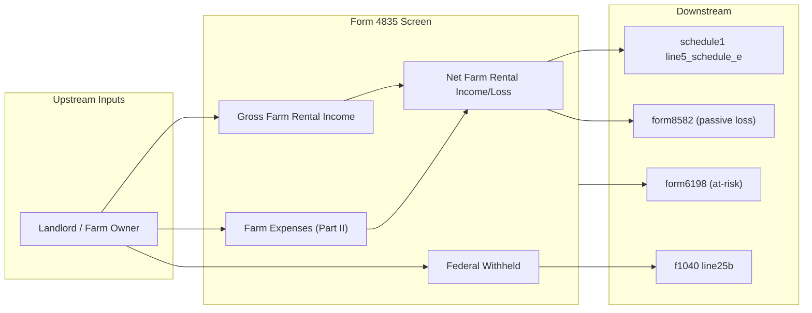

# Form 4835 — Farm Rental Income and Expenses

## Overview
Form 4835 is used by landowners and sub-lessors who do NOT materially participate in the operation or management of a farm to report farm rental income based on crops or livestock produced by the tenant. Because the landowner is passive, this income is NOT subject to self-employment tax (unlike Schedule F). The net farm rental income or loss flows to Schedule E page 2 (line 40), which aggregates into Schedule 1 line 5.

**IRS Form:** 4835
**Drake Screen:** 4835
**Tax Year:** 2025
**Drake Reference:** https://kb.drakesoftware.com/Site/Browse/4835

---

## Data Entry Fields

| Field | Type | Required | Drake Label | Description | IRS Reference | URL |
| ----- | ---- | -------- | ----------- | ----------- | ------------- | --- |
| activity_name | string | yes | Farm name / description | Identifies the farm rental activity | Form 4835, top | https://www.irs.gov/forms-pubs/about-form-4835 |
| gross_farm_rental_income | number | yes | Line 2 — Gross farm rental income | Cash/crop share rents, livestock share rents | Form 4835 Part I, line 2 | https://www.irs.gov/forms-pubs/about-form-4835 |
| ccc_loans_forfeited | number | no | Line 4a — CCC loans forfeited | Commodity Credit Corporation loans treated as income | Form 4835 Part I, line 4a | https://www.irs.gov/forms-pubs/about-form-4835 |
| federal_gasoline_credit | number | no | Line 6 — Agricultural program payment | USDA/farm program payments | Form 4835 Part I, line 6 | https://www.irs.gov/forms-pubs/about-form-4835 |
| total_income | number | no | Derived — sum of income lines | Total farm rental income (auto-computed) | Form 4835 Part I, line 7 | https://www.irs.gov/forms-pubs/about-form-4835 |
| expense_car_truck | number | no | Line 8 — Car and truck | Vehicle expenses for farm | Form 4835 Part II, line 8 | https://www.irs.gov/forms-pubs/about-form-4835 |
| expense_chemicals | number | no | Line 9 — Chemicals | Pesticides, fertilizers | Form 4835 Part II, line 9 | https://www.irs.gov/forms-pubs/about-form-4835 |
| expense_conservation | number | no | Line 10 — Conservation expenses | Soil/water conservation | Form 4835 Part II, line 10 | https://www.irs.gov/forms-pubs/about-form-4835 |
| expense_custom_hire | number | no | Line 11 — Custom hire | Third-party farm services | Form 4835 Part II, line 11 | https://www.irs.gov/forms-pubs/about-form-4835 |
| expense_depreciation | number | no | Line 12 — Depreciation | MACRS depreciation on farm assets | Form 4835 Part II, line 12 | https://www.irs.gov/forms-pubs/about-form-4835 |
| expense_employee_benefits | number | no | Line 13 — Employee benefit programs | Health insurance, pension for employees | Form 4835 Part II, line 13 | https://www.irs.gov/forms-pubs/about-form-4835 |
| expense_feed | number | no | Line 14 — Feed purchased | Feed for livestock | Form 4835 Part II, line 14 | https://www.irs.gov/forms-pubs/about-form-4835 |
| expense_fertilizer | number | no | Line 15 — Fertilizers and lime | Farm inputs | Form 4835 Part II, line 15 | https://www.irs.gov/forms-pubs/about-form-4835 |
| expense_freight_trucking | number | no | Line 16 — Freight/trucking | Transport costs | Form 4835 Part II, line 16 | https://www.irs.gov/forms-pubs/about-form-4835 |
| expense_gasoline | number | no | Line 17 — Gasoline, fuel, oil | Farm fuel costs | Form 4835 Part II, line 17 | https://www.irs.gov/forms-pubs/about-form-4835 |
| expense_insurance | number | no | Line 18 — Insurance | Crop/farm insurance | Form 4835 Part II, line 18 | https://www.irs.gov/forms-pubs/about-form-4835 |
| expense_mortgage_interest | number | no | Line 19a — Mortgage interest | Interest paid on farm mortgage | Form 4835 Part II, line 19a | https://www.irs.gov/forms-pubs/about-form-4835 |
| expense_other_interest | number | no | Line 19b — Other interest | Other farm-related interest | Form 4835 Part II, line 19b | https://www.irs.gov/forms-pubs/about-form-4835 |
| expense_labor_hired | number | no | Line 20 — Labor hired | Employee wages | Form 4835 Part II, line 20 | https://www.irs.gov/forms-pubs/about-form-4835 |
| expense_pension | number | no | Line 21 — Pension/profit sharing | Retirement plan contributions | Form 4835 Part II, line 21 | https://www.irs.gov/forms-pubs/about-form-4835 |
| expense_rent_lease_vehicles | number | no | Line 22a — Rent/lease vehicles/machinery | Equipment leases | Form 4835 Part II, line 22a | https://www.irs.gov/forms-pubs/about-form-4835 |
| expense_rent_lease_land | number | no | Line 22b — Rent/lease other property | Land/building leases | Form 4835 Part II, line 22b | https://www.irs.gov/forms-pubs/about-form-4835 |
| expense_repairs_maintenance | number | no | Line 23 — Repairs and maintenance | Farm building/equipment repairs | Form 4835 Part II, line 23 | https://www.irs.gov/forms-pubs/about-form-4835 |
| expense_seeds_plants | number | no | Line 24 — Seeds and plants | Crop inputs | Form 4835 Part II, line 24 | https://www.irs.gov/forms-pubs/about-form-4835 |
| expense_storage_warehousing | number | no | Line 25 — Storage and warehousing | Grain storage costs | Form 4835 Part II, line 25 | https://www.irs.gov/forms-pubs/about-form-4835 |
| expense_supplies | number | no | Line 26 — Supplies purchased | Miscellaneous farm supplies | Form 4835 Part II, line 26 | https://www.irs.gov/forms-pubs/about-form-4835 |
| expense_taxes | number | no | Line 27 — Taxes | Real estate taxes, payroll taxes | Form 4835 Part II, line 27 | https://www.irs.gov/forms-pubs/about-form-4835 |
| expense_utilities | number | no | Line 28 — Utilities | Farm utility costs | Form 4835 Part II, line 28 | https://www.irs.gov/forms-pubs/about-form-4835 |
| expense_vet_breeding | number | no | Line 29 — Veterinary/breeding | Livestock health costs | Form 4835 Part II, line 29 | https://www.irs.gov/forms-pubs/about-form-4835 |
| expense_other | number | no | Line 30 — Other expenses | Catch-all expense line | Form 4835 Part II, line 30 | https://www.irs.gov/forms-pubs/about-form-4835 |
| total_expenses | number | no | Derived — sum of all expenses | Total Part II expenses (auto-computed) | Form 4835 Part II, line 31 | https://www.irs.gov/forms-pubs/about-form-4835 |
| net_farm_rental_income | number | no | Line 32 — Net farm rental income | total_income - total_expenses (can be negative) | Form 4835 Part III, line 32 | https://www.irs.gov/forms-pubs/about-form-4835 |
| federal_withheld | number | no | Line 33 — Federal income tax withheld | Any withholding on farm rental income | Form 4835 line 33 | https://www.irs.gov/forms-pubs/about-form-4835 |
| some_investment_not_at_risk | boolean | no | At-risk checkbox | Triggers Form 6198 at-risk limitation | Form 4835, at-risk checkbox | https://www.irs.gov/forms-pubs/about-form-4835 |
| prior_unallowed_passive | number | no | Prior-year unallowed passive loss | Passive loss carryforward from prior year | Form 8582 / Carryover worksheet | https://www.irs.gov/pub/irs-pdf/f8582.pdf |

---

## Per-Field Routing

| Field | Destination | How Used | Triggers | Limit / Cap | IRS Reference | URL |
| ----- | ----------- | -------- | -------- | ----------- | ------------- | --- |
| net_farm_rental_income (positive) | schedule1 | line5_schedule_e: net farm rental profit → Schedule E page 2 | Always when > 0 | None | Schedule E page 2, line 40 → Schedule 1 line 5 | https://www.irs.gov/pub/irs-pdf/f1040se.pdf |
| net_farm_rental_income (negative) | schedule1 | line5_schedule_e: net farm rental loss (may be limited by passive rules) | Always when < 0 | Limited by passive rules (Form 8582) | Schedule E page 2, line 40 | https://www.irs.gov/pub/irs-pdf/f1040se.pdf |
| federal_withheld | f1040 | line25b_withheld_1099 | When > 0 | None | Form 1040 line 25b | https://www.irs.gov/pub/irs-pdf/f1040.pdf |
| some_investment_not_at_risk | form6198 | at_risk_income / at_risk_expenses passed to Form 6198 | When flag = true | None | IRC §465; Form 6198 | https://www.irs.gov/forms-pubs/about-form-6198 |
| prior_unallowed_passive | form8582 | prior passive loss carryforward | When > 0 | None | IRC §469; Form 8582 | https://www.irs.gov/pub/irs-pdf/f8582.pdf |
| net_farm_rental_income (negative, passive) | form8582 | current-year passive loss | When < 0 and not materially participating | None | IRC §469(c) | https://www.irs.gov/pub/irs-pdf/f8582.pdf |

---

## Calculation Logic

### Step 1 — Total Income (Form 4835 line 7)
Sum gross farm rental income + CCC loans + agricultural program payments.
> **Source:** IRS Form 4835 (2024), Part I, line 7 — https://www.irs.gov/pub/irs-pdf/f4835.pdf

### Step 2 — Total Expenses (Form 4835 line 31)
Sum all Part II expense lines (8 through 30).
> **Source:** IRS Form 4835 (2024), Part II, line 31 — https://www.irs.gov/pub/irs-pdf/f4835.pdf

### Step 3 — Net Farm Rental Income or Loss (Form 4835 line 32)
net = total_income − total_expenses
Can be negative (a loss). Farm rental income is always passive (non-materially-participating landowner).
> **Source:** IRS Form 4835 (2024), Part III, line 32 — https://www.irs.gov/pub/irs-pdf/f4835.pdf

### Step 4 — Flow to Schedule E
Net farm rental income or loss flows to Schedule E page 2, line 40. This aggregates with other pass-through income and goes to Schedule 1 line 5.
> **Source:** Form 4835 instructions, "Line 32" section; Schedule E page 2 — https://www.irs.gov/pub/irs-pdf/f4835.pdf

### Step 5 — Pre-computed net income override
If `net_farm_rental_income` is directly provided (from a pre-computed entry), skip Steps 1–3 and use the provided value.

---

## Constants & Thresholds (Tax Year 2025)

| Constant | Value | Source | URL |
| -------- | ----- | ------ | --- |
| (none) | — | No TY2025-specific thresholds in Form 4835 itself. Passive activity limits and at-risk rules use Form 8582/6198. | https://www.irs.gov/forms-pubs/about-form-4835 |

---

## Data Flow Diagram

---

## Edge Cases & Special Rules

1. **Self-employment tax**: Farm rental income on Form 4835 is NOT subject to SE tax (unlike Schedule F). The landowner does not materially participate.
2. **Multiple farms**: Each farm rental is a separate 4835 instance. Net income from each aggregates via the `schedule1 line5_schedule_e` accumulation.
3. **Loss limitation**: Net losses are passive and may be limited by Form 8582. The node passes the computed net to schedule1 and also to form8582 for passive activity limitation.
4. **At-risk**: If `some_investment_not_at_risk` = true, pass data to form6198.
5. **Pre-computed net**: If the caller provides `net_farm_rental_income` directly, use it (skip income/expense computation).
6. **Zero activity**: If all income and expense fields are zero and no pre-computed net is provided, emit no outputs.

---

## Sources

| Document | Year | Section | URL | Saved as |
| -------- | ---- | ------- | --- | -------- |
| IRS About Form 4835 | 2024 | Overview, related forms | https://www.irs.gov/forms-pubs/about-form-4835 | (web) |
| IRS Form 4835 | 2024 | Parts I–III | https://www.irs.gov/pub/irs-pdf/f4835.pdf | (binary) |
| IRC §469 | — | Passive activity rules | https://www.irs.gov/pub/irs-pdf/f8582.pdf | (web) |
| IRC §465 | — | At-risk rules | https://www.irs.gov/forms-pubs/about-form-6198 | (web) |
