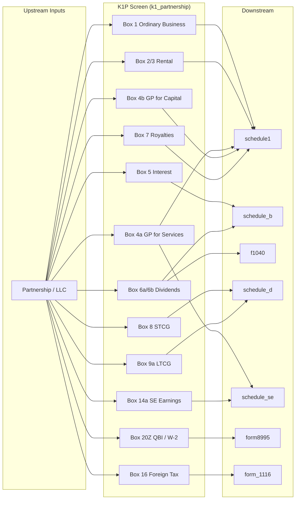

# Schedule K-1 (Form 1065) — Partner's Share of Income, Deductions, Credits

## Overview
Schedule K-1 (Form 1065) is issued by partnerships (including LLCs taxed as partnerships) to each partner, reporting the partner's distributive share of income, deductions, and credits. Key difference from S corp K-1: **Box 14 self-employment earnings are subject to Schedule SE**. QBI flows through Box 20 code Z.

**IRS Form:** Schedule K-1 (Form 1065)
**Drake Screen:** K1P
**Tax Year:** 2025
**Drake Reference:** https://kb.drakesoftware.com/Site/Browse/K1P

---

## Data Entry Fields

| Field | Type | Required | Drake Label | Description | IRS Reference | URL |
| ----- | ---- | -------- | ----------- | ----------- | ------------- | --- |
| partnership_name | string | yes | Partnership/LLC name | Identifies the issuing partnership | K-1 (1065) top | https://www.irs.gov/instructions/i1065sk1 |
| box1_ordinary_business | number | no | Box 1 — Ordinary business income/loss | Pro-rata share of ordinary income/loss → Schedule E page 2 | K-1 (1065) Box 1 | https://www.irs.gov/instructions/i1065sk1 |
| box2_rental_re | number | no | Box 2 — Net rental real estate income/loss | → Schedule E | K-1 (1065) Box 2 | https://www.irs.gov/instructions/i1065sk1 |
| box3_other_rental | number | no | Box 3 — Other net rental income/loss | → Schedule E | K-1 (1065) Box 3 | https://www.irs.gov/instructions/i1065sk1 |
| box4a_guaranteed_services | number | no | Box 4a — Guaranteed payments for services | SE income → Schedule E + Schedule SE | K-1 (1065) Box 4a | https://www.irs.gov/instructions/i1065sk1 |
| box4b_guaranteed_capital | number | no | Box 4b — Guaranteed payments for capital | Portfolio income → Schedule E | K-1 (1065) Box 4b | https://www.irs.gov/instructions/i1065sk1 |
| box5_interest | number | no | Box 5 — Interest income | → Schedule B | K-1 (1065) Box 5 | https://www.irs.gov/instructions/i1065sk1 |
| box6a_ordinary_dividends | number | no | Box 6a — Ordinary dividends | → Schedule B | K-1 (1065) Box 6a | https://www.irs.gov/instructions/i1065sk1 |
| box6b_qualified_dividends | number | no | Box 6b — Qualified dividends | → F1040 line 3a | K-1 (1065) Box 6b | https://www.irs.gov/instructions/i1065sk1 |
| box7_royalties | number | no | Box 7 — Royalties | → Schedule E | K-1 (1065) Box 7 | https://www.irs.gov/instructions/i1065sk1 |
| box8_net_st_cap_gain | number | no | Box 8 — Net STCG/loss | → Schedule D line 5 | K-1 (1065) Box 8 | https://www.irs.gov/instructions/i1065sk1 |
| box9a_net_lt_cap_gain | number | no | Box 9a — Net LTCG/loss | → Schedule D line 12 | K-1 (1065) Box 9a | https://www.irs.gov/instructions/i1065sk1 |
| box14a_se_earnings | number | no | Box 14 code A — SE earnings | Net SE earnings → Schedule SE | K-1 (1065) Box 14 code A | https://www.irs.gov/instructions/i1065sk1 |
| box16_foreign_tax | number | no | Box 16 — Foreign taxes paid | → Form 1116 | K-1 (1065) Box 16 | https://www.irs.gov/instructions/i1065sk1 |
| box20z_qbi | number | no | Box 20 code Z — Section 199A QBI | Qualified business income → Form 8995 | K-1 (1065) Box 20 code Z | https://www.irs.gov/instructions/i1065sk1 |
| box20_w2_wages | number | no | Box 20 code AA — W-2 wages | W-2 wages for QBI deduction | K-1 (1065) Box 20 | https://www.irs.gov/instructions/i1065sk1 |
| box20_ubia | number | no | Box 20 code AB — UBIA | UBIA of qualified property | K-1 (1065) Box 20 | https://www.irs.gov/instructions/i1065sk1 |

---

## Per-Field Routing

| Field | Destination | How Used | Triggers | Limit / Cap | IRS Reference | URL |
| ----- | ----------- | -------- | ---------- | ----------- | ------------- | --- |
| box1_ordinary_business | schedule1 | line5_schedule_e | When non-zero | Passive/at-risk rules | Schedule E page 2 / Schedule 1 line 5 | https://www.irs.gov/instructions/i1065sk1 |
| box2_rental_re | schedule1 | line5_schedule_e | When non-zero | Passive rules | Schedule E | https://www.irs.gov/instructions/i1065sk1 |
| box3_other_rental | schedule1 | line5_schedule_e | When non-zero | Passive rules | Schedule E | https://www.irs.gov/instructions/i1065sk1 |
| box4a_guaranteed_services | schedule1 | line5_schedule_e | When non-zero | None | Schedule E page 2 | https://www.irs.gov/instructions/i1065sk1 |
| box4a_guaranteed_services | schedule_se | net_profit_schedule_c | When > 0 | None | Schedule SE (SE tax) | https://www.irs.gov/instructions/i1065sk1 |
| box4b_guaranteed_capital | schedule1 | line5_schedule_e | When non-zero | None | Schedule E page 2 | https://www.irs.gov/instructions/i1065sk1 |
| box5_interest | schedule_b | taxable_interest_net | When > 0 | None | Schedule B Part I | https://www.irs.gov/instructions/i1065sk1 |
| box6a_ordinary_dividends | schedule_b | ordinaryDividends | When > 0 | None | Schedule B Part II | https://www.irs.gov/instructions/i1065sk1 |
| box6b_qualified_dividends | f1040 | line3a_qualified_dividends | When > 0 | ≤ box6a | F1040 line 3a | https://www.irs.gov/instructions/i1065sk1 |
| box7_royalties | schedule1 | line5_schedule_e | When non-zero | None | Schedule E | https://www.irs.gov/instructions/i1065sk1 |
| box8_net_st_cap_gain | schedule_d | line_5_k1_st | When non-zero | None | Schedule D line 5 | https://www.irs.gov/instructions/i1065sk1 |
| box9a_net_lt_cap_gain | schedule_d | line_12_k1_lt | When non-zero | None | Schedule D line 12 | https://www.irs.gov/instructions/i1065sk1 |
| box14a_se_earnings | schedule_se | net_profit_schedule_c | When > 0 | None | Schedule SE | https://www.irs.gov/instructions/i1065sk1 |
| box16_foreign_tax | form_1116 | foreign_tax_paid | When > 0 | None | Form 1116 | https://www.irs.gov/instructions/i1065sk1 |
| box20z_qbi | form8995 | qbi | When non-zero | None | IRC §199A; Form 8995 | https://www.irs.gov/instructions/i1065sk1 |
| box20_w2_wages | form8995 | w2_wages | When > 0 | None | Form 8995 | https://www.irs.gov/instructions/i1065sk1 |

---

## Calculation Logic

### Step 1 — Pass-through income aggregation
Box 1 + 2 + 3 + 4a + 4b + 7 → schedule1 line5_schedule_e.
Guaranteed payments for services (Box 4a) additionally → schedule_se for SE tax.
> **Source:** K-1 (1065) Box 1, 4 instructions — https://www.irs.gov/instructions/i1065sk1

### Step 2 — Portfolio income routing
Box 5 → schedule_b interest; Box 6a → schedule_b dividends; Box 6b → f1040 line3a.
> **Source:** K-1 (1065) Box 5–6 instructions — https://www.irs.gov/instructions/i1065sk1

### Step 3 — Capital gain routing
Box 8 → schedule_d line_5_k1_st; Box 9a → schedule_d line_12_k1_lt.
> **Source:** K-1 (1065) Box 8–9 instructions — https://www.irs.gov/instructions/i1065sk1

### Step 4 — Self-employment routing
Box 14a net SE earnings (or Box 4a guaranteed services if Box 14a absent) → schedule_se.
> **Source:** K-1 (1065) Box 14 instructions — https://www.irs.gov/instructions/i1065sk1

### Step 5 — QBI routing
Box 20Z QBI + W-2 wages → form8995 for §199A deduction.
> **Source:** K-1 (1065) Box 20 code Z instructions — https://www.irs.gov/instructions/i1065sk1

---

## Constants & Thresholds (Tax Year 2025)

| Constant | Value | Source | URL |
| -------- | ----- | ------ | --- |
| (none) | — | No form-level constants. SE tax and QBI thresholds computed by downstream nodes. | https://www.irs.gov/instructions/i1065sk1 |

---

## Data Flow Diagram

---

## Edge Cases & Special Rules

1. **SE tax on guaranteed payments**: Box 4a (guaranteed payments for services) is subject to SE tax. Box 4b (capital) is not.
2. **Box 14a vs. Box 4a**: Box 14a is the net SE earnings (may differ from Box 1 + Box 4a). Use Box 14a when provided, otherwise derive from Box 1 + Box 4a.
3. **Multiple K-1s**: Aggregate all boxes across all partnership K-1s.
4. **Losses**: Box 1, 2, 3 losses are passive by default (limited by basis/at-risk/passive rules downstream).
5. **QBI loss**: Negative Box 20Z (loss) reduces QBI — pass through signed value.
6. **Foreign tax**: Route to Form 1116 when Box 16 > 0.
7. **Zero all boxes**: Emit no outputs.

---

## Sources

| Document | Year | Section | URL | Saved as |
| -------- | ---- | ------- | --- | -------- |
| IRS Schedule K-1 (1065) Instructions | 2024 | All boxes | https://www.irs.gov/instructions/i1065sk1 | (web) |
