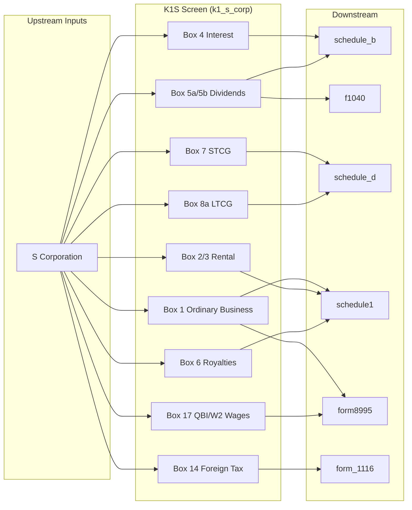

# Schedule K-1 (Form 1120-S) — Shareholder's Share of Income, Deductions, Credits

## Overview
Schedule K-1 (Form 1120-S) is issued by S corporations to each shareholder, reporting the shareholder's pro-rata share of income, deductions, credits, and other items. Shareholders report these on their Form 1040. Ordinary business income routes to Schedule E page 2. The key difference from partnership K-1 is: no self-employment tax on ordinary income (S corp shareholders are not self-employed on their S corp income).

**IRS Form:** Schedule K-1 (Form 1120-S)
**Drake Screen:** K1S
**Tax Year:** 2025
**Drake Reference:** https://kb.drakesoftware.com/Site/Browse/K1S

---

## Data Entry Fields

| Field | Type | Required | Drake Label | Description | IRS Reference | URL |
| ----- | ---- | -------- | ----------- | ----------- | ------------- | --- |
| corporation_name | string | yes | S Corp name | Identifies the issuing S corporation | K-1 (1120-S) top | https://www.irs.gov/instructions/i1120ssk |
| box1_ordinary_business | number | no | Box 1 — Ordinary business income/loss | Pro-rata share of ordinary income/loss | K-1 (1120-S) Box 1 → Schedule E | https://www.irs.gov/instructions/i1120ssk |
| box2_rental_re | number | no | Box 2 — Net rental real estate income/loss | Rental RE income/loss → Schedule E | K-1 (1120-S) Box 2 | https://www.irs.gov/instructions/i1120ssk |
| box3_other_rental | number | no | Box 3 — Other net rental income/loss | Other rental income → Schedule E | K-1 (1120-S) Box 3 | https://www.irs.gov/instructions/i1120ssk |
| box4_interest | number | no | Box 4 — Interest income | Portfolio interest → Form 1040 line 2b | K-1 (1120-S) Box 4 → Sch B | https://www.irs.gov/instructions/i1120ssk |
| box5a_ordinary_dividends | number | no | Box 5a — Ordinary dividends | Portfolio dividends → Form 1040 line 3b | K-1 (1120-S) Box 5a → Sch B | https://www.irs.gov/instructions/i1120ssk |
| box5b_qualified_dividends | number | no | Box 5b — Qualified dividends | Qualified dividends → Form 1040 line 3a | K-1 (1120-S) Box 5b | https://www.irs.gov/instructions/i1120ssk |
| box6_royalties | number | no | Box 6 — Royalties | Royalties → Schedule E line 4 (via schedule1) | K-1 (1120-S) Box 6 → Sch E | https://www.irs.gov/instructions/i1120ssk |
| box7_net_st_cap_gain | number | no | Box 7 — Net STCG/loss | Short-term cap gain → Schedule D line 5 | K-1 (1120-S) Box 7 → Sch D | https://www.irs.gov/instructions/i1120ssk |
| box8a_net_lt_cap_gain | number | no | Box 8a — Net LTCG/loss | Long-term cap gain → Schedule D line 12 | K-1 (1120-S) Box 8a → Sch D | https://www.irs.gov/instructions/i1120ssk |
| box9_net_1231 | number | no | Box 9 — Net §1231 gain/loss | §1231 gain/loss → Form 4797 | K-1 (1120-S) Box 9 | https://www.irs.gov/instructions/i1120ssk |
| box17_w2_wages | number | no | Box 17 Code W — W-2 wages | W-2 wages for QBI deduction | K-1 (1120-S) Box 17, Code W | https://www.irs.gov/instructions/i1120ssk |
| box17_ubia | number | no | Box 17 Code X — UBIA of qualified property | For QBI deduction calculation | K-1 (1120-S) Box 17, Code X | https://www.irs.gov/instructions/i1120ssk |
| box14_foreign_tax | number | no | Box 14 — Foreign taxes paid | Foreign tax credit → Form 1116 | K-1 (1120-S) Box 14 | https://www.irs.gov/instructions/i1120ssk |
| box14_foreign_income | number | no | Box 14 — Foreign source income | Foreign income for FTC | K-1 (1120-S) Box 14 | https://www.irs.gov/instructions/i1120ssk |

---

## Per-Field Routing

| Field | Destination | How Used | Triggers | Limit / Cap | IRS Reference | URL |
| ----- | ----------- | -------- | ---------- | ----------- | ------------- | --- |
| box1_ordinary_business | schedule1 | line5_schedule_e | When non-zero | Passive rules may apply | Schedule E page 2 / Schedule 1 line 5 | https://www.irs.gov/instructions/i1120ssk |
| box2_rental_re | schedule1 | line5_schedule_e | When non-zero | Passive rules | Schedule E | https://www.irs.gov/instructions/i1120ssk |
| box3_other_rental | schedule1 | line5_schedule_e | When non-zero | Passive rules | Schedule E | https://www.irs.gov/instructions/i1120ssk |
| box4_interest | schedule_b | taxable_interest_net | When > 0 | None | F1040 line 2b / Sch B | https://www.irs.gov/instructions/i1120ssk |
| box5a_ordinary_dividends | schedule_b | ordinaryDividends | When > 0 | None | F1040 line 3b / Sch B | https://www.irs.gov/instructions/i1120ssk |
| box5b_qualified_dividends | f1040 | line3a_qualified_dividends | When > 0 | ≤ box5a | F1040 line 3a | https://www.irs.gov/instructions/i1120ssk |
| box6_royalties | schedule1 | line5_schedule_e | When non-zero | None | Schedule E line 4 | https://www.irs.gov/instructions/i1120ssk |
| box7_net_st_cap_gain | schedule_d | line_5_k1_st | When non-zero | None | Schedule D line 5 | https://www.irs.gov/instructions/i1120ssk |
| box8a_net_lt_cap_gain | schedule_d | line_12_k1_lt | When non-zero | None | Schedule D line 12 | https://www.irs.gov/instructions/i1120ssk |
| box17_w2_wages | form8995 | w2_wages | When > 0 | None | Form 8995/8995-A | https://www.irs.gov/instructions/i1120ssk |
| box1 + box17 | form8995 | qbi | QBI deduction computation | None | IRC §199A | https://www.irs.gov/instructions/i1120ssk |
| box14_foreign_tax | form_1116 | foreign_tax_paid | When > 0 | None | Form 1116 | https://www.irs.gov/instructions/i1120ssk |

---

## Calculation Logic

### Step 1 — Ordinary income routing
Box 1 + Box 2 + Box 3 + Box 6 (royalties) → aggregate to schedule1 line5_schedule_e.
> **Source:** K-1 (1120-S) Box 1 instructions — https://www.irs.gov/instructions/i1120ssk

### Step 2 — Portfolio income routing
Box 4 interest → schedule_b; Box 5a dividends → schedule_b; Box 5b qualified dividends → f1040 line3a.
> **Source:** K-1 (1120-S) Box 4–5 instructions — https://www.irs.gov/instructions/i1120ssk

### Step 3 — Capital gain routing
Box 7 (STCG) → schedule_d line_5_k1_st; Box 8a (LTCG) → schedule_d line_12_k1_lt.
> **Source:** K-1 (1120-S) Box 7–8a instructions — https://www.irs.gov/instructions/i1120ssk

### Step 4 — QBI routing
Box 1 (ordinary business income, if positive) + Box 17 W-2 wages → form8995 for §199A deduction.
> **Source:** K-1 (1120-S) Box 17 code V/W/X instructions — https://www.irs.gov/instructions/i1120ssk

---

## Constants & Thresholds (Tax Year 2025)

| Constant | Value | Source | URL |
| -------- | ----- | ------ | --- |
| (none) | — | No form-level constants. QBI thresholds computed by form8995/8995-A. | https://www.irs.gov/instructions/i1120ssk |

---

## Data Flow Diagram

---

## Edge Cases & Special Rules

1. **No SE tax**: S corp ordinary income does NOT trigger SE tax (unlike partnership guaranteed payments).
2. **Passive vs. active**: Box 1 may be passive if shareholder does not materially participate. This node routes to schedule1; form8582 handles passive limitation.
3. **QBI**: Only positive Box 1 ordinary income qualifies for QBI. Losses are tracked but not included in QBI deduction here.
4. **Multiple K-1s**: Aggregate Box 1 across all S corp K-1s for QBI.
5. **Box 6 royalties**: Routes to Schedule E page 2 (same as other pass-through income).
6. **Zero all boxes**: Emit no outputs.

---

## Sources

| Document | Year | Section | URL | Saved as |
| -------- | ---- | ------- | --- | -------- |
| IRS Schedule K-1 (1120-S) Instructions | 2024 | All boxes | https://www.irs.gov/instructions/i1120ssk | (web) |
