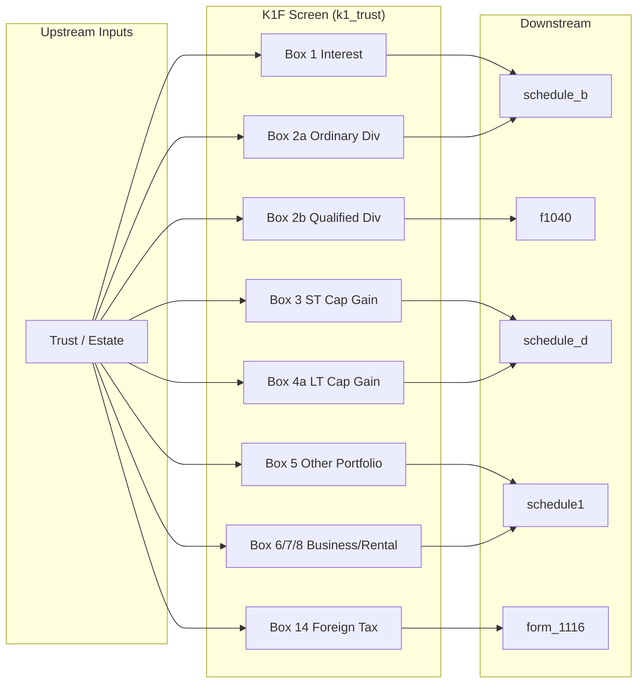

# Schedule K-1 (Form 1041) — Beneficiary's Share of Income, Deductions, Credits

## Overview
Schedule K-1 (Form 1041) is issued by a trust or estate to each beneficiary, reporting the beneficiary's share of income, deductions, and credits from the trust/estate. The beneficiary reports these items on their own Form 1040. This node aggregates all K-1 boxes from all trust/estate K-1s and routes each to the appropriate downstream schedule.

**IRS Form:** Schedule K-1 (Form 1041)
**Drake Screen:** K1F
**Tax Year:** 2025
**Drake Reference:** https://kb.drakesoftware.com/Site/Browse/K1F

---

## Data Entry Fields

| Field | Type | Required | Drake Label | Description | IRS Reference | URL |
| ----- | ---- | -------- | ----------- | ----------- | ------------- | --- |
| estate_trust_name | string | yes | Trust/Estate name | Identifies the issuing trust or estate | Schedule K-1 (1041) top | https://www.irs.gov/instructions/i1041sk1 |
| box1_interest | number | no | Box 1 — Interest income | Beneficiary's share of trust interest income | K-1 (1041) Box 1 → Sch B Part I | https://www.irs.gov/instructions/i1041sk1 |
| box2a_ordinary_dividends | number | no | Box 2a — Ordinary dividends | Beneficiary's share of ordinary dividends | K-1 (1041) Box 2a → Sch B Part II | https://www.irs.gov/instructions/i1041sk1 |
| box2b_qualified_dividends | number | no | Box 2b — Qualified dividends | Beneficiary's share of qualified dividends | K-1 (1041) Box 2b → F1040 line 3a | https://www.irs.gov/instructions/i1041sk1 |
| box3_net_st_cap_gain | number | no | Box 3 — Net short-term capital gain | Net STCG → Schedule D line 5 | K-1 (1041) Box 3 → Sch D line 5 | https://www.irs.gov/instructions/i1041sk1 |
| box4a_net_lt_cap_gain | number | no | Box 4a — Net long-term capital gain | Net LTCG → Schedule D line 12 | K-1 (1041) Box 4a → Sch D line 12 | https://www.irs.gov/instructions/i1041sk1 |
| box4b_28pct_rate_gain | number | no | Box 4b — 28% rate gain | Collectibles/1202 stock gain | K-1 (1041) Box 4b → Sch D 28% Worksheet | https://www.irs.gov/instructions/i1041sk1 |
| box4c_unrecaptured_1250 | number | no | Box 4c — Unrecaptured §1250 gain | Unrecaptured depreciation → Sch D worksheet | K-1 (1041) Box 4c → Sch D Wksht line 11 | https://www.irs.gov/instructions/i1041sk1 |
| box5_other_portfolio | number | no | Box 5 — Other portfolio income/loss | Royalties, annuities, IRS income → Sch E or 1040 | K-1 (1041) Box 5 → Schedule 1 | https://www.irs.gov/instructions/i1041sk1 |
| box6_ordinary_business | number | no | Box 6 — Ordinary business income/loss | Pass-through business income → Schedule E | K-1 (1041) Box 6 → Sch E / Schedule 1 | https://www.irs.gov/instructions/i1041sk1 |
| box7_rental_real_estate | number | no | Box 7 — Net rental real estate income | Rental real estate → Schedule E | K-1 (1041) Box 7 → Schedule E | https://www.irs.gov/instructions/i1041sk1 |
| box8_other_rental | number | no | Box 8 — Other rental income/loss | Other rental income → Schedule E | K-1 (1041) Box 8 → Schedule E | https://www.irs.gov/instructions/i1041sk1 |
| box10_estate_tax_deduction | number | no | Box 10 — Estate tax deduction | IRD deduction → Schedule A line 16 | K-1 (1041) Box 10 → Sch A line 16 | https://www.irs.gov/instructions/i1041sk1 |
| box11_final_year_deductions | number | no | Box 11 — Final year excess deductions | Excess deductions on termination → Sch 1 line 24k | K-1 (1041) Box 11 code A | https://www.irs.gov/instructions/i1041sk1 |
| box12_amt | number | no | Box 12 — AMT adjustment | AMT preference/adjustment items → Form 6251 | K-1 (1041) Box 12 → Form 6251 | https://www.irs.gov/instructions/i1041sk1 |
| box14_foreign_tax | number | no | Box 14 — Foreign tax paid | Foreign taxes creditable → Form 1116 | K-1 (1041) Box 14 code ZZ → Form 1116 | https://www.irs.gov/instructions/i1041sk1 |
| box14_foreign_income | number | no | Box 14 — Foreign source income | Foreign income for FTC limitation | K-1 (1041) Box 14 → Form 1116 | https://www.irs.gov/instructions/i1041sk1 |

---

## Per-Field Routing

| Field | Destination | How Used | Triggers | Limit / Cap | IRS Reference | URL |
| ----- | ----------- | -------- | -------- | ----------- | ------------- | --- |
| box1_interest | schedule_b | taxable_interest_net | When > 0 | None | Sch B Part I line 1 | https://www.irs.gov/instructions/i1041sk1 |
| box2a_ordinary_dividends | schedule_b | ordinaryDividends | When > 0 | None | Sch B Part II line 5 | https://www.irs.gov/instructions/i1041sk1 |
| box2b_qualified_dividends | f1040 | line3a_qualified_dividends | When > 0 | ≤ box2a | F1040 line 3a | https://www.irs.gov/instructions/i1041sk1 |
| box3_net_st_cap_gain | schedule_d | line_5_k1_st | When non-zero | None | Sch D line 5 | https://www.irs.gov/instructions/i1041sk1 |
| box4a_net_lt_cap_gain | schedule_d | line_12_k1_lt | When non-zero | None | Sch D line 12 | https://www.irs.gov/instructions/i1041sk1 |
| box5_other_portfolio | schedule1 | line8z_other_income | When non-zero | None | Schedule 1 line 8z | https://www.irs.gov/instructions/i1041sk1 |
| box6_ordinary_business | schedule1 | line5_schedule_e | When non-zero | None | Schedule E page 2 / Schedule 1 line 5 | https://www.irs.gov/instructions/i1041sk1 |
| box7_rental_real_estate | schedule1 | line5_schedule_e | When non-zero (added to ordinary business) | None | Schedule E | https://www.irs.gov/instructions/i1041sk1 |
| box8_other_rental | schedule1 | line5_schedule_e | When non-zero (added to ordinary business) | None | Schedule E | https://www.irs.gov/instructions/i1041sk1 |
| box10_estate_tax_deduction | schedule_a (informational) | Not computed here — informational only | n/a | None | Sch A line 16 | https://www.irs.gov/instructions/i1041sk1 |
| box14_foreign_tax | form_1116 | foreign_tax_paid | When > 0 | None | Form 1116 Part II | https://www.irs.gov/instructions/i1041sk1 |
| box14_foreign_income | form_1116 | foreign_income | When > 0 | None | Form 1116 Part I | https://www.irs.gov/instructions/i1041sk1 |

---

## Calculation Logic

### Step 1 — Interest routing
Box 1 interest → schedule_b taxable_interest_net (per payer entry).
> **Source:** K-1 (1041) Box 1 instructions — https://www.irs.gov/instructions/i1041sk1

### Step 2 — Dividend routing
Box 2a ordinary dividends → schedule_b ordinaryDividends.
Box 2b qualified dividends → f1040 line3a_qualified_dividends (summed across all K-1s).
> **Source:** K-1 (1041) Box 2 instructions — https://www.irs.gov/instructions/i1041sk1

### Step 3 — Capital gain routing
Box 3 net STCG → schedule_d line_5_k1_st (aggregate across K-1s).
Box 4a net LTCG → schedule_d line_12_k1_lt (aggregate across K-1s).
> **Source:** K-1 (1041) Box 3, 4a instructions — https://www.irs.gov/instructions/i1041sk1

### Step 4 — Pass-through income routing
Box 6 + Box 7 + Box 8 (business/rental) → schedule1 line5_schedule_e (aggregate).
Box 5 (other portfolio) → schedule1 line8z_other_income (aggregate).
> **Source:** K-1 (1041) Box 5–8 instructions — https://www.irs.gov/instructions/i1041sk1

### Step 5 — Foreign tax routing
Box 14 foreign tax paid + foreign income → form_1116 (per K-1 with foreign taxes).
> **Source:** K-1 (1041) Box 14 code ZZ instructions — https://www.irs.gov/instructions/i1041sk1

---

## Constants & Thresholds (Tax Year 2025)

| Constant | Value | Source | URL |
| -------- | ----- | ------ | --- |
| (none) | — | No TY2025-specific thresholds in K-1 (1041) routing. FTC de minimis threshold applied by form_1116 itself. | https://www.irs.gov/instructions/i1041sk1 |

---

## Data Flow Diagram

---

## Edge Cases & Special Rules

1. **Multiple K-1s from different trusts**: Each is a separate item; all aggregate to the same downstream fields.
2. **Losses**: Box 3, 4a (capital losses) and Box 6/7/8 (pass-through losses) are all signed — negative values allowed.
3. **Box 4b/4c (28% rate and unrecaptured 1250)**: These are special gain subcategories — informational pass-through only in this implementation (not routed to separate worksheets yet).
4. **Box 2b qualified dividends limit**: Qualified dividends cannot exceed ordinary dividends from same payer — validation at form level, not enforced here.
5. **Foreign tax de minimis**: Form 1116 decides whether to use the de minimis exception. This node always routes to form_1116 when foreign tax is present.
6. **Box 10 estate tax deduction (IRD)**: Complex calculation requiring Schedule A. Pass through as informational only.
7. **Zero all boxes**: If all boxes are zero, emit no outputs.

---

## Sources

| Document | Year | Section | URL | Saved as |
| -------- | ---- | ------- | --- | -------- |
| IRS Schedule K-1 (1041) Instructions | 2024 | All boxes | https://www.irs.gov/instructions/i1041sk1 | (web) |
| IRS Form 1041 | 2024 | — | https://www.irs.gov/pub/irs-pdf/i1041sk1.pdf | (binary) |
