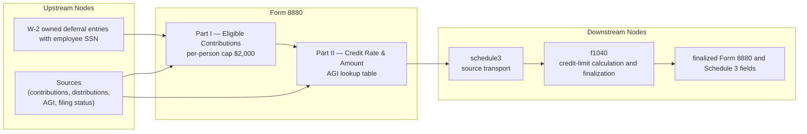

# Form 8880 — Credit for Qualified Retirement Savings Contributions

## Overview

**IRS Form:** Form 8880 **Drake Screen:** 8880 **Tax Year:** 2025

---
## Input Fields
| Field | Type | Source Node | Description | IRS Reference | URL |
| ----- | ---- | ----------- | ----------- | ------------- | --- |
| w2_deferral_entries | array of employee SSN, box 12 code, amount, and reviewed code G split where applicable | W-2 box 12 D/E/F/G/H/S/AA/BB/EE | Each source entry retains its employee; Form 8880 matches it to the filed taxpayer or MFJ spouse SSN before placing line 2 in column (a) or (b). Code G requires a reviewed governmental 457(b) employee-elective amount and workpaper reference; only that amount qualifies. Raw code G, employer share, and missing/mismatched identity reject. | Part I line 2 | https://www.irs.gov/pub/irs-pdf/f8880.pdf |
| elective_deferrals_taxpayer | number | direct reviewed source | Taxpayer qualifying contributions not duplicated by W-2 source entries | Part I col (a) line 2 | https://www.irs.gov/pub/irs-pdf/f8880.pdf |
| elective_deferrals_spouse | number | direct reviewed source | MFJ spouse qualifying contributions not duplicated by W-2 source entries | Part I col (b) line 2 | https://www.irs.gov/pub/irs-pdf/f8880.pdf |
| ira_contributions_taxpayer | number | direct | Taxpayer IRA contributions (trad + Roth) | col (a) line 1 | https://www.irs.gov/pub/irs-pdf/f8880.pdf |
| ira_contributions_spouse | number | direct | Spouse IRA contributions (trad + Roth) | col (b) line 1 | https://www.irs.gov/pub/irs-pdf/f8880.pdf |
| joint_distribution_review | reviewed dated ledger | general | Complete 2023-through-prefiling-2026 qualifying distribution review; joint-filing evidence determines whether each spouse's amount appears in both columns. Required for a positive MFJ credit. | col (a)/(b) line 4 | https://www.irs.gov/pub/irs-prior/f8880--2025.pdf |
| distributions_taxpayer | number | direct, nonjoint only | Nonjoint taxpayer distribution scalar; a sourced nonjoint ledger remains open. Joint scalars reject. | col (a) line 4 | https://www.irs.gov/pub/irs-prior/f8880--2025.pdf |
| agi | number | AGI aggregator | Final Form 1040 line 11a before the Form 8880 refigure | line 8 | https://www.irs.gov/pub/irs-prior/f8880--2025.pdf |
| foreign_agi_addback | number | AGI aggregator / filed Form 2555 | Source-checked foreign exclusion and housing deduction added to AGI for Form 8880 line 8 | line 8 | https://www.irs.gov/publications/p590a |
| filing_status | enum | general | Filing status | line 9 table | https://www.irs.gov/pub/irs-pdf/f8880.pdf |
| credit-limit capacity | number | Form 1040 finalization | Form 1040 line 18 less Schedule 3 lines 1, 2, 3, 6d, and 6l; a direct `income_tax_liability` input rejects | line 11 | https://www.irs.gov/pub/irs-pdf/f8880.pdf |
---

## Calculation Logic

### Step 1 — Per-person eligible contributions (Part I)

- Line 3: line 1 IRA/ABLE contributions plus line 2 elective deferrals (per
  person)
- Line 4: disqualifying distributions received
- Line 5: max(line 3 - line 4, 0)
- Line 6: min(line 5, $2,000) — contribution cap per person

### Step 2 — Credit rate (line 9)

AGI thresholds for TY2025:

- Single/MFS/QSS: 50% through $23,750; 20% through $25,500; 10% through $39,500;
  0% above $39,500.
- HOH: 50% through $35,625; 20% through $38,250; 10% through $59,250; 0% above
  $59,250.
- MFJ: 50% through $47,500; 20% through $51,000; 10% through $79,000; 0% above
  $79,000.

### Step 3 — Credit amount (lines 7–12)

- Line 7: taxpayer line 6 plus spouse line 6
- Line 8: sourced return AGI plus the filed Form 2555 foreign addback, when
  present
- Line 10: line 7 × line 9 credit rate
- Line 11: sourced credit-limit worksheet tax capacity, required for a positive
  claim
- Line 12: min(line 10, line 11)

---
## Output Routing
| Output Field | Destination Node | Line / Field | Condition | IRS Reference | URL |
| ------------ | ---------------- | ------------ | --------- | ------------- | --- |
| form8880_source | schedule3, then f1040 | source transport | positive contribution | Form 8880 lines 1–12 | https://www.irs.gov/pub/irs-pdf/f8880.pdf |
| line4_retirement_savings_credit | schedule3 finalization | line 4 | sourced credit > 0 | Form 8880 line 12 | https://www.irs.gov/pub/irs-pdf/f8880.pdf |
---

## Constants & Thresholds (Tax Year 2025)

| Constant         | Value | Source                         | URL                                       |
| ---------------- | ----- | ------------------------------ | ----------------------------------------- |
| CONTRIBUTION_CAP | 2000  | IRC §25B(b)(1); IRS i8880 2025 | https://www.irs.gov/instructions/i8880    |
| AGI_50_SINGLE    | 23750 | 2025 Form 8880 line 9 table    | https://www.irs.gov/pub/irs-pdf/f8880.pdf |
| AGI_20_SINGLE    | 25500 | 2025 Form 8880 line 9 table    | https://www.irs.gov/pub/irs-pdf/f8880.pdf |
| AGI_10_SINGLE    | 39500 | 2025 Form 8880 line 9 table    | https://www.irs.gov/pub/irs-pdf/f8880.pdf |
| AGI_50_HOH       | 35625 | 2025 Form 8880 line 9 table    | https://www.irs.gov/pub/irs-pdf/f8880.pdf |
| AGI_20_HOH       | 38250 | 2025 Form 8880 line 9 table    | https://www.irs.gov/pub/irs-pdf/f8880.pdf |
| AGI_10_HOH       | 59250 | 2025 Form 8880 line 9 table    | https://www.irs.gov/pub/irs-pdf/f8880.pdf |
| AGI_50_MFJ       | 47500 | 2025 Form 8880 line 9 table    | https://www.irs.gov/pub/irs-pdf/f8880.pdf |
| AGI_20_MFJ       | 51000 | 2025 Form 8880 line 9 table    | https://www.irs.gov/pub/irs-pdf/f8880.pdf |
| AGI_10_MFJ       | 79000 | 2025 Form 8880 line 9 table    | https://www.irs.gov/pub/irs-pdf/f8880.pdf |

---
## Data Flow Diagram

---

## Edge Cases & Special Rules

1. **MFJ both spouses**: Each can contribute up to $2,000; total eligible up to
   $4,000
2. **Non-MFJ**: Only taxpayer column (col a) applies
3. **Elective deferrals from W-2**: Every supported D/E/F/H/S/AA/BB/EE source
   retains the employee SSN. The calculator matches it to the return's taxpayer
   or MFJ spouse. The former combined `elective_deferrals` amount is rejected,
   and a direct per-person amount cannot duplicate W-2 entries for that person.
   Positive code G fails closed without an independently sourced employee-only
   split.
4. **Distributions offset**: If distributions exceed contributions, eligible = 0
   (not negative)
5. **Zero credit**: If AGI exceeds threshold or no contributions, no output
   emitted
6. **Credit limit**: Form 1040 finalization derives line 11 from line 18 less
   Schedule 3 lines 1, 2, 3, 6d, and 6l; a manual tax-capacity input rejects.
7. **Nonrefundable**: Cannot exceed tax liability; no carryforward modeled here
8. **Remaining source coverage**: Non-W-2 line 2 evidence and the qualified
   employee-only portion of box 12 code G are not automatically sourced here.
   Complete age, dependent, student and cross-year distribution evidence remains
   a separate coverage gate; this graph fix does not establish a complete 2025
   credit claim.

---

## Sources

| Document                   | Year | Section                      | URL                                           | Saved as                    |
| -------------------------- | ---- | ---------------------------- | --------------------------------------------- | --------------------------- |
| Instructions for Form 8880 | 2025 | All parts                    | https://www.irs.gov/instructions/i8880        | .research/docs/i8880.pdf    |
| Rev Proc 2024-40           | 2024 | TY2025 inflation adjustments | https://www.irs.gov/pub/irs-drop/rp-24-40.pdf | .research/docs/rp-24-40.pdf |
