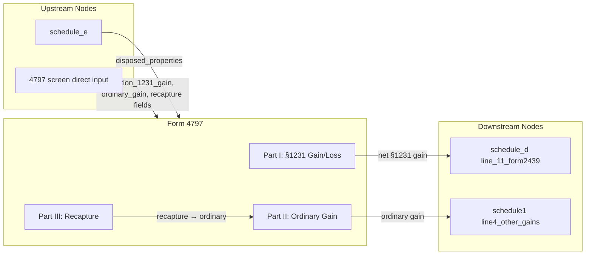

# Form 4797 — Sales of Business Property

## Overview

**IRS Form:** Form 4797 **Drake Screen:** 4797 **Tax Year:** 2025

---
## Input Fields
| Field | Type | Source Node | Description | IRS Reference | URL |
| ----- | ---- | ----------- | ----------- | ------------- | --- |
| disposed_properties | number | schedule_e | Count of disposed rental properties | Sch E Part II | — |
| section_1231_gain | number | K-1, Form 6252/8824, or direct calculation | Part I line 7 gain or loss before the five-year prior-loss lookback | IRC §1231 | https://www.irs.gov/instructions/i4797 |
| gain_form6252 | number | Form 6252 | Part I line 4 amount already included in `section_1231_gain` | Form 4797 line 4 | https://www.irs.gov/pub/irs-pdf/f4797.pdf |
| k1_1231_rows | K-1 source rows | partnership and S-corp K-1 nodes | Part I line 2, one row per nonzero box 10 or box 9 amount | Form 4797 line 2 | https://www.irs.gov/instructions/i4797 |
| passive_property_sales | dated sale rows | direct, linked to one disposed Schedule E passive activity | Positive, no-depreciation Part I line 2 or Part II line 10 sales with proceeds, basis, and exact activity link | Form 4797 lines 2 and 10 | https://www.irs.gov/instructions/i4797 |
| ordinary_gain | number | direct (4797 screen) | Additional Part II ordinary gain or loss, excluding the separately calculated §1231 recapture | IRC §1245/1250 | https://www.irs.gov/instructions/i4797 |
| ordinary_gain_form4684 | number | Form 4684 | Section B line 31 or 38a net trade/business casualty gain or loss, routed to Form 4797 line 14 | Form 4684 line 31/38a | https://www.irs.gov/pub/irs-pdf/f4684.pdf |
| recapture_form6252 | number | Form 6252 | Line 12 depreciation recapture from Form 4797 Part III; not Form 6252 line 25 | Form 6252 line 12 | https://www.irs.gov/pub/irs-pdf/f6252.pdf |
| recapture_1245 | number | direct (4797 screen) | §1245 depreciation recapture from Part III line 25 | IRC §1245 | — |
| recapture_1250 | number | direct (4797 screen) | §1250 additional depreciation recapture from Part III line 26 | IRC §1250 | — |
| nonrecaptured_1231_loss | number | direct (4797 screen) | Prior-year nonrecaptured §1231 losses (Part I line 8) | IRC §1231(c) | — |
---

## Calculation Logic

### Step 1 — Part I: Net Section 1231 Gain/Loss

- `passive_property_sales` now carries direct property-level source rows for
  positive gains with zero depreciation allowed, acquired/sold dates, proceeds,
  and basis. The holding period determines whether the row belongs in Part I
  line 2 or Part II line 10. Native MeF rows link to exactly one disposed
  passive Schedule E activity. Aggregate Part I/II amounts cannot overlap the
  corresponding rows, since the engine cannot prove they are different sales.
- This is only a bounded no-recapture source path, not completion of prior PAL
  losses. A linked activity with current operating loss or any prior passive
  carryforward still fails MeF until the shared Form 8582 Part IX allocation is
  wired into Form 4797 and AGI. The PDF projection also explicitly stops on
  these rows until its property-level line 2/10 map exists. Current sales
  requiring depreciation recapture, losses, installment treatment, or other Part
  III detail remain unsupported by this source shape.

- Multiple source nodes can supply `section_1231_gain`; the node sums their
  contributions and self-emits the total for Form 4797 MeF.
- The K-1 nodes retain each source row for MeF line 2, while Form 6252 remains
  on line 4; the serializer reconciles these known sources to line 7.
- Taxpayer provides gross §1231 gain (line 7 if positive) and nonrecaptured
  prior losses (line 8)
- Net §1231 gain = section_1231_gain − nonrecaptured_1231_loss (floor 0)
- If result > 0, that amount goes to Schedule D line 11 as long-term capital
  gain
- The portion offset by nonrecaptured losses becomes ordinary income (line 12 →
  Part II)

### Step 2 — Part II: Ordinary Gains and Losses

- The calculation node combines ordinary_gain, the source-tagged Form 4684 and
  Form 6252 amounts, and the §1231 loss or prior-loss recapture computed from
  Part I.
- That combined amount routes to Schedule 1 line 4. The MeF serializer reports
  the Form 4684 amount on line 14. Generic ordinary_gain and Form 6252 line 12
  recapture still lack the source-line or Part III property details necessary to
  report them correctly, so they fail closed.

### Step 3 — Recapture amounts

- recapture_1245 and recapture_1250 are included in ordinary_gain; no separate
  routing needed
- The §1231 five-year lookback recapture is calculated separately and must not
  also be included in ordinary_gain.

---
## Output Routing
| Output Field | Destination Node | Line / Field | Condition | IRS Reference | URL |
| ------------ | ---------------- | ------------ | --------- | ------------- | --- |
| net_section_1231_gain | schedule_d | line_11_form2439 | section_1231_gain > nonrecaptured_1231_loss | IRC §1231; Sch D line 11 | — |
| ordinary_gain | schedule1 | line4_other_gains | ordinary_gain > 0 | F1040 line 4 / Sch 1 line 4 | — |
---

## Constants & Thresholds (Tax Year 2025)

| Constant | Value | Source | URL |
| -------- | ----- | ------ | --- |
| None     | —     | —      | —   |

---
## Data Flow Diagram

---

## Edge Cases & Special Rules

- When section_1231_gain ≤ nonrecaptured_1231_loss: the entire gain is ordinary
  income (no LT capital gain to Schedule D)
- When section_1231_gain is zero or negative (pure §1231 loss): ordinary loss,
  no output to Schedule D
- disposed_properties alone (from schedule_e) is an indicator field — does not
  drive computation; actual sale data must be present
- Part III recapture (§1245/§1250) is always ordinary income regardless of
  holding period
- §1250 recapture for MACRS post-1986 real property is generally $0
  (straight-line depreciation); unrecaptured §1250 gain is capital gain handled
  by the unrecaptured_1250_worksheet
- The TY2025v5.4 MeF serializer uses Form 4797 line 7 and, when applicable,
  lines 8, 9, 11, 12, 14, 17, and 18b. Those paths have direct and XSD tests.
  Generic Part II, Part III depreciation recapture, and prior passive Form 4797
  losses still require source-level reporting and fail closed.

---

## Sources

| Document                   | Year | Section                           | URL                                       | Saved as                 |
| -------------------------- | ---- | --------------------------------- | ----------------------------------------- | ------------------------ |
| Instructions for Form 4797 | 2025 | All Parts                         | https://www.irs.gov/pub/irs-pdf/i4797.pdf | .research/docs/i4797.pdf |
| IRC §1231                  | —    | Net §1231 gain/loss               | —                                         | —                        |
| IRC §1245                  | —    | Depreciation recapture            | —                                         | —                        |
| IRC §1250                  | —    | Additional depreciation recapture | —                                         | —                        |
