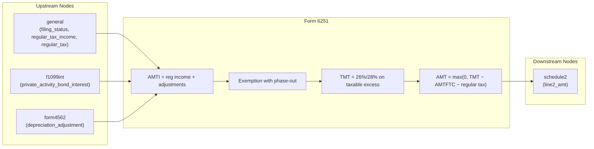

# Form 6251 — Alternative Minimum Tax—Individuals

## Overview
**IRS Form:** Form 6251
**Drake Screen:** 6251
**Tax Year:** 2025

---
## Input Fields
| Field | Type | Source Node | Description | IRS Reference | URL |
| ----- | ---- | ----------- | ----------- | ------------- | --- |
| filing_status | FilingStatus enum | general | Determines exemption amounts and rate brackets | Form 6251 Line 5 Worksheet | https://www.irs.gov/pub/irs-pdf/i6251.pdf |
| regular_tax_income | number | (upstream) | Regular taxable income (Form 1040 line 15 approx) | Form 6251 Line 1 | https://www.irs.gov/pub/irs-pdf/i6251.pdf |
| regular_tax | number | (upstream) | Regular tax liability (Form 1040 line 16 minus Form 4972) | Form 6251 Line 10 | https://www.irs.gov/pub/irs-pdf/i6251.pdf |
| iso_adjustment | number | upstream | ISO exercise adjustment (FMV − exercise price) | Form 6251 Line 2i | https://www.irs.gov/pub/irs-pdf/i6251.pdf |
| depreciation_adjustment | number | form4562 | Post-1986 depreciation AMT adjustment | Form 6251 Line 2l | https://www.irs.gov/pub/irs-pdf/i6251.pdf |
| nol_adjustment | number | unsupported direct input | Nonzero AMT NOL deduction rejects until Schedule 1 line 8a, Form 6251 line 2e, and a sourced AMT NOL refigure reconcile | Form 6251 Line 2f | https://www.irs.gov/instructions/i6251 |
| private_activity_bond_interest | number | f1099int | Tax-exempt interest from private activity bonds | Form 6251 Line 2g | https://www.irs.gov/pub/irs-pdf/i6251.pdf |
| qsbs_adjustment | number | upstream | 7% of excluded QSBS gain (section 1202) | Form 6251 Line 2h | https://www.irs.gov/pub/irs-pdf/i6251.pdf |
| other_adjustments | number | upstream | Net of all other Part I adjustments/preferences | Form 6251 Lines 2a–2e, 2j–2t, 3 | https://www.irs.gov/pub/irs-pdf/i6251.pdf |
| amtftc | number | form_1116 | AMT foreign tax credit | Form 6251 Line 8 | https://www.irs.gov/pub/irs-pdf/i6251.pdf |
| foreign_earned_income_exclusion | number | Form 2555 via income-tax calculation | Form 2555 lines 45 and 50 excluded amount used in the AMT stacking worksheet | Form 6251 Foreign Earned Income Tax Worksheet line 2a | https://www.irs.gov/instructions/i6251 |
| foreign_exclusion_disallowed_deductions | number | Form 2555 structured filing's `amt_line2b_disallowed_deductions_and_exclusions` fact | Total deductions or exclusions not claimable because they relate to excluded income; an explicit zero is required when line 6 is positive | Form 6251 Foreign Earned Income Tax Worksheet line 2b | https://www.irs.gov/instructions/i6251 |

---
## Calculation Logic
### Step 1 — AMTI (Line 4)
AMTI = regular_tax_income + iso_adjustment + depreciation_adjustment + nol_adjustment + private_activity_bond_interest + qsbs_adjustment + other_adjustments

This is a historical sketch, not the complete TY2025 line-by-line calculation. Nonzero `nol_adjustment` and mixed `other_adjustments` currently stop before AMTI is filed.

### Step 2 — Exemption (Line 5)
Full exemption from table: Single/HOH=$88,100, MFJ/QSS=$137,000, MFS=$68,500
Phase-out: 25% × max(0, AMTI − phase-out threshold)
Exemption = max(0, full_exemption − 25% × max(0, AMTI − threshold))

### Step 3 — Taxable Excess (Line 6)
Line 6 = max(0, Line 4 − Line 5)

### Step 4 — Tentative Minimum Tax (Line 7)
If Line 6 ≤ $239,100: TMT = Line 6 × 26%
If Line 6 > $239,100: TMT = Line 6 × 28% − $4,782
(MFS: threshold $119,550, adjustment $2,391)

For an ordinary-income Form 2555 return with positive line 6, use the 2025 Foreign Earned Income Tax Worksheet instead: line 2c = max(0, Form 2555 lines 45 and 50 minus line 2b disallowed deductions or exclusions); line 3 = Form 6251 line 6 plus line 2c; line 7 = AMT ordinary tax on line 3 minus AMT ordinary tax on line 2c. The structured Form 2555 filing path carries its distinct declared AMT line 2b total through income-tax calculation to Form 6251; the older Form 2555-only `deductions_allocable_to_excluded_income: 0` fact cannot establish that broader total. The AMT path does not invent zero when the fact is missing. If Form 6251 line 6 is zero, the IRS says not to complete that worksheet. Form 2555 returns with qualified dividends or capital gain distributions still require the separate AMT Part III capital-gain-excess refigure and remain unsupported. Source: [2025 Form 6251 instructions, Foreign Earned Income Tax Worksheet](https://www.irs.gov/instructions/i6251).

### Step 5 — Net AMT (Lines 9–11)
Line 9 = Line 7 − AMTFTC
Line 10 = regular tax
Line 11 = max(0, Line 9 − Line 10)

---
## Output Routing
| Output Field | Destination Node | Line / Field | Condition | IRS Reference | URL |
| ------------ | ---------------- | ------------ | --------- | ------------- | --- |
| line2_amt | schedule2 | Line 2 | AMT > 0 | Form 6251 Line 11 → 2025 Schedule 2 Line 2 | https://www.irs.gov/pub/irs-pdf/f1040s2.pdf |

---
## Constants & Thresholds (Tax Year 2025)
| Constant | Value | Source | URL |
| -------- | ----- | ------ | --- |
| Exemption — Single/HOH | $88,100 | IRS Instructions i6251 TY2025 | https://www.irs.gov/pub/irs-pdf/i6251.pdf |
| Exemption — MFJ/QSS | $137,000 | IRS Instructions i6251 TY2025 | https://www.irs.gov/pub/irs-pdf/i6251.pdf |
| Exemption — MFS | $68,500 | IRS Instructions i6251 TY2025 | https://www.irs.gov/pub/irs-pdf/i6251.pdf |
| Phase-out start — Single/HOH | $626,350 | IRS Instructions i6251 TY2025 | https://www.irs.gov/pub/irs-pdf/i6251.pdf |
| Phase-out start — MFJ/QSS | $1,252,700 | IRS Instructions i6251 TY2025 | https://www.irs.gov/pub/irs-pdf/i6251.pdf |
| Phase-out start — MFS | $626,350 | IRS Instructions i6251 TY2025 | https://www.irs.gov/pub/irs-pdf/i6251.pdf |
| 26%/28% bracket threshold | $239,100 ($119,550 MFS) | IRS Instructions i6251 TY2025 | https://www.irs.gov/pub/irs-pdf/i6251.pdf |
| 28% rate adjustment | $4,782 ($2,391 MFS) | IRS Instructions i6251 TY2025 | https://www.irs.gov/pub/irs-pdf/i6251.pdf |

---
## Data Flow Diagram

---
## Edge Cases & Special Rules
- MFS: phase-out threshold same as Single but exemption is $68,500; bracket threshold halved to $119,550
- If AMTI ≥ zero-exemption threshold (Single: $978,750, MFJ: $1,800,700, MFS: $900,350), exemption = $0 — skip worksheet, use line 4 directly as line 6
- AMT = 0 when regular tax ≥ tentative minimum tax → no output
- ISO exercise: for AMT, income = FMV − exercise price (not recognized for regular tax)
- The ordinary-income Form 2555 AMT stacking worksheet has focused cases but has not been run in the requested full-batch test. Preferential-income Form 2555 returns and the Part III capital-gain-excess refigure remain unsupported.
- Part III source and MeF paths for other qualified-dividend and capital-gain cases have been built elsewhere, but the full batch and IRS acceptance remain unverified. Do not claim complete AMT support based on this document.
- The bounded identified Form 8949 AMT-basis gain paths now cover separate unadjusted long-term-only and short-term-only positive-gain rows. The signed line 2k, long-term Part III refigure, short-term ordinary-rate path, MeF element, PDF widget, and remaining exclusions are documented in `docs/mef/ty2025-form6251-8949-basis-gap.md`. Their tests are written but unrun.

---
## Sources
| Document | Year | Section | URL | Saved as |
| -------- | ---- | ------- | --- | -------- |
| Instructions for Form 6251 | 2025 | All | https://www.irs.gov/pub/irs-pdf/i6251.pdf | .research/docs/i6251.pdf |
| IRS Form 6251 | 2025 | All | https://www.irs.gov/pub/irs-pdf/f6251.pdf | — |
