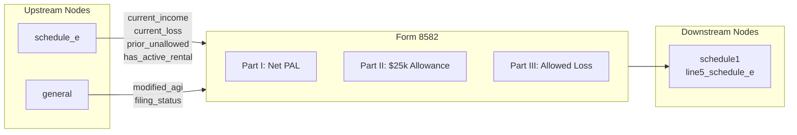

# Form 8582 — Passive Activity Loss Limitations

## Overview

**IRS Form:** Form 8582 **Drake Screen:** 8582 **Tax Year:** 2025

---
## Input Fields
| Field | Type | Source Node | Description | IRS Reference | URL |
| ----- | ---- | ----------- | ----------- | ------------- | --- |
| current_income | number | schedule_e | Current-year net passive income (sum of profitable activities) | Part I lines 1a/2a | https://www.irs.gov/instructions/i8582 |
| rental_current_income | number | schedule_e | Income from actively participated rentals, separated from other passive income | Part I line 1a | https://www.irs.gov/instructions/i8582 |
| current_loss | number | schedule_e | Current-year net passive loss (positive amount) | Part I lines 1b/2b | https://www.irs.gov/instructions/i8582 |
| rental_current_loss | number | schedule_e | Current loss from actively participated rentals | Part I line 1b | https://www.irs.gov/instructions/i8582 |
| rental_prior_eligible_loss | number | schedule_e | Prior operating loss eligible for Part IV based on participation in both years | Part I line 1c | https://www.irs.gov/instructions/i8582 |
| prior_unallowed | number | schedule_e | Prior-year unallowed PAL carryforward | Part I lines 1c/2c | https://www.irs.gov/instructions/i8582 |
| has_active_rental | boolean | schedule_e | True if any activity_type="A" (active rental RE) | Part II | https://www.irs.gov/instructions/i8582 |
| has_other_passive | boolean | schedule_e | True if any activity_type="B" (other passive) | Part V | https://www.irs.gov/instructions/i8582 |
| modified_agi | number | (caller/upstream) | Modified AGI for Part II phase-out | Part II, Line 6 | https://www.irs.gov/instructions/i8582 |
| active_participation | boolean | (caller) | Actively participated in rental RE | Part II eligibility | https://www.irs.gov/instructions/i8582 |
| filing_status | string | general | MFS disqualifies Part II if lived with spouse | Part II Caution | https://www.irs.gov/instructions/i8582 |
| activities | array | schedule_e | Per-property name, classification, net amount, and operating/4797 carryovers for Part IV/V worksheets | Parts IV-V | https://www.irs.gov/instructions/i8582 |

## Current MeF Coverage

The 2025 MeF builder emits Form 8582 for distinct Schedule E properties with whole-dollar current operating income or losses and/or prior-year operating losses. Actively participated rentals appear in Parts I and IV, while other passive rentals appear in Parts I and V. Mixed Part IV/V returns are supported: Part II's special allowance is allocated only to eligible Part IV losses, then Part VII allocates the remaining suspended loss across both kinds of activity. Parts III, VI, and VIII are emitted when applicable. Per-property loss allocations are shared between Form 8582 and Schedule E line 22, line 25, and line 26. The calculation graph separates active-rental profit from other passive profit before applying the special allowance. The current build pass splits an active rental's prior loss that did not arise during active participation into Part V and excludes it from the special allowance, including in Form 4835 farm activity routing. This split is untested under the requested build-first workflow. Prior Form 4797 losses still fail closed until their destination-form reporting is implemented. The graph currently exposes only the aggregate suspended PAL carryforward, not durable per-activity carryforward identities.

The node now rejects duplicate activity names after trimming and case folding,
including when there is no Form 4797 gain. Form 8582 Part IV/V and the later
allocation worksheets work per activity, so these rows cannot be reconciled
unambiguously. This is a current-return guard, not a durable activity ID across
tax years.

The 2025 Part IX instructions explicitly require a separate line for Form 4797 Part I and Part II; a current gain on the same part offsets the corresponding prior loss before the suspended amount is allocated across the remaining net-loss lines. `allocatePartIXLosses` implements that column (a)/(b)/(d)/(e) arithmetic from explicit per-form/part facts. The bounded no-current-Form-4797-transaction route now consumes Schedule E's origin-tagged prior Part I/II losses for other-passive activities only. The same pure allocation feeds Form 8582 Part IX XML, Form 4797 MeF PAL rows and totals, and Form 8582's Schedule 1 line 4/5 split; AGI deducts the combined allowed PAL once. An exact operating reporting form tag distinguishes Schedule E from Form 4835. Cases are written but not run. PDF export explicitly stops because Form 4797 PAL property rows and Form 8582 Part IX are not mapped to 2025 AcroForm fields. Active-rental prior Form 4797 PALs, current Part I gain combined with a prior PAL, depreciation recapture, and disposition exceptions remain blocked. Form 4797 runs before AGI, while Form 8582 runs after AGI for modified AGI, so there is no Form 8582-to-Form 4797 node feedback edge. Schedule E's existing `section_1231_gain_loss` field is still unused and not reconciled to a Form 4797 transaction; do not infer a current gain from it.
---

## Calculation Logic

### Step 1 — Combine Passive Income and Loss (Part I)

- net_rental = current_income_rental - current_loss_rental -
  prior_unallowed_rental
- net_other = current_income_other - current_loss_other - prior_unallowed_other
- overall_pal = net_rental + net_other
- If overall_pal >= 0: no PAL, all losses allowed

### Step 2 — Special $25k Allowance (Part II, active rental RE only)

- Only if has_active_rental AND active_participation AND modified_agi available
- rental_net_loss = |net_rental| (when net_rental < 0)
- Phase-out: reduce the $25,000 maximum by 50% × MAGI over $100,000
- special_allowance = min(rental_net_loss, phased-out maximum, overall passive
  loss)
- MFS (lived apart): thresholds halved ($12,500 / $75k)

### Step 3 — Total Allowed Loss (Part III)

- allowed = min(total passive losses, passive income + special_allowance)
- disallowed = total passive losses - allowed (carries forward)

### Step 4 — Route Allowed Loss

- Allowed loss → schedule1.line5_schedule_e (as negative)

---
## Output Routing
| Output Field | Destination Node | Line / Field | Condition | IRS Reference | URL |
| ------------ | ---------------- | ------------ | --------- | ------------- | --- |
| allowed passive loss | schedule1 | line5_schedule_e | When PAL exists and allowance > 0 | Part III Line 11 | https://www.irs.gov/instructions/i8582 |
---

## Constants & Thresholds (Tax Year 2025)

| Constant             | Value    | Source            | URL                                       |
| -------------------- | -------- | ----------------- | ----------------------------------------- |
| RENTAL_ALLOWANCE_MAX | $25,000  | IRC §469(i)(2)    | https://www.irs.gov/pub/irs-pdf/i8582.pdf |
| MAGI_LOWER_THRESHOLD | $100,000 | IRC §469(i)(3)(A) | https://www.irs.gov/pub/irs-pdf/i8582.pdf |
| MAGI_UPPER_THRESHOLD | $150,000 | IRC §469(i)(3)(A) | https://www.irs.gov/pub/irs-pdf/i8582.pdf |
| PHASE_OUT_RATE       | 50%      | IRC §469(i)(3)(B) | https://www.irs.gov/pub/irs-pdf/i8582.pdf |
| MFS_ALLOWANCE_MAX    | $12,500  | IRC §469(i)(5)(B) | https://www.irs.gov/pub/irs-pdf/i8582.pdf |
| MFS_MAGI_LOWER       | $50,000  | IRC §469(i)(5)(B) | https://www.irs.gov/pub/irs-pdf/i8582.pdf |
| MFS_MAGI_UPPER       | $75,000  | IRC §469(i)(5)(B) | https://www.irs.gov/pub/irs-pdf/i8582.pdf |

---
## Data Flow Diagram

---

## Edge Cases & Special Rules

1. If passive income covers all current and prior passive losses, the full loss
   amount is released to the downstream Schedule 1 calculation.
2. MFS filers who lived with spouse ANY time during year: not eligible for Part
   II; use Part III directly
3. MAGI ≥ $150,000: special allowance = $0; entire rental RE loss disallowed
   (unless offset by passive income)
4. No active_rental flag: skip Part II entirely, go straight to Part III
5. Prior unallowed losses from prior years are included in the PAL calculation
   (Part IV/V col c)
6. The graph records an aggregate suspended PAL carryforward, but per-activity
   allocation is still needed for filing and next-year use.

---

## Sources

| Document                   | Year | Section | URL                                                                             | Saved as                 |
| -------------------------- | ---- | ------- | ------------------------------------------------------------------------------- | ------------------------ |
| Instructions for Form 8582 | 2025 | All     | https://www.irs.gov/pub/irs-pdf/i8582.pdf                                       | .research/docs/i8582.pdf |
| IRC §469                   | 2025 | §469(i) | https://uscode.house.gov/view.xhtml?req=granuleid:USC-prelim-title26-section469 | N/A                      |
