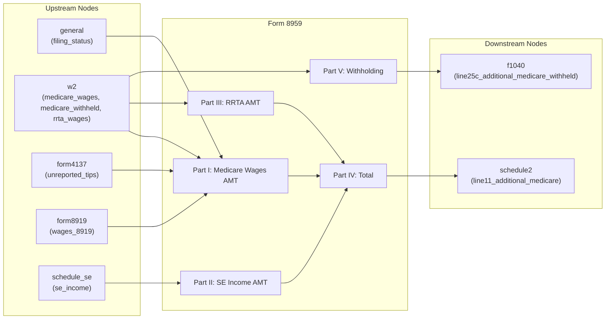

# Form 8959 — Additional Medicare Tax

## Overview

**IRS Form:** Form 8959 **Drake Screen:** None (no matching entry in
screens.json) **Tax Year:** 2025

---
## Input Fields
| Field | Type | Source Node | Description | IRS Reference | URL |
| ----- | ---- | ----------- | ----------- | ------------- | --- |
| filing_status | FilingStatus enum | general | Filing status determines threshold | IRC §3101(b)(2) | i8959 p.1 |
| w2_medicare_wages | number (optional) | w2 | Total W-2 Medicare wages & tips (box 5) | Form 8959 line 1 | i8959 p.3 |
| f4852_medicare_wages | number (optional) | f4852 | Substitute W-2 Medicare wages | Form 8959 line 1 | i8959 p.3 |
| household_medicare_wages | number (optional) | household_wages | Household employee Medicare wages | Form 8959 line 1 | i8959 p.3 |
| unreported_tips | number (optional) | form4137 | Unreported tips (Form 4137 line 6) | Form 8959 line 2 | i8959 p.3 |
| wages_8919 | number (optional) | form8919 | Wages from Form 8919 line 6 | Form 8959 line 3 | i8959 p.3 |
| se_income | number (optional) | schedule_se | SE income from Sch SE Part I line 6 | Form 8959 line 8 | i8959 p.3 |
| w2_rrta_wages | number (optional) | w2 | RRTA compensation (W-2 box 14) | Form 8959 line 14 | i8959 p.3 |
| ct2_rrta_wages | number (optional) | ct2 | Employee-representative CT-2 line 2 Tier 1 Medicare compensation | Form 8959 line 14 | i8959 p.3 |
| w2_medicare_withheld | number (optional) | w2 | Medicare tax withheld (W-2 box 6 + FICA codes B+N, excluding RRTA codes B+N) | Form 8959 line 19 | i8959 p.4 |
| f4852_medicare_withheld | number (optional) | f4852 | Substitute W-2 Medicare withholding | Form 8959 line 19 | i8959 p.4 |
| household_medicare_withheld | number (optional) | household_wages | Household employee Medicare withholding | Form 8959 line 19 | i8959 p.4 |
| w2_rrta_medicare_withheld | number (optional) | w2 | Additional Medicare Tax withheld on RRTA (W-2 box 14) | Form 8959 line 23 | i8959 p.4 |
| ct2_rrta_medicare_tax_paid | number (optional) | ct2 | Paid Additional Medicare Tax from CT-2 line 3 | Form 8959 line 23 | i8959 p.4 |
| w2_single_over_withholding_threshold | boolean (optional) | w2 | One W-2 exceeds the $200,000 withholding trigger | Form 8959 filing rule | i8959 p.1 |
| f4852_single_over_withholding_threshold | boolean (optional) | f4852 | One substitute W-2 exceeds the trigger | Form 8959 filing rule | i8959 p.1 |

The source-specific wage deposits are summed once into normalized
`medicare_wages` for lines 1 and 20, then emitted for MeF. The former
`medicare_wages_box5` override is removed. Box 1 remains the Form 1040
wage source, not a Form 8959 wage source. Statutory-employee W-2 box 5 amounts
are included even though their box 1 wages route to Schedule C. The node and
MeF builder reject the removed second wage field. Substitute W-2 and household
inputs reject Medicare withholding without corresponding Medicare wages. The
mixed-source return case and source checks are written but unrun.

The W-2 node also carries a filing-required fact when any one employer reports
more than $200,000 in box 5 or RRTA compensation in box 14. A Form 4852 W-2
substitute can carry the box 5 fact as well. This keeps Form 8959 in the return
for a joint filer whose total is below $250,000 and has no computed Additional
Medicare Tax or withholding credit. The calculation, MeF, PDF inclusion, and
full-return cases are written but unrun.
---

## Calculation Logic

### Step 1 — Determine Threshold by Filing Status

- MFJ: $250,000
- MFS: $125,000
- Single / HOH / QSS: $200,000

### Step 2 — Part I: Medicare Wages

- Line 4 = medicare_wages + unreported_tips + wages_8919
- Line 6 = max(0, line4 - threshold)
- Line 7 = line6 × 0.009

### Step 3 — Part II: SE Income

- Line 9 = filing-status threshold
- Line 10 = line 4 (total Medicare wages and tips)
- Line 11 = max(0, line 9 - line 10)
- Line 12 = max(0, nonnegative SE income - line 11)
- Line 13 = line 12 × 0.009

### Step 4 — Part III: RRTA

- Line 16 = max(0, rrta_wages - threshold) [NOT reduced by wages]
- Line 17 = line16 × 0.009

### Step 5 — Part IV: Total

- Line 18 = line7 + line13 + line17

### Step 6 — Part V: Withholding

- Line 19 = W-2 box 6 Medicare tax withheld
- Line 20 = line 1 W-2 box 5 wages
- Line 21 = line 20 × 1.45%
- Line 22 = max(0, line 19 - line 21)
- Line 23 = RRTA Additional Medicare Tax withheld from W-2 box 14
- Line 24 = line 22 + line 23

---
## Output Routing
| Output Field | Destination Node | Line / Field | Condition | IRS Reference | URL |
| ------------ | ---------------- | ------------ | --------- | ------------- | --- |
| line18_amt_tax | schedule2 | line11_additional_medicare | line18 > 0 | Form 8959 line 18 → Sch 2 line 11 | i8959 p.4 |
| line24_withheld | f1040 | line25c_additional_medicare_withheld | line24 > 0 | Form 8959 line 24 → F1040 line 25c | i8959 p.4 |
---

## Constants & Thresholds (Tax Year 2025)

| Constant                 | Value   | Source          | URL       |
| ------------------------ | ------- | --------------- | --------- |
| AMT_RATE                 | 0.009   | IRC §3101(b)(2) | i8959 p.1 |
| MFJ_THRESHOLD            | 250,000 | Not indexed     | i8959 p.1 |
| MFS_THRESHOLD            | 125,000 | Not indexed     | i8959 p.1 |
| SINGLE_HOH_QSS_THRESHOLD | 200,000 | Not indexed     | i8959 p.1 |

---
## Data Flow Diagram

---

## Edge Cases & Special Rules

1. SE income loss (negative SE) → zero for Part II (negative shouldn't count)
2. RRTA threshold is NOT reduced by wages (separate pools per instructions
   Example 7)
3. Wages DO reduce the SE income threshold (instructions Example 3)
4. If no wages at all, SE threshold = full filing status threshold
5. MFS threshold: $125k (half of MFJ) — not $200k like Single
6. All thresholds are NOT indexed for inflation
7. Qualifying surviving spouse uses the $200,000 threshold on the 2025 form, not
   the $250,000 married-filing-jointly threshold. The corrected cases are
   written but unrun.

---

## Sources

| Document                   | Year | Section   | URL                                                                              | Saved as                 |
| -------------------------- | ---- | --------- | -------------------------------------------------------------------------------- | ------------------------ |
| Instructions for Form 8959 | 2025 | All parts | https://www.irs.gov/pub/irs-pdf/i8959.pdf                                        | .research/docs/i8959.pdf |
| IRC §3101(b)(2)            | —    | AMT rate  | https://uscode.house.gov/view.xhtml?req=granuleid:USC-prelim-title26-section3101 | —                        |
