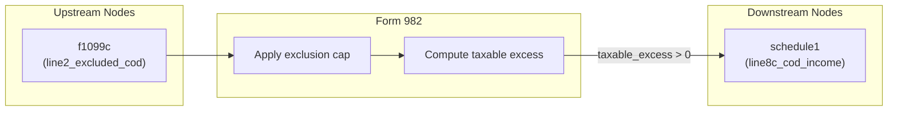

# Form 982 — Reduction of Tax Attributes Due to Discharge of Indebtedness

## Overview

**IRS Form:** Form 982 **Drake Screen:** 982 **Tax Year:** 2025

---
## Input Fields
| Field | Type | Source Node | Description | IRS Reference | URL |
| ----- | ---- | ----------- | ----------- | ------------- | --- |
| line2_excluded_cod | number | f1099c | Total excluded COD amount (line 2) | Form 982 Line 2 | https://www.irs.gov/pub/irs-pdf/f982.pdf |
| exclusion_type | enum | f1099c / user | Reason for exclusion: bankruptcy, insolvency, farm_debt, real_property_business, qpri | Form 982 Lines 1a-1e | https://www.irs.gov/instructions/i982 |
| insolvency_amount | number (optional) | user | For insolvency: liabilities minus FMV of assets immediately before discharge | IRC §108(a)(1)(B) | https://www.irs.gov/instructions/i982 |
| qpri_mfs | boolean (required for QPRI) | filing status | True if married filing separately (lowers QPRI cap from $750k to $375k) | Form 982 Line 1e | https://www.irs.gov/instructions/i982 |
| qpri_total_loan_balance_before_discharge | number | lender/loan records | Total principal immediately before discharge | Form 982 line 1e mixed-use loan rule | https://www.irs.gov/instructions/i982 |
| qpri_qualified_loan_balance_before_discharge | number | acquisition/improvement and loan records | Portion traced to buying, building, or substantially improving the main home | Form 982 line 1e mixed-use loan rule | https://www.irs.gov/instructions/i982 |
| qpri_main_home_security_confirmed | true | security and residence records | Confirms the traced debt was secured by the principal residence | QPRI definition | https://www.irs.gov/publications/p4681 |
| qpri_discharge_reason | enum | lender/workout records | Home-value decline or taxpayer financial condition, not payment for services | Form 982 line 1e | https://www.irs.gov/instructions/i982 |
| qpri_discharge_reason_source | string | lender/workout records | Identifies supporting evidence for the qualifying discharge reason | Form 982 line 1e | https://www.irs.gov/instructions/i982 |
| discharge_date | date | lender discharge record | Actual 2025 discharge date, not merely Form 1099-C box 1 identifiable-event date | Form 982 line 1e | https://www.irs.gov/instructions/i982 |
| box3_interest_treatment | taxable or cash_basis_deductible_if_paid | interest deduction and accounting-method records | Classifies the entire box 3 amount separately from QPRI principal | Form 1099-C boxes 2/3; deductible-debt exception | https://www.irs.gov/publications/p4681 |
| box3_interest_treatment_source | string | source document reference | Documents the interest classification | Form 1099-C boxes 2/3 | https://www.irs.gov/publications/p4681 |
---

## Calculation Logic

### Step 1 — Determine Applicable Cap

- bankruptcy: no cap
- insolvency: cap = insolvency_amount
- farm_debt: no explicit dollar cap (limited by tax attributes — not enforced in
  return)
- real_property_business: no explicit dollar cap (limited by adjusted basis)
- qpri: first subtract the nonqualified pre-discharge balance from discharged
  principal, then cap the qualifying remainder at $750,000 ($375,000 if MFS);
  2025 discharges only in this exporter. Missing balance tracing and a Form
  1099-C with box 3 interest requires box 2 = sourced discharged principal plus
  box 3. The interest is either taxable COD or excluded under the documented
  cash-method deductible-debt exception, never Form 982 line 2 principal. MeF
  export reconciles the MFS cap choice with the return filing status. The 1099-C
  route requires a separate actual discharge date and stops if fees or penalties
  need another classification. Form 1099-C box 7 FMV alone never creates a
  Schedule D gain; a transferred property needs a separate sourced disposition
  calculation.

### Step 2 — Compute Excluded Amount

excluded = min(line2_excluded_cod, applicable_cap) for non-QPRI exclusions; for
QPRI, excluded = min(max(0, discharged principal - (total pre-discharge
balance - traced qualified pre-discharge balance)), applicable cap)

### Step 3 — Taxable Excess

taxable_excess = line2_excluded_cod - excluded If taxable_excess > 0 → route to
schedule1 line8c_cod_income

---
## Output Routing
| Output Field | Destination Node | Line / Field | Condition | IRS Reference | URL |
| ------------ | ---------------- | ------------ | --------- | ------------- | --- |
| line8c_cod_income | schedule1 and agi_aggregator | Schedule 1 line 8c and Form 1040 line 11 | taxable_excess > 0 | Form 982; IRC §108 | https://www.irs.gov/instructions/i982 |
---

## Constants & Thresholds (Tax Year 2025)

| Constant          | Value  | Source                                   | URL                                   |
| ----------------- | ------ | ---------------------------------------- | ------------------------------------- |
| QPRI_CAP_STANDARD | 750000 | IRC §108(a)(1)(E); Form 982 instructions | https://www.irs.gov/instructions/i982 |
| QPRI_CAP_MFS      | 375000 | IRC §108(a)(1)(E); Form 982 instructions | https://www.irs.gov/instructions/i982 |

---
## Data Flow Diagram

---

## Edge Cases & Special Rules

- Insolvency cap: excluded amount cannot exceed insolvency margin (total
  liabilities minus total FMV of assets immediately before discharge)
- QPRI: applies only to discharges before January 1, 2026
- QPRI: MFS filers capped at $375,000; all others at $750,000
- QPRI: a mixed-use loan's nonqualified balance is treated as discharged first
  under the line 1e instructions; source loan balances must support that split.
- Current QPRI source evidence is entered but not authenticated. The 2025
  Publication 4681 interest, recourse/nonrecourse, disposition-gain, and
  multiple-debt cases need separate review. The other Form 982 exclusions still
  need tax-attribute reduction details before MeF export.
- If line2_excluded_cod = 0, no output produced
- Bankruptcy (Title 11) exclusion has no dollar cap
- Tax attribute reductions (NOL, credit carryovers, basis reductions) are Part
  II/III of Form 982 and are tracked as carry-forward adjustments — not computed
  on the 1040 return itself

---

## Sources

| Document                  | Year                 | Section          | URL                                            | Saved as                |
| ------------------------- | -------------------- | ---------------- | ---------------------------------------------- | ----------------------- |
| Instructions for Form 982 | 2021 (Rev. Dec 2021) | All              | https://www.irs.gov/pub/irs-pdf/i982.pdf       | .research/docs/i982.pdf |
| IRC §108                  | 2025                 | §108(a), §108(b) | https://www.law.cornell.edu/uscode/text/26/108 | —                       |
