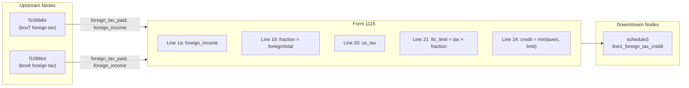

# Form 1116 — Foreign Tax Credit

## Overview

**IRS Form:** Form 1116 **Drake Screen:** 1116 **Tax Year:** 2025

---
## Input Fields
| Field | Type | Source Node | Description | IRS Reference | URL |
| ----- | ---- | ----------- | ----------- | ------------- | --- |
| foreign_tax_paid | number \| number[] | f1099div (box7), f1099int (box6), k1_s_corp, k1_trust, fec | Total creditable foreign taxes paid/accrued. Accumulated across feeders, then summed | IRC §901 | https://www.irs.gov/pub/irs-pdf/i1116.pdf |
| foreign_income | number \| number[] | f1099div (box1a), f1099int (box1), fec (compensation_usd) | Gross foreign source income (Line 1a). Accumulated across feeders, then summed | Form 1116 Part I | https://www.irs.gov/pub/irs-pdf/i1116.pdf |
| total_income | number | agi_aggregator (gross income) | Worldwide gross income from all sources (Line 3e) | Form 1116 Part I Line 3e | https://www.irs.gov/pub/irs-pdf/i1116.pdf |
| us_tax_before_credits | number | income_tax_calculation (f1040 line 16) | Regular tax liability before credits (Line 20) | Form 1116 Part III Line 20 | https://www.irs.gov/pub/irs-pdf/i1116.pdf |
| income_category | IncomeCategory enum | fec sends general; the 1099 feeders leave it at the passive default | Category of foreign income (passive, general, etc.) | Form 1116 Part I checkbox | https://www.irs.gov/pub/irs-pdf/i1116.pdf |
| filing_status | FilingStatus enum | start node | Determines de minimis threshold | IRS instructions p.1 | https://www.irs.gov/pub/irs-pdf/i1116.pdf |
---

## Calculation Logic

### Step 1 — De minimis check (election, upstream)

If total creditable foreign taxes ≤ $300 ($600 MFJ) and all from 1099 payee
statements, no Form 1116 is needed. The upstream node (f1099div/f1099int)
handles this routing. Foreign tax on wages (fec) never qualifies for the §904(j)
election and always reaches this node.

### Step 2 — FTC Limitation (Part III, IRC §904(a))

```
limitation_fraction = min(1, foreign_income / total_income)
ftc_limit = us_tax_before_credits × limitation_fraction
allowed_credit = min(foreign_taxes_paid, ftc_limit)
```

### Step 3 — Output

Route `allowed_credit` → schedule3 line1_foreign_tax_credit

---
## Output Routing
| Output Field | Destination Node | Line / Field | Condition | IRS Reference | URL |
| ------------ | ---------------- | ------------ | --------- | ------------- | --- |
| allowed_credit | schedule3 | line1_foreign_tax_credit | credit > 0 | Schedule 3 Part I Line 1 | https://www.irs.gov/pub/irs-pdf/f1040s3.pdf |
---

## Constants & Thresholds (Tax Year 2025)

| Constant          | Value | Source               | URL                                       |
| ----------------- | ----- | -------------------- | ----------------------------------------- |
| DE_MINIMIS_SINGLE | $300  | IRS Instructions p.1 | https://www.irs.gov/pub/irs-pdf/i1116.pdf |
| DE_MINIMIS_MFJ    | $600  | IRS Instructions p.1 | https://www.irs.gov/pub/irs-pdf/i1116.pdf |

---
## Data Flow Diagram

---

## Edge Cases & Special Rules

1. **No foreign income** → no output (nothing to credit)
2. **FTC ≤ limitation** → full credit (credit = foreign_taxes_paid)
3. **FTC > limitation** → limited credit (credit = ftc_limit); excess carries
   forward 10 yr / back 1 yr (not modeled here)
4. **Zero US tax** → no credit (limitation = 0)
5. **Passive vs General category** — tracked via income_category enum; separate
   Form 1116 per category
6. **De minimis** → handled upstream; this node only fires when above threshold
7. **Directly allocable expenses** — require a source explanation. The MeF
   builder includes Part I line 2 and links a separate
   `ForeignIncmRelatedExpensesStmt` in ReturnData order. The K-1 partnership, S
   corporation, and trust inputs can carry the explanation alongside the
   foreign-deduction amount. This path is written but awaits the full test batch
   and IRS business-rule review.
8. **Other categories** — the 2025 form requires a separate Form 1116 and
   separate Part IV credit line for section 951A, foreign branch, section
   901(j), treaty-resourced, and lump-sum income. The calculation now rejects
   the four unsupported categories represented in `IncomeCategory` before
   sending any credit to Schedule 3, including when mixed with a supported
   passive/general item. Those baskets still require their own source facts,
   category-specific tax adjustments, MeF tags, and filing tests; a checkbox
   alone is not a calculation. Lump-sum is not an input category yet.
9. **2025 senior deduction and line 18** — Form 1116 line 18 adds back Schedule
   1-A line 37 to Form 1040 line 11b less line 14, while line 3b expressly
   excludes that senior deduction. The present worldwide-taxable- income input
   is not proven against those source lines, so this is an open source-to-return
   reconciliation gap rather than an amount to infer.
10. **2025 PDF field map** — direct inspection of the official 2025 AcroForm
    field tree and page-2 widget rectangles identifies
    `topmostSubform[0].Page2[0].f2_10[0]` at printed line 18 and
    `topmostSubform[0].Page2[0].f2_12[0]` at printed line 20. The PDF descriptor
    now maps `total_income` and `us_tax_before_credits` to those fields,
    respectively. This corrects the previous line-6/line-10 destinations but
    does not establish that the raw line-18 input includes the Schedule 1-A
    line-37 add-back. Likewise, line 20 also requires Schedule 2 line 1z in
    addition to Form 1040 line 16, and the raw U.S.-tax input is not yet
    reconciled to both sources. Render verification is deferred to the full
    batch.

---

## Sources

### TY2025 preferential-rate line 18 build slice (written, unrun)

The
[2025 Form 1116 line 18 instructions](https://www.irs.gov/instructions/i1116)
require the Worksheet for Line 18 when the Qualified Dividends and Capital Gain
Tax Worksheet has positive line 5 and preferential line 23 tax below line 24,
unless a qualifying adjustment-exception election is made. The Form 1116
worksheet starts with **signed** Form 1040 line 11b less line 14 **plus**
Schedule 1-A line 37, before flooring. Its QDCGT route skips lines 2-5 and uses
QDCGT lines 20, 17 and 9 on lines 6, 8 and 10, applying 0.4595 and 0.5946 to the
first two before subtracting their sum and the full 0%-rate amount from line 1.
The regular-tax node now deposits its sourced QD, net gain, filing status, tax
method and pre-additional-item tax; Form 1116 recomputes those worksheet lines
and line 18. The Form 1040 sink still independently reconciles the signed base
to filed lines, then checks the computed adjustment.

This slice requires a documented public `form1116_review` input verifying zero
foreign-source qualified dividends and no foreign-source capital gains or losses
(zero net gain alone could hide a loss). That keeps each foreign-category line
17 numerator unadjusted; positive foreign-source preferential income needs its
separate category-rate adjustment and is rejected. Known 1099-DIV foreign-source
qualified dividends are also deposited as a contradiction check. The Schedule D
Tax Worksheet (28%/25% gains or Form 4952 election), Form 2555 and Form 8615
overlaps, and AMT overlap remain rejected. The no-AMT review fact is checked
again at the final Form 1040 sink against the sourced Schedule 2 Part I line 2
amount (Part I less line 1z), or a positive Form 6251 line 11 audit field; this
still does not implement the AMT foreign-tax-credit limitation. No current-run
test, XSD, PDF render, business-rule, or ATS pass has been performed.

### TY2025 current-year excess carryover slice (written, unrun)

The [2025 Form 1116 instructions](https://www.irs.gov/instructions/i1116)
require Schedule B for a category that generates a foreign-tax carryover in
2025. The [Schedule B instructions](https://www.irs.gov/instructions/i1116sb)
separate line 6, current-year excess taxes, from line 7, the amount carried back
to 2024, and line 8, the amount remaining for future years. The 2025
IRS1116ScheduleB schema places `ForeignTxCyovGenCurrTYGrp` (line 6) before
`ForeignTxCyovFollowingTYGrp` (line 8), both with current-year and total
amounts. `ReturnData1040.xsd` places Schedule B immediately after IRS1116.

This build slice computes line 6 from one passive or general category's
current-year foreign tax less the category's limitation. It emits equal line 8
only when reviewed 2024 Form 1116 line 24 has used the full line 23 limitation,
the reviewed 2024 Schedule B ending balance is zero, and no foreign-tax
redetermination or special adjustment is unresolved. The review retains source
document references. A missing review or unused prior-year limitation fails
closed rather than silently treating the carryback as zero. Prior carryover
balances, nonzero carrybacks, multiple excess categories, foreign-tax
reductions, section 951A, and other category-specific rules remain open. Native
Schedule B XML and focused cases are written; no test, XSD, business-rule, PDF,
or ATS gate has run.

### TY2025 reviewed 2023/2024 prior carryover use (written, unrun)

The [2025 Form 1116](https://www.irs.gov/pub/irs-pdf/f1116.pdf) puts the
adjusted prior carryover from Schedule B line 3 column (xiv) on line 10, adds it
to current tax on line 11, and uses the resulting line 14 amount (absent lines
12 and 13 adjustments) against the category line 23 limit on line 24. The
[Schedule B instructions](https://www.irs.gov/instructions/i1116sb) carry 2024
line 8 columns (xii) and (xiii) into 2025 line 1 columns (xi) and (xii),
reconcile them on line 3, record actual 2025 use oldest-first as a negative on
line 4, and leave unused vintage balances on line 8. The local TY2025 v5.4 IRS
schema has the matching second-preceding, first-preceding, and total elements in
that order.

The public `form1116_prior_carryover` input accepts one filed 2024 Schedule B
line 8 balance for a passive or general category with one or both 2023/2024
vintages. The vintage entries must add exactly to the filed line 8 total, all
other vintages must be reviewed as zero, and no intervening adjustment may be
unresolved. For one category, 2025 tax uses limitation first, then the older
2023 balance before 2024, as the Schedule B line 4 instructions require. The
native Schedule B emits both year columns and totals in checked-in XSD order.
The current-year and prior-year Schedule B cases are an explicit discriminated
union, not an inferred zero or a silent fallback. Multi-category carryover use,
older vintages, carryback adjustments, current excess in the same category, AMT,
excluded income, and tax redeterminations remain unsupported.
XML/PDF/full-batch/IRS-rule/ATS gates have not run.

### TY2025 foreign tax redetermination and Schedule C (reviewed, not filed)

The
[December 2025 Schedule C instructions](https://www.irs.gov/instructions/i1116sc)
require Schedule C for a foreign tax redetermination occurring in 2025 even if
it does not change U.S. tax. Parts I and II distinguish an increase in accrued
tax from a decrease or refund; Parts III and IV track changes to taxes and U.S.
liability in relation-back and affected years. A changed U.S. liability also
requires an amended return for the affected year. Additional _paid_ tax under
the cash method is instead current-year Form 1116 Part II, not Schedule C Part
I. Contested provisional credits additionally implicate Form 7204 and Part V.

The checked-in TY2025 v5.4 `IRS1116ScheduleC.xsd` has a native root and required
nested relation-back-year and payor groups. The current foreign-tax item knows
current amount, income category, country, tax date, and paid/accrued method, but
not the foreign tax year, relation-back U.S. year, payor identity, original
filed tax, local-currency change and conversion, affected-year U.S. tax
recomputation, or filed/amended return evidence. Existing carryover sources
assert no intervening redetermination and cannot substitute for those facts.
The public `form1116_schedule_c_source` now accepts a category/relation-back
ledger with payor tax changes, filed and redetermined Form 1116 totals, and
affected-year U.S. liability reviews, each with source references. It checks
the payor and category arithmetic, cash-method classification, and the
24-month nonpayment date before routing to Form 1116. The node and direct
MeF/PDF serializers still reject the event because no native Schedule C or
amended-year package is produced. Omitting an event cannot be detected from
today's source graph. Real filing support still needs the primary foreign
assessment/refund/payment evidence, prior filed Form 1116/Schedule B, all
affected returns and recalculations, and any Form 7204 contest history.
The [Schedule C gap audit](../../../../../../../docs/mef/ty2025-form1116-schedule-c-gap.md)
records the missing payor, currency, filed-return, and affected-year facts and
the exact fail-closed validation boundary.

| Document                   | Year | Section        | URL                                            | Saved as  |
| -------------------------- | ---- | -------------- | ---------------------------------------------- | --------- |
| Instructions for Form 1116 | 2025 | All parts      | https://www.irs.gov/pub/irs-pdf/i1116.pdf      | i1116.pdf |
| Form 1116                  | 2025 | Parts I–IV     | https://www.irs.gov/pub/irs-pdf/f1116.pdf      | —         |
| IRC §904                   | —    | FTC Limitation | https://www.law.cornell.edu/uscode/text/26/904 | —         |
