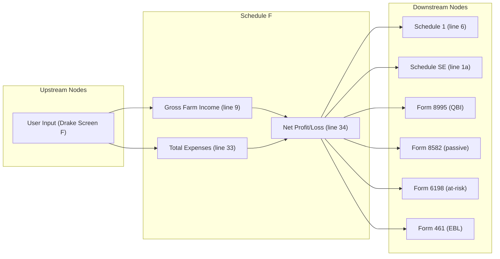

# Schedule F — Profit or Loss From Farming

## Overview
**IRS Form:** Schedule F (Form 1040)
**Drake Screen:** F
**Tax Year:** 2025

---
## Input Fields
| Field | Type | Source Node | Description | IRS Reference | URL |
| ----- | ---- | ----------- | ----------- | ------------- | --- |
| farm_id | string? | user | Stable farm identifier used to reconcile routed 1099s and vehicle expenses; required when sources exist | Per-activity Schedule F reconciliation | https://www.irs.gov/instructions/i1040sf |
| line_a_principal_crop_activity | string | user | Principal crop or activity | Sch F line A | https://www.irs.gov/pub/irs-pdf/f1040sf.pdf |
| line_b_agricultural_activity_code | string | user | Six-digit agricultural activity code | Sch F line B | https://www.irs.gov/pub/irs-pdf/f1040sf.pdf |
| line_c_farm_name | string? | user | Internal farm/activity label for per-activity tracking | Form 6198 activity description | https://www.irs.gov/pub/irs-pdf/f6198.pdf |
| line_d_ein | string? | user | Employer ID number | Sch F line D | https://www.irs.gov/pub/irs-pdf/i1040sf.pdf |
| line_e_material_participation | boolean | user | Did you materially participate? | Sch F line E | https://www.irs.gov/pub/irs-pdf/i1040sf.pdf |
| line_f_made_1099_payments | boolean? | user | Did you make payments requiring 1099? | Sch F line F | https://www.irs.gov/pub/irs-pdf/i1040sf.pdf |
| line_f_filed_1099s | boolean? | user | Were required Forms 1099 filed? | Sch F line G | https://www.irs.gov/pub/irs-pdf/f1040sf.pdf |
| accounting_method | "cash"\|"accrual" | user | Cash or accrual; accrual is rejected until Part III facts are modeled | Sch F Parts I/III | https://www.irs.gov/pub/irs-pdf/f1040sf.pdf |
| line1_sales_livestock_resale | number | user | Sales of livestock and other resale items | Sch F Part I line 1a | https://www.irs.gov/pub/irs-pdf/f1040sf.pdf |
| line1b_cost_livestock_resale | number? | user | Cost or basis of livestock purchased for resale | Sch F Part I line 1b | https://www.irs.gov/pub/irs-pdf/f1040sf.pdf |
| line2_sales_products_raised | number? | user | Sales of livestock, produce, grains, and other products raised | Sch F Part I line 2 | https://www.irs.gov/pub/irs-pdf/f1040sf.pdf |
| line3a_cooperative_distributions | number? | user | Total cooperative distributions | Sch F Part I line 3a | https://www.irs.gov/pub/irs-pdf/i1040sf.pdf |
| line3b_cooperative_distributions_taxable | number? | user | Taxable cooperative distributions | Sch F Part I line 3b | https://www.irs.gov/pub/irs-pdf/i1040sf.pdf |
| line4a_ag_program_payments | number? | user | Total agricultural program payments | Sch F Part I line 4a | https://www.irs.gov/pub/irs-pdf/i1040sf.pdf |
| line4b_ag_program_payments_taxable | number? | user | Taxable agricultural program payments | Sch F Part I line 4b | https://www.irs.gov/pub/irs-pdf/i1040sf.pdf |
| line5a_ccc_loans_election | number? | user | CCC loans reported under election | Sch F Part I line 5a | https://www.irs.gov/pub/irs-pdf/i1040sf.pdf |
| line5a_ccc_loan_details | {description, amount}[]? | user | Itemized CCC loans matching line 5a; MeF supporting statement | Sch F Part I line 5a | https://www.irs.gov/instructions/i1040sf |
| ccc_loan_election_in_effect | boolean? | user | Whether CCC loan proceeds are reported as income, including a prior-year election; required when a 1099-G market gain is routed | Sch F lines 4b and 5a | https://www.irs.gov/instructions/i1040sf |
| line5b_ccc_loans_forfeited | number? | user | CCC loans forfeited (total) | Sch F Part I line 5b | https://www.irs.gov/pub/irs-pdf/i1040sf.pdf |
| line5c_ccc_loans_forfeited_taxable | number? | user | Taxable amount of forfeited CCC loans | Sch F Part I line 5c | https://www.irs.gov/pub/irs-pdf/f1040sf.pdf |
| line6a_crop_insurance | number? | user | Crop insurance proceeds received | Sch F Part I line 6a | https://www.irs.gov/pub/irs-pdf/i1040sf.pdf |
| line6b_crop_insurance_taxable | number? | user | Crop insurance taxable in current year | Sch F Part I line 6b | https://www.irs.gov/pub/irs-pdf/i1040sf.pdf |
| line6c_defer_crop_insurance | boolean? | user | Election to defer eligible crop insurance | Sch F Part I line 6c | https://www.irs.gov/instructions/i1040sf |
| line6c_crop_insurance_deferral_details | object? | user | Damaged crops, dates, payments, carriers, and normal practice for the attached statement | Sch F Part I line 6c | https://www.irs.gov/publications/p225 |
| line6d_crop_insurance_deferred | number? | user | Crop insurance deferred from prior year | Sch F Part I line 6d | https://www.irs.gov/pub/irs-pdf/i1040sf.pdf |
| line7_custom_hire_income | number? | user | Custom hire / machine work income | Sch F Part I line 7 | https://www.irs.gov/pub/irs-pdf/i1040sf.pdf |
| line8_other_income | number? | user | Other farm income | Sch F Part I line 8 | https://www.irs.gov/pub/irs-pdf/i1040sf.pdf |
| line10_car_truck | number? | user | Car and truck expenses | Sch F Part II line 10 | https://www.irs.gov/pub/irs-pdf/i1040sf.pdf |
| line11_chemicals | number? | user | Chemicals | Sch F Part II line 11 | https://www.irs.gov/pub/irs-pdf/i1040sf.pdf |
| line12_conservation | number? | user | Conservation expenses | Sch F Part II line 12 | https://www.irs.gov/pub/irs-pdf/i1040sf.pdf |
| line13_custom_hire | number? | user | Custom hire / machine work expense | Sch F Part II line 13 | https://www.irs.gov/pub/irs-pdf/i1040sf.pdf |
| line14_depreciation | number? | user | Depreciation / section 179 | Sch F Part II line 14 | https://www.irs.gov/pub/irs-pdf/i1040sf.pdf |
| line15_employee_benefits | number? | user | Employee benefit programs | Sch F Part II line 15 | https://www.irs.gov/pub/irs-pdf/i1040sf.pdf |
| line16_feed | number? | user | Feed purchased | Sch F Part II line 16 | https://www.irs.gov/pub/irs-pdf/i1040sf.pdf |
| line17_fertilizers | number? | user | Fertilizers and lime | Sch F Part II line 17 | https://www.irs.gov/pub/irs-pdf/i1040sf.pdf |
| line18_freight | number? | user | Freight and trucking | Sch F Part II line 18 | https://www.irs.gov/pub/irs-pdf/i1040sf.pdf |
| line19_gasoline | number? | user | Gasoline, fuel, and oil | Sch F Part II line 19 | https://www.irs.gov/pub/irs-pdf/i1040sf.pdf |
| line20_insurance | number? | user | Insurance (other than health) | Sch F Part II line 20 | https://www.irs.gov/pub/irs-pdf/i1040sf.pdf |
| line21a_interest_mortgage | number? | user | Mortgage interest | Sch F Part II line 21a | https://www.irs.gov/pub/irs-pdf/i1040sf.pdf |
| line21b_interest_other | number? | user | Other interest | Sch F Part II line 21b | https://www.irs.gov/pub/irs-pdf/i1040sf.pdf |
| line22_labor_hired | number? | user | Gross labor hired before employment credits; the calculator subtracts farm-linked Form 5884 line 2 and separately entered other employment credits for the filed line 22 amount | Sch F Part II line 22 | https://www.irs.gov/pub/irs-pdf/i1040sf.pdf |
| line23_pension_plans | number? | user | Pension and profit-sharing plans | Sch F Part II line 23 | https://www.irs.gov/pub/irs-pdf/i1040sf.pdf |
| line24a_rent_vehicles | number? | user | Rent/lease vehicles, machinery | Sch F Part II line 24a | https://www.irs.gov/pub/irs-pdf/i1040sf.pdf |
| line24b_rent_land | number? | user | Rent/lease other property (land, pasture) | Sch F Part II line 24b | https://www.irs.gov/pub/irs-pdf/i1040sf.pdf |
| line25_repairs | number? | user | Repairs and maintenance | Sch F Part II line 25 | https://www.irs.gov/pub/irs-pdf/i1040sf.pdf |
| line26_seeds | number? | user | Seeds and plants | Sch F Part II line 26 | https://www.irs.gov/pub/irs-pdf/i1040sf.pdf |
| line27_storage | number? | user | Storage and warehousing | Sch F Part II line 27 | https://www.irs.gov/pub/irs-pdf/i1040sf.pdf |
| line28_supplies | number? | user | Supplies | Sch F Part II line 28 | https://www.irs.gov/pub/irs-pdf/i1040sf.pdf |
| line29_taxes | number? | user | Taxes | Sch F Part II line 29 | https://www.irs.gov/pub/irs-pdf/i1040sf.pdf |
| line30_utilities | number? | user | Utilities | Sch F Part II line 30 | https://www.irs.gov/pub/irs-pdf/i1040sf.pdf |
| line31_vet | number? | user | Veterinary, breeding, medicine | Sch F Part II line 31 | https://www.irs.gov/pub/irs-pdf/i1040sf.pdf |
| line32_other_expenses | {description, amount}[]? | user | Itemized other farm expenses | Sch F Part II line 32 | https://www.irs.gov/pub/irs-pdf/f1040sf.pdf |
| line36_at_risk | "a"\|"b"? | user | At-risk box (36a=all at risk, 36b=some not) | Sch F line 36 | https://www.irs.gov/pub/irs-pdf/i1040sf.pdf |
| filing_status | FilingStatus? | user | Filing status (for EBL threshold) | Form 461 | https://www.irs.gov/pub/irs-pdf/f461.pdf |
| farm_optional_method_elected | boolean? | user | Return-wide Schedule SE Part II farm optional-method election; route Schedule F line 9 gross and line 34 net even when net is below $400 or a loss | 2025 Schedule SE Part II line 15 and footnotes | https://www.irs.gov/pub/irs-prior/f1040sse--2025.pdf |
| farm_sources | {farm_id, kind, amount, deferred?}[]? | 1099-G, 1099-MISC, 1099-NEC, auto-expense | Source amounts for per-farm reconciliation; not added a second time to income or expenses | Schedule F lines 4a, 6a, 8, 10 | https://www.irs.gov/instructions/i1040sf |

---
## Calculation Logic
### Step 1 — Gross Farm Income (line 9)
Sum: line 1c (line 1a less line 1b) + line 2 + line 3b + line 4b + line 5a + line 5c + line 6b + line 6d + line 7 + line 8. Line 5b is informational; line 5c is its taxable amount.

The start node accepts user-entered `schedule_f.schedule_fs`. Routed sources carry `farm_id` and must be covered by that farm's reported lines: 1099-G boxes 7 and 9 on line 4a, 1099-MISC box 9 on line 6a, 1099-NEC farm payments on line 8, and auto expenses on line 10. Source amounts validate coverage but are not added to these lines again. CCC market gain on line 4a is taxable on line 4b only when the farmer did not elect to report the CCC loan proceeds as income. The election status must be stated when a market-gain source exists, since it may have begun in a prior year. Schedule F and Form 4835 share the itemized CCC-loan and crop-insurance deferral statement logic.

### Step 2 — Total Expenses (line 33)
Sum all Part II expense lines 10–32f.
Conservation expenses (line 12) are limited to 25% of gross farm income.

### Step 3 — Net Profit / Loss (line 34)
line 34 = line 9 − line 33

### Step 4 — Output Routing
- When activity exists → Schedule 1 line 6 (even if the net result is zero)
- If net profit ≥ $400 → Schedule SE (net_profit_schedule_f)
- With an explicit farm optional-method election → one Schedule SE Part II route
  with total Schedule F line 9 gross farm income (not less than zero) and
  total line 34 net farm profit before any subsequent Form 6198 at-risk
  limitation. This replaces the ordinary per-farm Schedule SE line 1a route,
  including when the farm has a loss or less than $400 profit. Schedule 1 and
  QBI still use their own existing calculations. The Schedule SE node decides
  eligibility and computes line 15.
- If net profit > 0 → Form 8995 (qbi_from_schedule_f)
- If material_participation = false → Form 8582 (passive_schedule_f)
- If at_risk = "b" and loss, the farm requires per-activity simplified Form 6198
  facts. The computed allowable loss reaches Schedule 1; the excess is tracked
  separately for that farm. MeF creates one Form 6198 document per affected
  farm rather than using a return-wide `schedule_f_loss` amount.
- If EBL threshold exceeded → Form 461

---
## Output Routing
| Output Field | Destination Node | Line / Field | Condition | IRS Reference | URL |
| ------------ | ---------------- | ------------ | --------- | ------------- | --- |
| line6_schedule_f | schedule1 | Line 6 | always | IRC §61 | https://www.irs.gov/pub/irs-pdf/i1040s1.pdf |
| net_profit_schedule_f | schedule_se | Line 1a | profit ≥ $400 | IRC §1402 | https://www.irs.gov/pub/irs-pdf/i1040sse.pdf |
| farm_optional_method_elected, gross_farm_income, net_profit_schedule_f | schedule_se | Part II line 15 eligibility/input | election is true | 2025 Schedule SE Part II and footnotes | https://www.irs.gov/pub/irs-prior/f1040sse--2025.pdf |
| qbi_from_schedule_f | form8995 | — | profit > 0 | IRC §199A | https://www.irs.gov/pub/irs-pdf/f8995.pdf |
| passive_schedule_f | form8582 | — | not material participant | IRC §469 | https://www.irs.gov/pub/irs-pdf/f8582.pdf |
| per-farm at-risk facts | form6198 | — | loss + not all at risk | IRC §465 | https://www.irs.gov/pub/irs-pdf/f6198.pdf |
| excess_business_loss | form461 | — | loss > EBL threshold | IRC §461(l) | https://www.irs.gov/pub/irs-pdf/f461.pdf |

---
## Constants & Thresholds (Tax Year 2025)
| Constant | Value | Source | URL |
| -------- | ----- | ------ | --- |
| SE_TAX_THRESHOLD | $400 | IRC §1402(b) | https://www.irs.gov/pub/irs-pdf/i1040sse.pdf |
| CONSERVATION_LIMIT_PCT | 25% of gross farm income | Pub. 225 ch.5 | https://www.irs.gov/pub/irs-pdf/p225.pdf |
| EBL_THRESHOLD_SINGLE | $313,000 | IRC §461(l); Rev. Proc. 2024-40 | https://www.irs.gov/pub/irs-drop/rp-24-40.pdf |
| EBL_THRESHOLD_MFJ | $626,000 | IRC §461(l); Rev. Proc. 2024-40 | https://www.irs.gov/pub/irs-drop/rp-24-40.pdf |

---
## Data Flow Diagram

---
## Edge Cases & Special Rules
1. **Zero income + zero expenses** — no outputs (nothing to report)
2. **Loss → Schedule 1** — losses are reported (line 6 can be negative)
3. **Loss → Schedule SE** — losses do not route under the ordinary method, but
   an explicit farm optional-method election routes gross income and line 34
   net profit for Schedule SE Part II eligibility and line 15.
4. **Conservation limit** — capped at 25% of gross farm income
5. **EBL** — uses same thresholds as Schedule C ($313k single / $626k MFJ)
6. **Accrual method** — node does not recompute; input fields carry accrual-adjusted amounts
7. **CCC loans** — line 5c is the taxable portion of forfeited loans and enters gross income; line 5b is not added separately.

---
## Sources
| Document | Year | Section | URL | Saved as |
| -------- | ---- | ------- | --- | -------- |
| Instructions for Schedule F (Form 1040) | 2025 | All | https://www.irs.gov/pub/irs-pdf/i1040sf.pdf | .research/docs/i1040sf.pdf |
| Schedule F (Form 1040) | 2025 | — | https://www.irs.gov/pub/irs-pdf/f1040sf.pdf | — |
| Publication 225 (Farmer's Tax Guide) | 2025 | Ch. 4–8 | https://www.irs.gov/pub/irs-pdf/p225.pdf | — |
| IRC §1402 | — | SE income | https://uscode.house.gov/view.xhtml?req=granuleid:USC-prelim-title26-section1402 | — |
| IRC §461(l) | — | EBL | https://uscode.house.gov/view.xhtml?req=granuleid:USC-prelim-title26-section461 | — |
