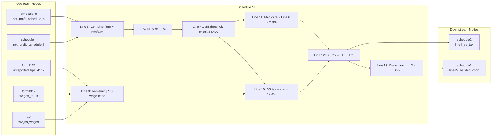

# Schedule SE — Self-Employment Tax

## Overview

Schedule SE computes self-employment (SE) tax for individuals with net
self-employment income. It receives net profits from upstream nodes (Schedule C,
Schedule F), unreported tips (Form 4137), and wages subject to SE (Form 8919).
It applies the 92.35% net-earnings multiplier, computes the Social Security
portion (12.4%, subject to the annual wage base) and Medicare portion (2.9%),
then emits the SE tax to Schedule 2 (line 4) and the deductible half (50%) to
Schedule 1 (line 15).

**IRS Form:** Schedule SE (Form 1040) **Drake Screen:** SE **Tax Year:** 2025
**Drake Reference:** https://kb.drakesoftware.com/Site/Browse/13034

---

## Input Fields

Fields received from upstream NodeOutput objects.

| Field                        | Type                          | Source Node | Description                                                                                          | IRS Reference                       | URL                                          |
| ---------------------------- | ----------------------------- | ----------- | ---------------------------------------------------------------------------------------------------- | ----------------------------------- | -------------------------------------------- |
| net_profit_schedule_c        | number (optional)             | schedule_c  | Net profit/loss from Schedule C, line 31                                                             | Sch SE Line 2                       | https://www.irs.gov/pub/irs-pdf/f1040sse.pdf |
| net_profit_schedule_f        | number (optional)             | schedule_f  | Net farm profit/loss from Schedule F, line 34; eligibility fact when farm optional method is elected | Sch SE Line 1a; Part II eligibility | f1040sse.pdf                                 |
| farm_optional_method_elected | boolean (optional)            | schedule_f  | Explicit Part II farm optional method election                                                       | Sch SE Part II                      | f1040sse.pdf                                 |
| gross_farm_income            | nonnegative number (optional) | schedule_f  | Schedule F line 9 gross income for elected Part II line 15                                           | Sch SE Part II line 15              | f1040sse.pdf                                 |
| unreported_tips_4137         | number (optional)             | form4137    | Unreported tips subject to SE from Form 4137, line 10                                                | Sch SE Line 8b                      | https://www.irs.gov/pub/irs-pdf/f1040sse.pdf |
| wages_8919                   | number (optional)             | form8919    | Wages subject to SE from Form 8919, line 10                                                          | Sch SE Line 8c                      | https://www.irs.gov/pub/irs-pdf/f1040sse.pdf |
| w2_ss_wages                  | number (optional)             | w2          | Combined W-2 SS wages (boxes 3+7) for wage base offset                                               | Sch SE Line 8a                      | https://www.irs.gov/pub/irs-pdf/f1040sse.pdf |

---

## Calculation Logic

### Step 1 — Farm net earnings (Line 1a)

Farm profit from Schedule F. Enter net_profit_schedule_f (may be negative).

> **Source:** Schedule SE (Form 1040) 2025, Part I Line 1a —
> https://www.irs.gov/pub/irs-pdf/f1040sse.pdf

### Step 2 — Nonfarm net profit (Line 2)

Net profit from Schedule C line 31 (and K-1 box 14 code A for nonfarm).

> **Source:** Schedule SE (Form 1040) 2025, Part I Line 2 —
> https://www.irs.gov/pub/irs-pdf/f1040sse.pdf

### Step 3 — Combine (Line 3)

Line 3 = Line 1a + Line 2 (Line 1b for Conservation Reserve Program payments —
not in scope)

> **Source:** Schedule SE (Form 1040) 2025, Part I Line 3 —
> https://www.irs.gov/pub/irs-pdf/f1040sse.pdf

### Step 4 — Net earnings from self-employment (Line 4a)

If Line 3 > 0: Line 4a = Line 3 × 0.9235 If Line 3 ≤ 0: Line 4a = Line 3 (enter
as-is per instructions)

> **Source:** Schedule SE (Form 1040) 2025, Part I Line 4a —
> https://www.irs.gov/pub/irs-pdf/f1040sse.pdf

### Step 5 — SE threshold check (Line 4c)

Line 4c = Line 4a + optional methods Line 4b. The farm optional method is
implemented for an explicit election; the nonfarm optional method remains
outside this slice. If Line 4c < $400 → no SE tax; stop computation (return
empty outputs). Exception: if church employee income exists, enter -0- and
continue (church income not in scope).

> **Source:** Schedule SE (Form 1040) 2025, Part I Line 4c note —
> https://www.irs.gov/pub/irs-pdf/f1040sse.pdf

### Step 6 — Line 6 (total SE earnings)

Line 6 = Line 4c + Line 5b (church employee income × 92.35%; not in scope) In
practice: Line 6 = Line 4c, including farm optional method earnings when
elected.

> **Source:** Schedule SE (Form 1040) 2025, Part I Line 6 —
> https://www.irs.gov/pub/irs-pdf/f1040sse.pdf

### Step 7 — SS wage base (Line 7)

Fixed constant for TY2025: $176,100

> **Source:** Rev Proc 2024-40; Schedule SE (Form 1040) 2025, Part I Line 7 —
> https://www.irs.gov/pub/irs-pdf/f1040sse.pdf

### Step 8 — Offset W-2 wages from wage base (Lines 8a–8d)

Line 8a = Total SS wages from W-2 forms (w2_ss_wages) Line 8b = Unreported tips
from Form 4137 line 10 (unreported_tips_4137) Line 8c = Wages subject to SS from
Form 8919 line 10 (wages_8919) Line 8d = 8a + 8b + 8c

> **Source:** Schedule SE (Form 1040) 2025, Part I Lines 8a–8d —
> https://www.irs.gov/pub/irs-pdf/f1040sse.pdf

### Step 9 — Remaining wage base (Line 9)

Line 9 = max(0, Line 7 − Line 8d) If Line 9 = 0, skip lines 8b–10 and go to Line
11 (no additional SS tax).

> **Source:** Schedule SE (Form 1040) 2025, Part I Line 9 —
> https://www.irs.gov/pub/irs-pdf/f1040sse.pdf

### Step 10 — Social Security tax portion (Line 10)

Line 10 = min(Line 6, Line 9) × 0.124

> **Source:** Schedule SE (Form 1040) 2025, Part I Line 10 —
> https://www.irs.gov/pub/irs-pdf/f1040sse.pdf

### Step 11 — Medicare tax portion (Line 11)

Line 11 = Line 6 × 0.029

> **Source:** Schedule SE (Form 1040) 2025, Part I Line 11 —
> https://www.irs.gov/pub/irs-pdf/f1040sse.pdf

### Step 12 — Total SE tax (Line 12)

Line 12 = Line 10 + Line 11 Routed to Schedule 2 (Form 1040), line 4.

> **Source:** Schedule SE (Form 1040) 2025, Part I Line 12 —
> https://www.irs.gov/pub/irs-pdf/f1040sse.pdf

### Step 13 — SE deduction (Line 13)

Line 13 = Line 12 × 0.50 Routed to Schedule 1 (Form 1040), line 15.

> **Source:** Schedule SE (Form 1040) 2025, Part I Line 13 —
> https://www.irs.gov/pub/irs-pdf/f1040sse.pdf

---

## Output Routing

| Output Field | Destination Node | Line / Field | Condition          | IRS Reference  | URL                                          |
| ------------ | ---------------- | ------------ | ------------------ | -------------- | -------------------------------------------- |
| se_tax       | schedule2        | line 4       | SE earnings ≥ $400 | Sch SE Line 12 | https://www.irs.gov/pub/irs-pdf/f1040sse.pdf |
| se_deduction | schedule1        | line 15      | SE earnings ≥ $400 | Sch SE Line 13 | https://www.irs.gov/pub/irs-pdf/f1040sse.pdf |

---

## Constants & Thresholds (Tax Year 2025)

| Constant                | Value           | Source                          | URL                                          |
| ----------------------- | --------------- | ------------------------------- | -------------------------------------------- |
| SS wage base            | $176,100        | Rev Proc 2024-40; Sch SE Line 7 | https://www.irs.gov/pub/irs-pdf/f1040sse.pdf |
| SE earnings threshold   | $400            | IRC §1402(b); Sch SE Line 4c    | https://www.irs.gov/pub/irs-pdf/f1040sse.pdf |
| Net earnings multiplier | 92.35% (0.9235) | IRC §1402(a)(12)                | https://www.irs.gov/pub/irs-pdf/f1040sse.pdf |
| SS tax rate             | 12.4% (0.124)   | IRC §1401(a)                    | https://www.irs.gov/pub/irs-pdf/f1040sse.pdf |
| Medicare tax rate       | 2.9% (0.029)    | IRC §1401(b)                    | https://www.irs.gov/pub/irs-pdf/f1040sse.pdf |
| SE deduction rate       | 50% (0.50)      | IRC §164(f)                     | https://www.irs.gov/pub/irs-pdf/f1040sse.pdf |

---

## Data Flow Diagram

---

## Edge Cases & Special Rules

1. **SE earnings below $400**: If line 4c < $400 and no church employee income,
   no SE tax is owed. Return empty outputs.
2. **SS wage base fully offset**: If W-2 wages + unreported tips + form 8919
   wages ≥ $176,100, line 9 = 0. Only Medicare tax applies (line 10 = 0, line 11
   still computed).
3. **Negative net profit**: If line 3 ≤ 0 (net loss), line 4a is entered as-is
   (loss). Line 4c ≤ 0 → below $400 threshold → no SE tax.
4. **Farm income (Schedule F)**: Included in line 1a. Combined with Schedule C
   in line 3.
5. **Multiple Schedule C businesses**: schedule_c node aggregates and sends a
   single combined net profit. Schedule SE receives one total.
6. **Church employee income** (lines 5a/5b): Out of scope for current
   implementation.
7. **Farm optional method** (Part II): An explicit election requires Schedule F
   line 9 gross income and line 34 net profit. It is allowed when gross farm
   income is at most $10,860 **or** net farm profit is below $7,840. The latter
   is a strict less-than comparison. Part II line 15 is the smaller of
   two-thirds of nonnegative gross income and $7,240. The form says to skip Part
   I line 1a when using the farm optional method, so line 15 flows only through
   line 4b, without the regular 92.35% multiplier. Farm net profit remains an
   eligibility fact, not an additional tax base. A nonfarm line 2 amount still
   flows through line 4a and combines with line 4b on line 4c. Negative nonfarm
   line 4a can therefore offset line 4b. Unlike the nonfarm optional method, the
   IRS places no limit on how many years the farm method can be elected.
8. **Nonfarm optional method** (Part II line 17): Still out of scope; do not
   infer election merely from low nonfarm earnings.
9. **Source-fact boundary**: The IRS defines net farm profits for
   optional-method eligibility as Schedule F line 34 plus farm partnership K-1
   box 14 code A, minus the Schedule SE line 1b Conservation Reserve Program
   exclusion. The current `net_profit_schedule_f` bridge covers Schedule F line
   34 only. A return with farm K-1 or applicable line 1b facts needs those
   sources routed and reconciled before this computation can be considered
   complete for that return; neither amount should be silently assumed to be
   zero.

---

## Sources

| Document                     | Year | Section        | URL                                           | Saved as                                                                    |
| ---------------------------- | ---- | -------------- | --------------------------------------------- | --------------------------------------------------------------------------- |
| Schedule SE (Form 1040)      | 2025 | Parts I and II | https://www.irs.gov/pub/irs-pdf/f1040sse.pdf  | Source URL (the older `f1040se.pdf` URL serves Schedule E, not Schedule SE) |
| Instructions for Schedule SE | 2025 | All            | https://www.irs.gov/pub/irs-pdf/i1040sse.pdf  | .research/docs/i1040sse.pdf                                                 |
| Rev Proc 2024-40             | 2024 | §3.28          | https://www.irs.gov/pub/irs-drop/rp-24-40.pdf | (SS wage base $176,100)                                                     |
